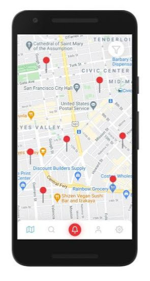
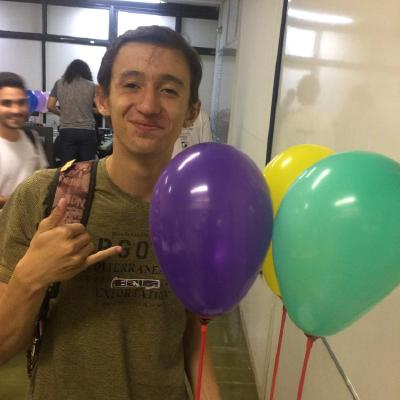

# Sobre

	

	

<h1 class="legenda" > Códigos fonte </h1>

<a href="https://github.com/fga-eps-mds/2020.1-stay-safe-front-end">
  

	
  

	<h4 class="legenda">Frontend</h4>
	<h6 class=legenda>Mobile</h6>
</a>
<a href="https://github.com/fga-eps-mds/2020.1-stay-safe-user-service">
  

	
  

	<h4 class="legenda">User-Service</h4>
	<h6 class=legenda>Api</h6>
</a>
<a href="https://github.com/fga-eps-mds/2020.1-stay-safe-secretary-service">
  

	
  

	<h4 class="legenda">Secretary-Service</h4>
	<h6 class=legenda>Web Crawler e Api</h6>
</a>

<h1 class="legenda" >Equipe </h1>
<h2 class="legenda" >Desenvolvimento </h2>

<a href="https://github.com/brendavsantos">
  

    
  

  <h4 class="legenda">Brenda Santos</h4>
</a>
<a href="https://github.com/danieldagerom">
  

    
  

  <h4 class="legenda">Daniel Primo</h4>
</a>
<a href="https://github.com/herickport">
  

    
  

  <h4 class="legenda">Hérick Portugues</h4>
</a>
<a href="https://github.com/alvesitalo">
  

    
  

  <h4 class="legenda">Ítalo Alves</h4>
</a>
<a href="https://github.com/lboaventura25">
  

    
  

  <h4 class="legenda">Lucas Boaventura</h4>
</a>
<a href="https://github.com/LuizPettengill">
  

    
  

  <h4 class="legenda">Luiz Pettengill</h4>
</a>
<a href="https://github.com/tsrrodrigues">
  

    
  

  <h4 class="legenda">Tiago Rodrigues</h4>
</a>

<h2 class="legenda" > Gerenciamento e Suporte </h2>

<a href="https://github.com/renan601">
  

    
  

  <h4 class="legenda">Renan Schadt</h4>
</a>
<a href="https://github.com/rossicler">
  

    
  

  <h4 class="legenda">Rossicler Junior</h4>
</a>
<a href="https://github.com/silvasara">
  

    
  

  <h4 class="legenda">Sara Silva</h4>
</a>

