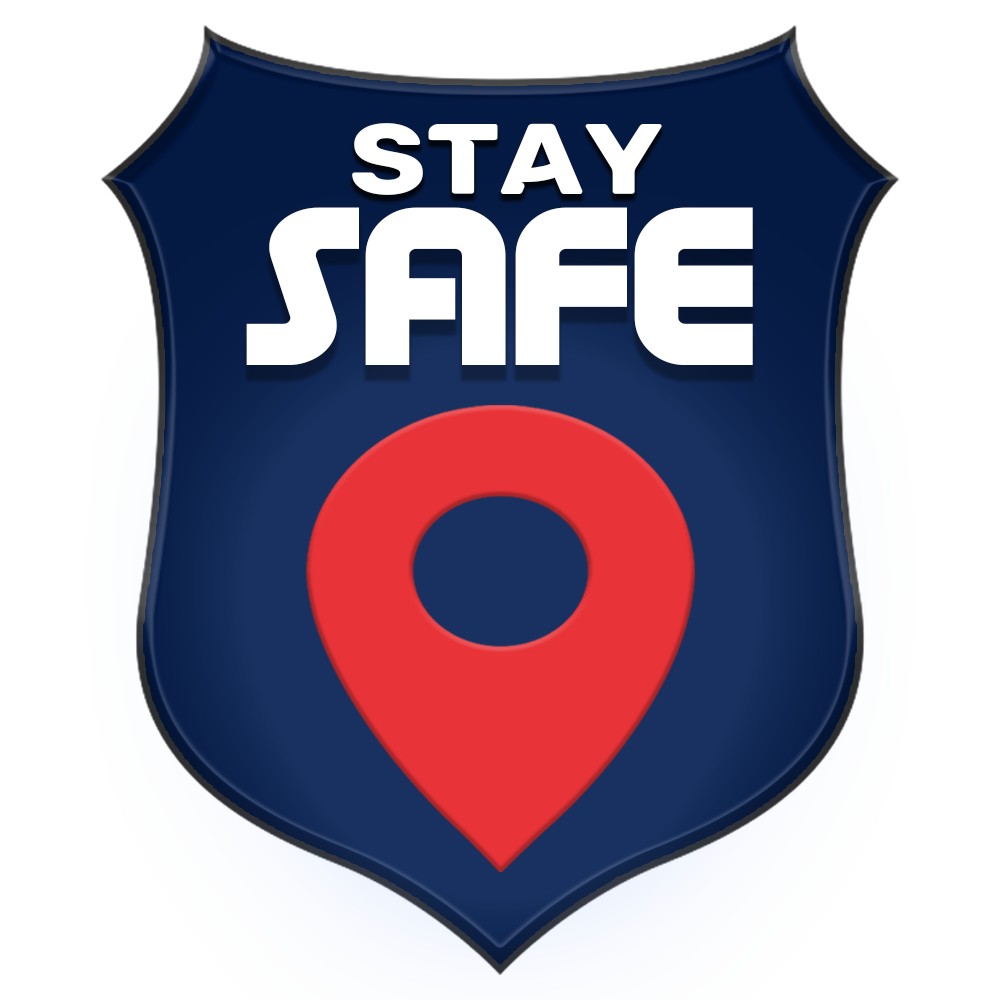
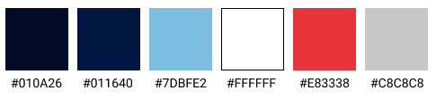

#Identidade Visual

## 1. Introdução
O presente documento define aspectos visuais para a implementação e divulgação do app Stay Safe, como as fontes utilizadas, cores e formas.

## 2. Logo
A iconografia da logo remete ao principal objetivo pretendido na aplicação, que seria mapear o acontecimento de crimes, e por isso foi utilizado um marcador semelhante aos comumente utilizados em mapas digitais para formar uma figura que sugere um criminoso.

A logo deve estar nas fontes Cunia e Age, sendo uma forma eficiente de representar a marca para os usuários. Não utilizar outras cores ou versões.

## 3. Fontes
As fontes definidas para a aplicação buscam alinhar a ideia de seriedade geral para confiabilidade, agregando uma usabilidade intuitiva. Pensando em fontes simples e que passam a sensação de segurança para o usuário.

### 3.1 Tipografia
Todos os textos do App devem estar na fonte Trueno, cuja ausência de serifas e sua forma simples e moderna auxilia na usabilidade e compreensão. 

-**Trueno Bold**: Utilizada em títulos.  
-**Trueno SemiBold**: Utilizada em subtítulos e botões.  
-**Trueno Regular**: Utilizada para textos em geral.  

## 4. Paleta de cores

 

### 4.1 Cores Primárias
 Partindo da escolha da logo, o Cor de Rosa Avermelhado foi escolhido como cor primária para os elementos da aplicação.

**#E83338 - Cor de Rosa Avermelhado**  
      *Cor RGB: (232, 51, 56)*   

### 4.2 Cores Secundárias
As demais cores agem como auxílio,  contrastando com o tom principal e auxiliando no uso e identificação de diferenças de coloração por pessoas com vertentes do daltonismo. 
 
**#011640 - Azul Ciano Escuro**  
      *Cor RGB: (1, 10, 38)*  
**#B6D6F2 - Azul Ciano Claro**  
      *Cor RGB: (182, 214, 242)*  
**#FFFFFF - Branco**  
      *Cor RGB: (255, 255, 255)*    
**#E83338 - Cor de Rosa Avermelhado**   
      *Cor RGB: (232, 51, 56)*   
**#C8C8C8 - Cinza**
      *Cor RGB: (200,200,200)*

## 5. Formas
As formas preferidas para o aplicativo são caixas e botões com cantos arredondados (~15px) e formas circulares, que assim caracterizam o flat design.
