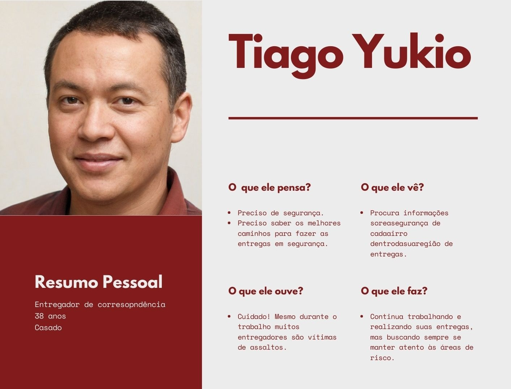

# Técnicas de Definição de Produto

## 1. Introdução
O presente documento visa apresentar as principais práticas realizadas durante a concepção do produto e como permitiram a modelagem, e consequentemente o desenvolvimento, do aplicativo Stay Safe.    

## 2. Técnicas
### 2.1 Brainstorming
A Brainstorming é uma técnica utilizada para incentivar o pensamento criativo e a produção de idéias. Quando se trata de um produto de software, o brainstorming torna-se uma ferramenta de extrema importância para a definição da estratégia e identificação de riscos. Caso as funcionalidades não sejam previamente definidas pelo cliente, como é no presente cenário, estimula-se a pluralidade de ideias e soluções baseadas em algum estudo de mercado. O brainstorming pode englobar diversas áreas de um projeto, como por exemplo: Gestão de projeto, gestão de processos, desenvolvimento, marketing etc.   
Entrando em detalhes sobre a concepção do StaySafe, o brainstorming ocorreu em um ambiente descontraído onde a maior parte da equipe se reuniu para debater ideias e assim formar uma visão mais concreta do que viria a ser a aplicação. Essa prática se mostrou necessária pois, como não havia cliente real, era preciso estabelecer o que de fato seria um produto com bons objetivos e que trariam retorno à sociedade. Dentro desse contexto social foi definido que o negócio principal seria a segurança pública, pois sempre foi(e provavelmente continuará sendo) uma área de interesse dos cidadãos. Na reunião foram identificados qual seria o contexto do projeto, quais os prováveis requisitos, as principais funcionalidades e, de forma resumida, qual o objetivo do produto.

### 2.2 Entrevistas
Como a temática de segurança pública é muito ampla, o produto passou a ter muitas possibilidades de funcionalidades e notou-se que os membros haviam formado ideias muito diferentes de como seria desenvolvido o projeto e qual seria o resultado final. Devido a essas divergências, foram agendadas entrevistas com a equipe de desenvolvedores com o intuito de entender quais as expectativas de cada um e como suas visões de produto haviam evoluido. Ao final dessa prática foi possível alinhar na medida do possível as ideias de todos os membros da equipe para que, finalmente, o projeto pudesse ser iniciado.

### 2.3 Personas   
A medida que a ideia do aplicativo passou a ser mais consistente ainda persistia o fato do projeto não possuir um cliente real, então foi adotada a solução onde deveriam ser elaboradas personas que representariam esse alvo demográfico. A criação de personas é uma das formas mais comuns e eficientes utilizadas para representação fictícia de clientes em projetos na Engenharia de Software. O principal intuito é apresentar perfis diversificados de possíveis usuários, incluindo histórias pessoais, objetivos, motivações e o que mais se mostrar conveniente para a análise do público alvo. O desenvolvimento de personas é recomendado em casos em que busca-se representar o cliente de forma humanizada e personalizada mesmo quando o produto não é desenvolido através de uma demanda de um cliente real.  

#### 2.3.1 Apresentação das Personas
Serão apresentados os perfis escolhidos, seguidos de seus respectivos Mapas da Empatia.

#### Persona 1:   

#### Persona 2:       

#### Persona 3:   

#### Persona 4:    

#### Persona 5:   

As imagens utilizadas nas personas foram originadas por uma inteligência articifial desenvolvida para criar figuras de [pessoas que não existem](https://thispersondoesnotexist.com/), sendo assim uma boa alternativa para evitar problemas com direitos de imagem.

