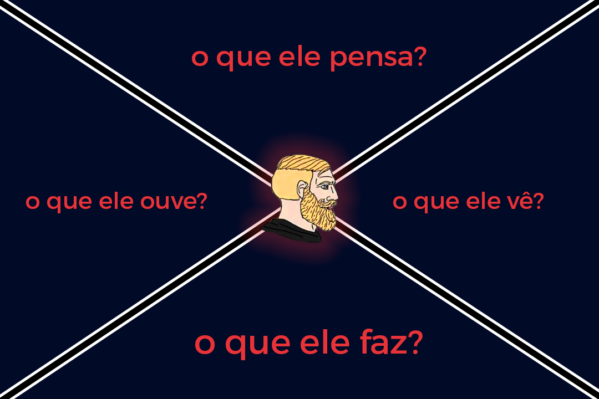
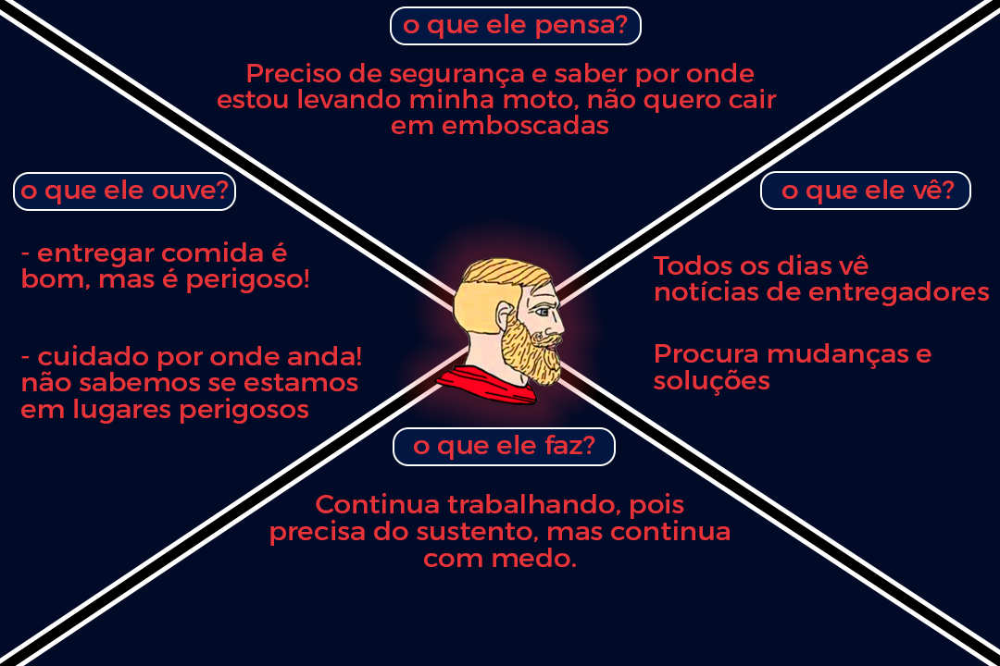
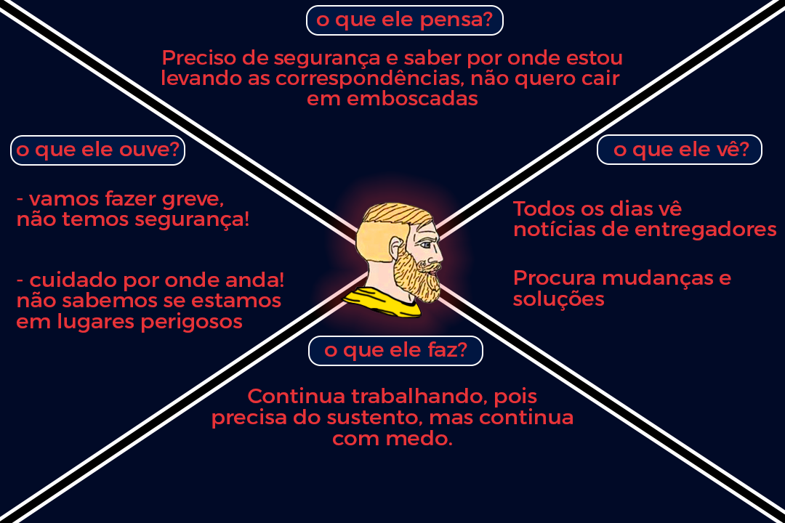
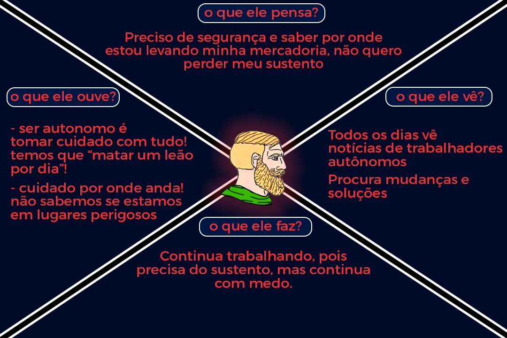

# Personas

## 1. Introdução
O presente documento define os aspectos principais das *personas* do aplicativo Stay Safe, ou o publico alvo.

## 2. Mapa da Empatia
Será utilizado, para fácil visualização das principais características das *personas*, o Mapa da Empatia, representado pela **figura**:

## 3. Apresentação das Personas
Serão apresentados os **perfis escolhidos**, seguidos de seus respectivos **Mapas da Empatia**.

## **Persona 1**: 
### **Entregador por Aplicativo**
### **Nome:** Carlos
### **Idade:** 28 Anos

## **Persona 2**: 
### **Entregador de Correspondência**
### **Nome:** Walisson
### **Idade:** 38 Anos

## **Persona 3**: 
### **Motorista por Aplicativo**
### **Nome:** Edivan
### **Idade:** 40 Anos

## **Persona 4**: 
### **Trabalhador Autonomo**
### **Nome:** José Carlos
### **Idade:** 36 Anos

## **Persona 5**: 
### **Universitária**
### **Nome:** Amanda
### **Idade:** 21 Anos

## 4. Objetivo
Apresentando o **Mapa da Empatia** de cada perfil selecionado, é possivel descobrir quais as **dores** e **desejos** do público alvo, e isso é fundamental para a aplicação mobile ser desenvolvida como a solução que irá trazer a transformação a cada **persona**.
