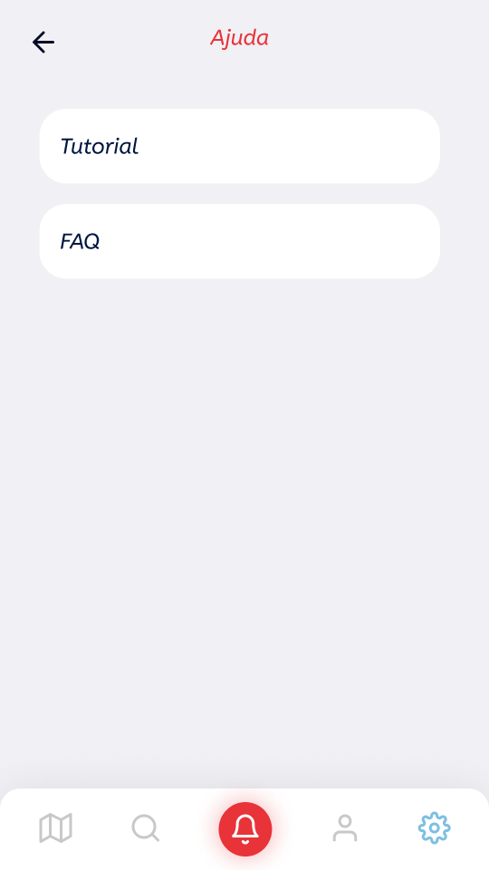
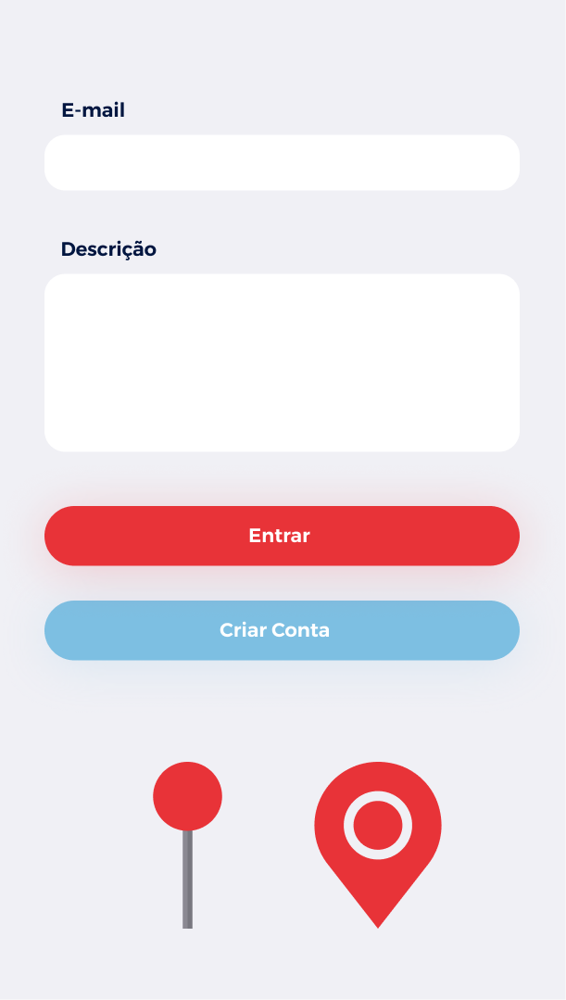

# Protótipo de Alta Fidelidade

Telas prototipadas do aplicativo, caso sejam necessárias telas adicionais, elas terão os mesmos elementos e componentes.

| | |
|:-------------------------:|:-------------------------:|
| Cadastro | Login |
| Home | Home com mapa |
| Home com filtros | Pesquisa dos bairros |
| Dica de como reportar | Reportar Ocorrência |
| Avaliação de um bairro | Adicionar ou editar avaliação |
| Ver/Editar perfil | Configurações do app |
| Ajuda | Pins do mapa e componentes comuns |