# Protótipo de Alta Fidelidade

Telas prototipadas do aplicativo, caso sejam necessárias telas adicionais, elas terão os mesmos elementos e componentes.

| | |
|:-------------------------:|:-------------------------:|
|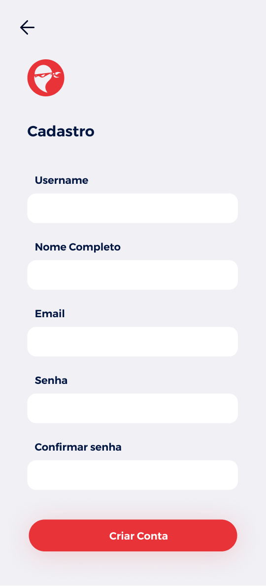 Cadastro |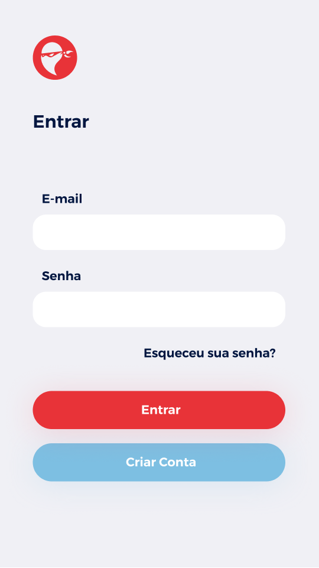 Login |
|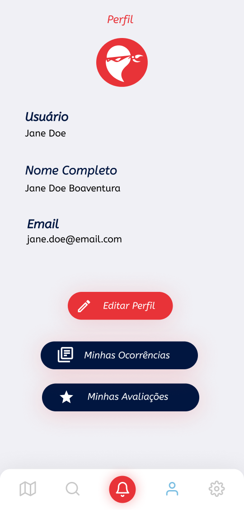 Ver/Editar perfil | Editar Perfil |
|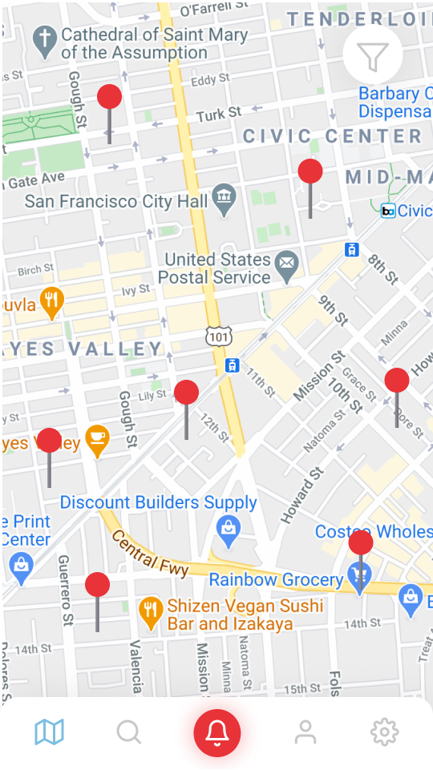 Home com mapa |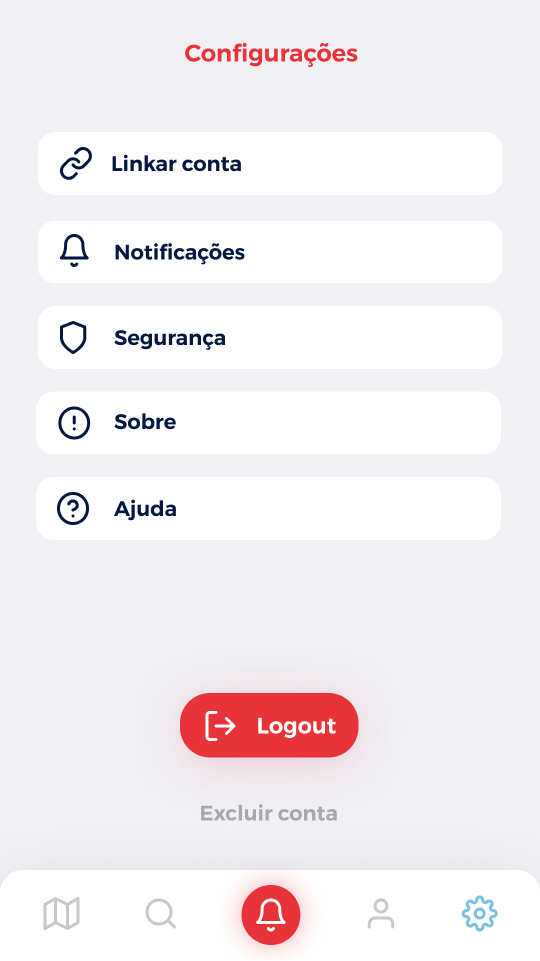 Configurações do app |
|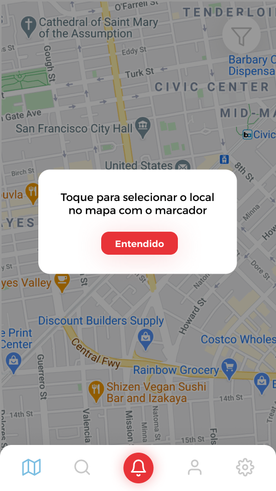 Dica de como reportar |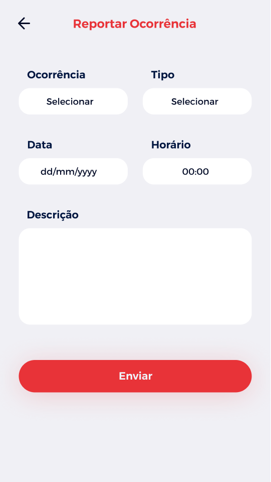 Reportar Ocorrência |
|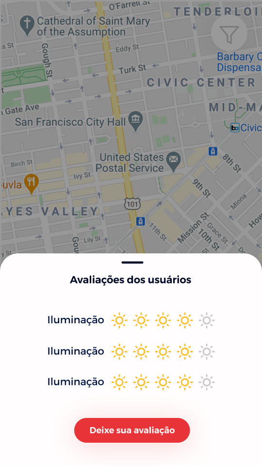 Avaliação de um bairro |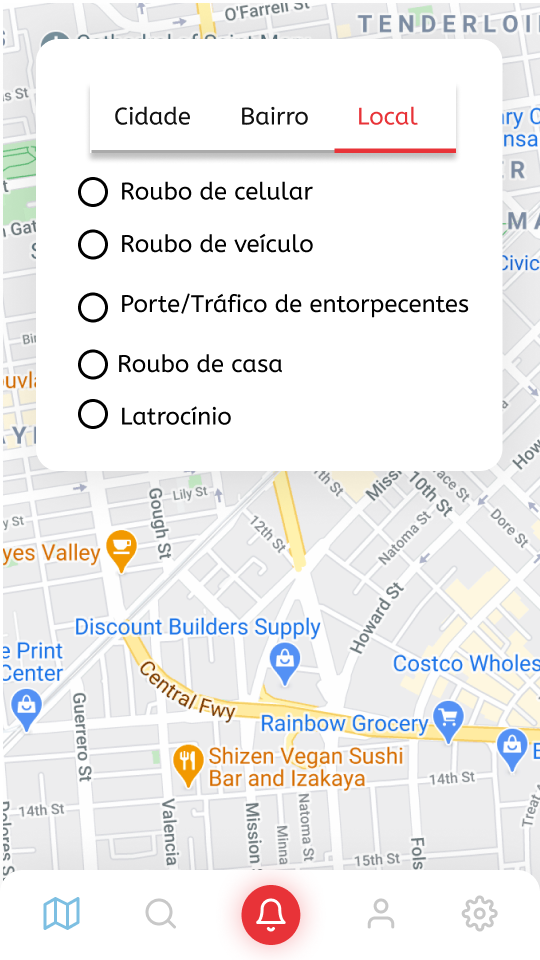 Tela dos Filtros Local|
| Deletar Ocorrência | Deletar Avaliação |
| Avaliar Bairro 1| Avaliar Bairro 2|
| Comparar Estatísticas 1| Comparar Estatísticas 2|
| Delegacia mais próxima |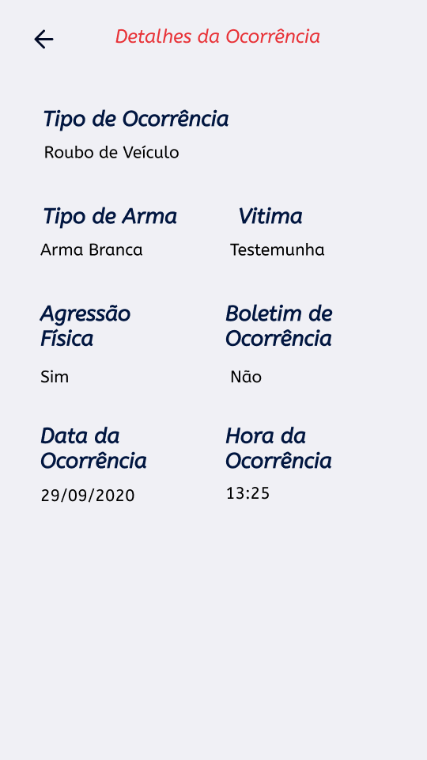 Detalhes da Ocorrência |
|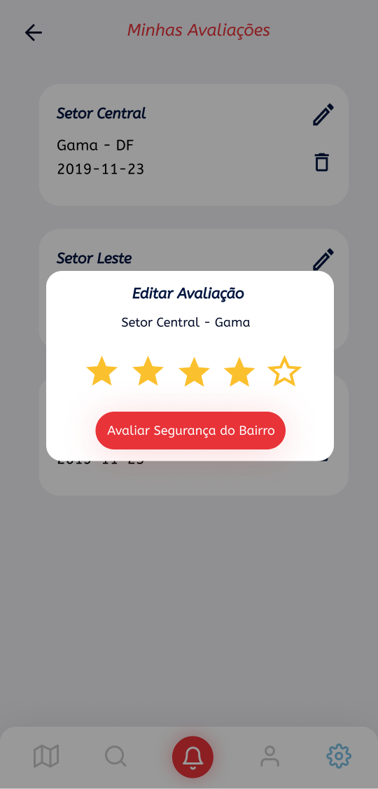 Editar Avaliação|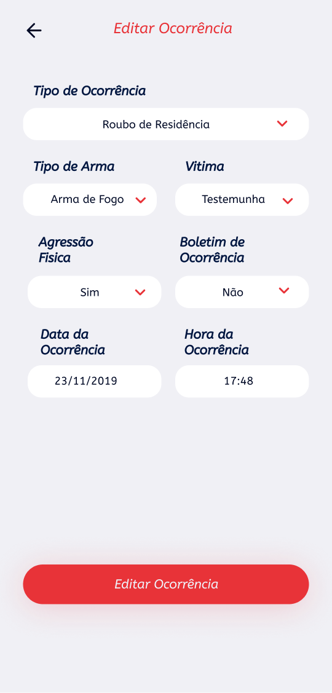 Editar Avaliação |
| Visualizar Estatsticas |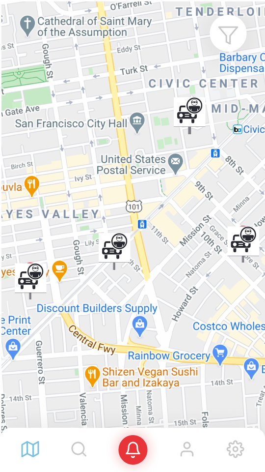 Filtros de Crimes |
|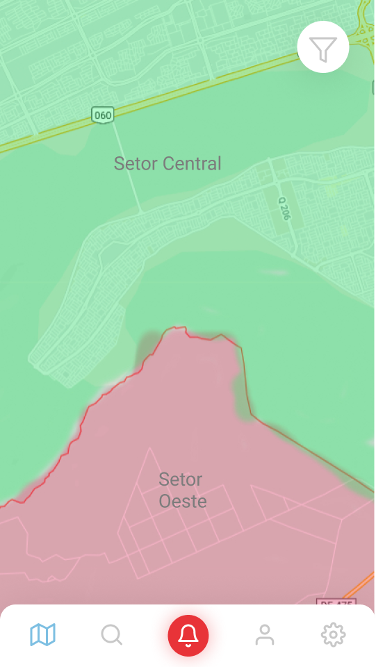 Mapa de Calor por Bairro |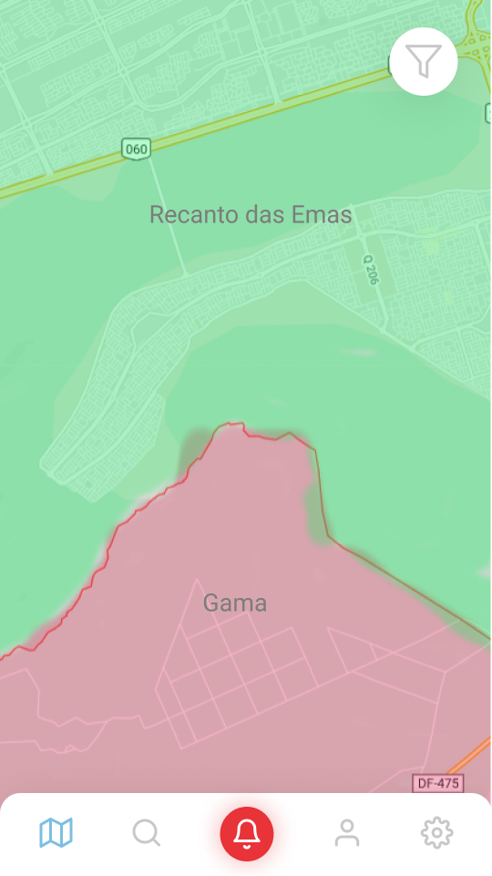 Mapa de Calor por Cidade|
| Minhas Avaliações | Minhas Ocorrências |
|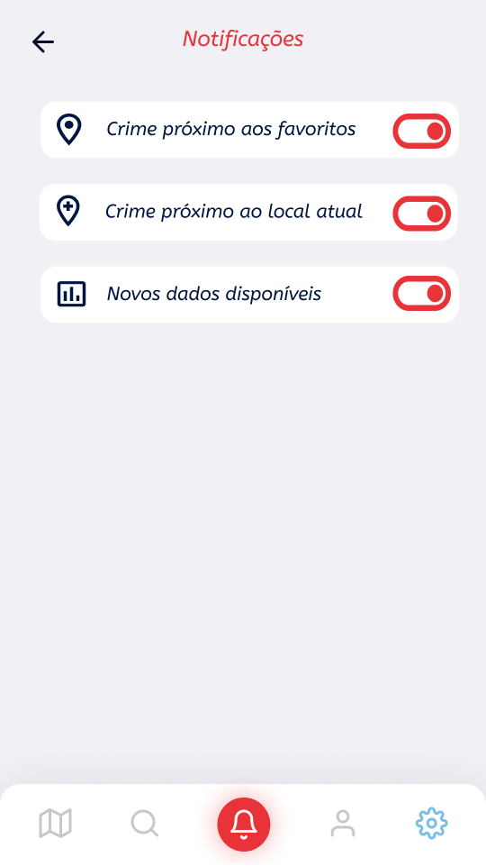 Notificações |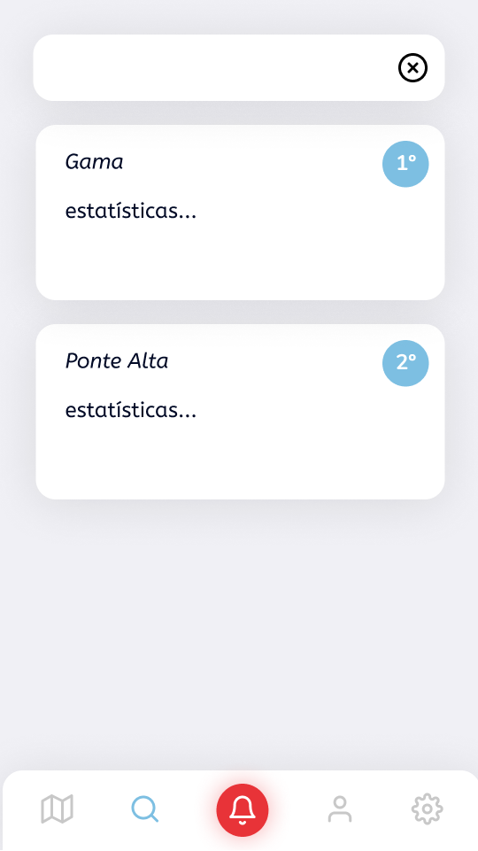 Tela de Classificações |
|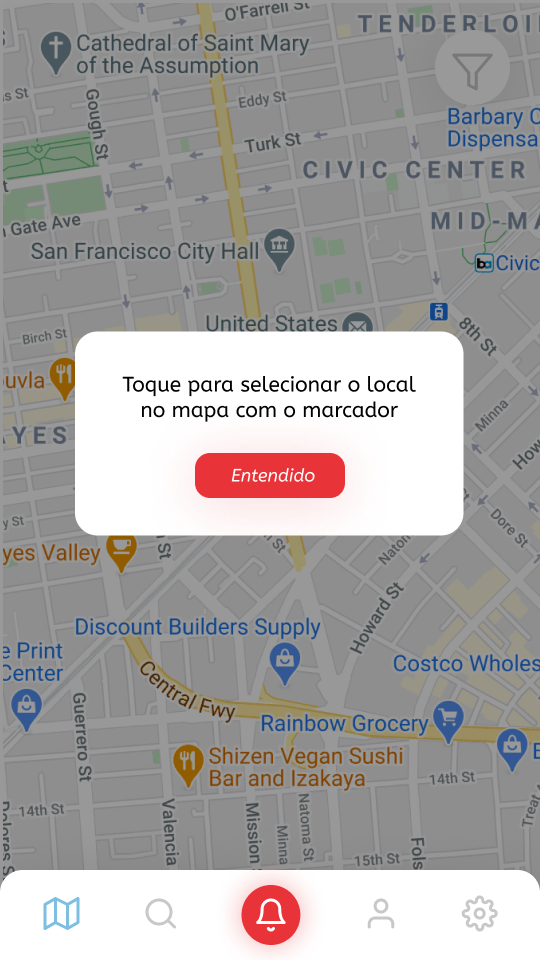 Reportar Ocorrência 1 | Reportar Ocorrência 2 |
|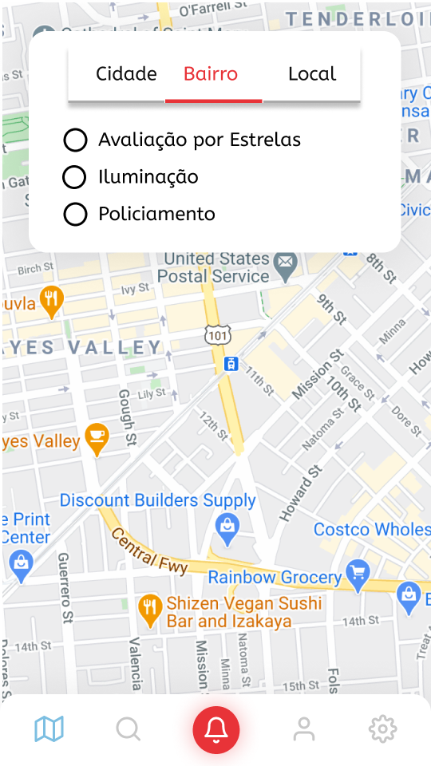 Tela dos Filtros por Bairro |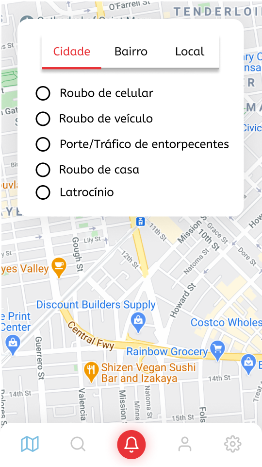 Tela dos Filtros por Cidade |

