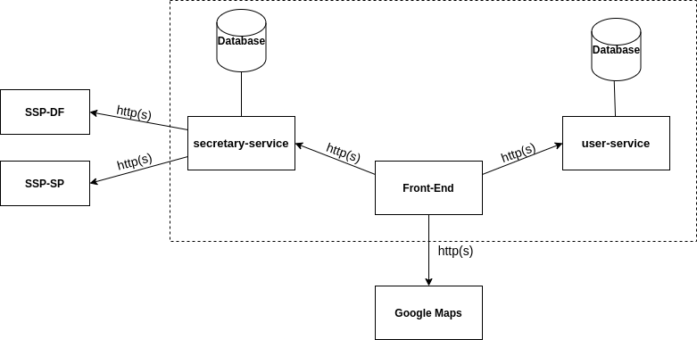
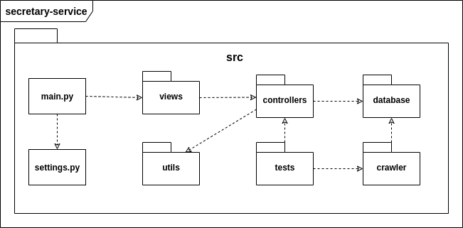
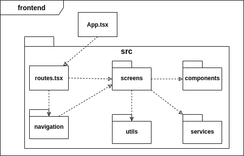

# Documento de Arquitetura

## 1. Introdução

### 1.1. Finalidade

Este documento tem como objetivo fornecer uma visão geral da arquitetura do aplicativo Stay Safe. Visa apresentar de forma clara o fluxo de dados, o comportamento da aplicação e como as partes se relacionam, bem como expor de maneira objetiva as decisões arquiteturais que foram tomadas em relação ao projeto.

### 1.2. Escopo

Este documento de arquitetura se aplica ao Stay Safe. Estão descritos neste documento os padrões de arquitetura adotados, frameworks e linguagens escolhidas.

### 1.3. Definições, Acrônimos e Abreviações

* **API** - *Application Programming Interface*: conjunto de rotinas e padrões de programação que viabiliza a comunicação entre dois sistemas ou plataformas distintas.
* **HTTP** - *Hypertext Transfer Protocol*: protocolo de transferência e comunicação de dados.
* **Backend** - Parte da aplicação responsável pela conexão com o banco de dados e gerência das informações que serão enviadas ao frontend.
* **Frontend** - Parte da aplicação responsável pela interação com o usuário, utilizando recursos consumidos do backend.
* **SSP** - Secretaria de Estado de Segurança Pública.
* **SQL** - *Structured Query Language*: Linguagem declarativa de busca para bancos de dados relacionais.

## 2. Representação da Arquitetura

### 2.1. Diagrama Geral

A aplicação terá um frontend feito em React Native, dois microserviços em seu backend e irá fazer o uso da API do Google Maps para os mapas do aplicativo. Um dos microserviços é o User Service, uma API REST desenvolvida em Flask, que irá tratar todos os dados dos usuários, mais pins reportados e avaliações submetidas, enviando-os para serem armazenados em um banco de dados relacional, PostgreSQL. O segundo microserviço é o Secretary Service, que consiste em um sistema também desenvolvido em Flask que obtém as informações dos websites da SSP por meio de crawlers e as armazena em um banco de dados não relacional, MongoDB. Por fim o aplicativo irá utilizar a API do Google Maps para implementar os mapas na aplicação. As comunicações entre todos os componentes serão feitas com o protocolo HTTP.

### 2.2. Flask

[Flask](https://flask.palletsprojects.com/en/1.1.x/#) é um framework de aplicativos web em Python. Foi designado para se ter um início de projeto fácil e rápido, com a habilidade de escalar para aplicações complexas. Flask oferece sugestões, mas não força dependências e layouts ao projeto.

### 2.3. React Native

[React Native](https://reactnative.dev/) é um framework de JavaScript para desenvolver aplicações nativas tanto para Android como para IOS. É baseada em React, uma biblioteca do Facebook criada para desenvolver interfaces de usuário, porém em vez de adaptar o código para browsers, ele adapta para dispositivos móveis.

### 2.4. API Google Maps

A [API do Google Maps](https://developers.google.com/maps/documentation?hl=pt-br) será utilizada para obter os mapas da aplicação, onde será feita a inclusão dos marcadores de crimes por parte dos usuários e a inclusão das demarcações dos estados/cidades/bairros de acordo com os dados obtidos da SSP.

### 2.5. SSP

A Secretaria de Segurança Pública do [Distrito Federal](http://www.ssp.df.gov.br/) e do [Estado de São Paulo](https://www.ssp.sp.gov.br/) são as maiores fontes dos dados obtidos para a aplicação. Os dados são disponibilizados nos respectivos websites e iremos utilizar crawlers para a obtenção dos mesmos. Com as funcionalidades do aplicativo, esses dados serão mostrados de uma forma mais amigável ao usuário final.

### 2.6. PostgreSQL

[PostgreSQL](https://www.postgresql.org/) é um banco de dados relacional open source que suporta grande parte do padrão SQL. Ele será utilizado no User Service, que precisa de mais persistência dos dados.

### 2.7. MongoDB

[MongoDB](https://www.mongodb.com/) é um banco de dados orientado a documentos não relacional caracterizado como NoSQL. Ele possui uma maior versatilidade para armazenar os dados. Ele será usado no Secretary Service para armazenar os dados obtidos das SSPs, cuja modelagem pode variar entre as secretarias.

## 3. Requisitos e Restrições de Arquitetura

* Aplicação deve ser construída baseada na arquitetura de microsserviços, na qual o backend será desenvolvido em Flask e o frontend em React Native.

* O aplicativo será funcional em celulares com o sistema operacional Android e acesso à loja de aplicativos Play Store.

* O celular necessita de conexão estável de internet para uso completo e atualizado do aplicativo.

* O secretary-service deve ser desenvolvida para consumir dados de diferentes secretarias, portanto deve ser facilmente escalável.

* O serviço de mapas da aplicação será fornecido pela API externa do Google Maps.

## 4. Visão de Implementação

### 4.1. User-Service

* **src/** - Pasta que contém todo o código fonte da API.
* **main.py** - Arquivo que controla a execução do serviço.
* **settings.py** - Arquivo que contém todas as configurações do servidor.
* **views/** - Camada que implementa os endpoints e define quais métodos HTTP serão utilizados.
* **controllers/** - Camada responsável por controlar os dados que entram e que saem da aplicação. É usada para itermediar a comunicação entre as camadas de database e a de view.
* **utils/** - Armazena funções utilitárias reutilizáveis que serão disponibilizadas para todo o projeto. 
* **tests/** - Inclui os testes unitários realizados dentro da API.
* **database/** - Camada que realiza a comunicação com o banco de dados relacional.

### 4.2. Secretary-Service

* **src/** - Pasta que contém todo o código fonte da API.
* **main.py** - Arquivo que controla a execução do serviço.
* **settings.py** - Arquivo que contém todas as configurações do servidor.
* **views/** - Camada que implementa os endpoints e define quais métodos HTTP serão utilizados.
* **controllers/** - Camada responsável por controlar os dados que entram e que saem da aplicação. É usada para itermediar a comunicação entre as camadas de database e a de view.
* **utils/** - Armazena funções utilitárias reutilizáveis que serão disponibilizadas para todo o projeto. 
* **tests/** - Inclui os testes unitários realizados dentro da API.
* **database/** - Camada que realiza a comunicação com o banco de dados não relacional.
* **crawler/** - Responsável pela implementação dos crawlers que realizarão a extração metódica e automatizada de dados das SSPs. 

### 4.3. Frontend

* **src/** - Pasta que contém todo o código fonte da API.
* **index.js** - Arquivo que controla a execução da aplicação.
* **config.js** - Responsável por armazenar diferentes variáveis, rotas e configurações da aplicação.
* **screens/** - Contêm as telas da aplicação.
* **utils/** - Armazena funções utilitárias reutilizáveis que serão disponibilizadas para todo o projeto. 
* **components/** - Inclue os componentes primários que serão aproveitados nas telas da aplicação.
* **public/assets/** - Possui as imagens e ícones estáticos utilizados no projeto.

## 5. Esquema de Dados 

## 6. Referências

JUNIOR, Cleber; LUI, Brian; HORINOUCHI, Lucas; SOUZA, Rômulo; HERONILDO, Francisco; TOYOSHIMA, Filipe; ALVES, Vitor; APOLINÁRIO, Jacó. Projeto HubCare: Documento de Arquitetura. Disponível em: https://cjjcastro.gitlab.io/2019-1-hubcare-docs/project/architecture-document/#5-visao-de-implementacao. Acesso em: 26 ago. 2020;

LIMA, Alan; BERNARDO, Elias; MARQUES, Guilherme; BARREIROS, Leonardo; BLANCO, Matheus; FÉO, Pedro; RODRIGUES, Pedro; KADER, Saleh; SILVA, Sara; ALCÂNTARA, Shayane. Projeto QR Comer: Documento de Arquitetura. Disponível em: https://fga-desenho-2019-2.github.io/Wiki/seminario5/arquitetura/. Acesso em: 26 ago. 2020;

MENDES, Iasmin; VALÉRIO, Renato; JOÃO, Lucas; DAVI, Gabriel; SOUZA, Sousa; MACIEL, Lucas; FERNANDES, Weiller; GOMES, Matheus. Projeto Indica AI: Documento de Arquitetura. Disponível em: https://fga-eps-mds.github.io/2018.2-IndicaAi//docs/2018/08/28/architecture-doc.html. Acesso em: 26 ago. 2020;

MIGUEL, Alexandre; ALVES, Davi; GUEDES, Gabriela; GOULART, Helena; ROBSON, João; MENEZES, Leticia; GUILHERME, Luiz; SCHADT, Renan; VINICIUS, Rômulo; HUGO, Victor. Projeto Translate.me: Documento de Arquitetura. Disponível em: https://translate-me.github.io/docs/documentos/projeto/doc_de_arquitetura/. Acesso em: 26 ago. 2020;

## Histórico de Revisão

| Data | Versão| Descrição | Autor |
|----|----|----|----|
| 26/08/2020 | 0.1 | Adicionando Introdução | Brenda e Hérick |
| 26/08/2020 | 0.2 | Adicionando Requisitos e Restrições de Arquitetura | Brenda e Hérick |
| 26/08/2020 | 0.3 | Adicionando Visão de Implementação | Brenda e Hérick |
| 26/08/2020 | 0.4 | Adicionando Representação da Arquitetura | Tiago |
| 26/08/2020 | 0.5 | Adicionando Referências | Luiz |
| 26/08/2020 | 0.6 | Revisando Documento | Brenda, Luiz, Hérick, Tiago |
| 29/08/2020 | 1.0 | Revisão e algumas correções | Sara |
