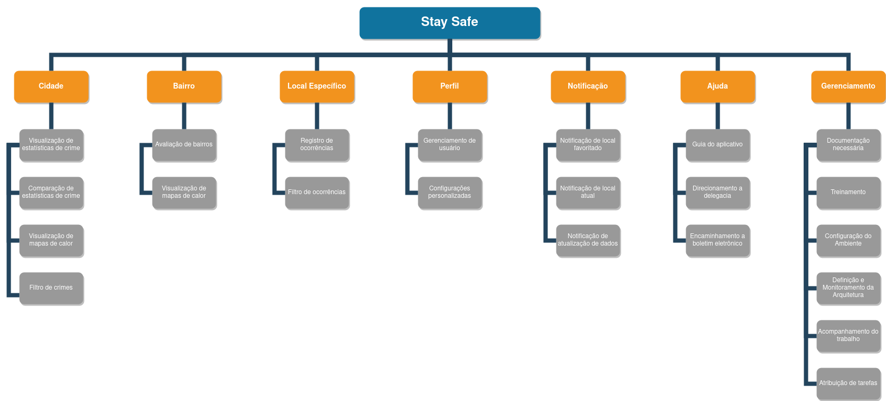

# Estrutura Analítica do Projeto

## 1. Introdução
Este documento se dedica a mostrar a Estrutura Analítica do Projeto representando o escopo de maneira simplificada e visual. As tarefas principais são os épicos do produto e gerenciamento, as tarefas que vem abaixo destas mapeiam as entregas necessárias para atingir esses objetivos.

## 2. EAP
