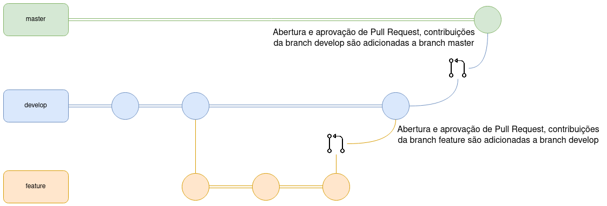
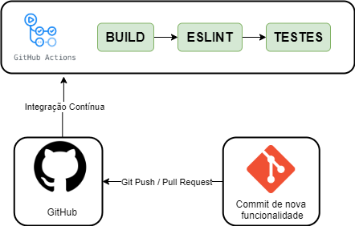

# Plano de Gerência e Configuração de Software

## 1. Introdução
Este documento tem como objetivo apresentar as ferramentas, políticas e regras adotadas pelo projeto Stay Safe para auxiliar quem deseja contribuir.

## 2. Ferramentas 
| Ferramenta | Finalidade |
|---|---|
| GitHub | Hospedagem e versionamento de código |
| GitHub Actions | Ferramenta de integração contínua |
| GitHub Pages | Hospedagem de página web para repositório GitHub |
| Docker | Ferramenta de isolamento de ambiente |
| Docker-Compose | Ferramenta de gerenciamento de containers |
| Flask | Framework de desenvolvimento backend |
| Pytest | Framework de teste Python |
| Coverage py | Ferramenta de cobertura de código Python |
| Pylint | Ferramenta de análise de código Python |
| React Native | Framework de desenvolvimento frontend |
| Jest | Framework de teste JavaScript |
| ESLint | Ferramenta de análise de código JavaScript |
| Prettier | Formatador de código automático |

## 3 Política de Issues
Caso encontre um bug ou tenha alguma sugestão de melhoria para o software é possível criar uma issue seguindo os passos abaixo:

1. Escolha o tipo de issue a ser criado (funcionalidade, documentação ou correção de bug)
2. Escreva um título sucinto para a issue
3. Preencha a descrição da issue seguindo os passos e as orientações do template que será mostrado
4. Preencha informações adicionais caso possua (executores, épico, marco, etc)

Tanto o título como a descrição da issue devem estar escritos em inglês e seguir suas regras de sintaxe e semântica. 

## 4 Política de Branches

### 4.1 Repositórios de Código

O Git Flow dos repositórios de código será tratado da forma mostrada na imagem acima. Para uma mudança chegar a branch master (branch estável) os passos abaixo são seguidos:

1. Toda nova branch deve ser feita a partir da develop
2. Ao resolver a issue proposta a nova branch deve ser merjada e comparada em relação a develop
3. Caso o PR seja aprovado pela equipe a nova branch será deletada e seu conteúdo integrado a develop
4. Na develop será testada a integração entre as funcionalidades recentemente adicionadas
5. Quando a equipe atestar a estabilidade da develop seu conteúdo é integrado a master

### 4.2 Repositório de Documentação

O Git Flow do repositório de documentação será tratado da forma mostrada na imagem acima. Para uma mudança chegar a branch master (branch estável) os passos abaixo são seguidos:

1. Toda nova branch deve ser feita a partir da master
2. Ao resolver a issue proposta a nova branch deve ser merjada e comparada em relação a master
3. Caso o PR seja aprovado pela equipe a nova branch será deletada e seu conteúdo integrado a master

### 4.3 Regras de Nomenclatura
Toda nova branch criada nos repositórios Stay Safe deve se propor a resolver uma issue específica, o nome da branch deve seguir as seguintes regras:

1. Conter o código da issue fornecido pelo GitHub
2. Ser curto e expressivo a respeito da issue a ser tratada
3. As palavras devem ser separadas por underscore "-"
4. Ser escrito em "lower case"

Exemplo:

    2-vision-document

## 5 Política de Commits
Os commits devem ser atômicos (uma contribuição pequena para resolver um problema específico). A mensagem do commit deve relatar o que foi feito de maneira sucinta e direta, além disso ela precisa estar em inglês, começar com um verbo e com a primeira letra maiúscula. 

Contribuições feitas por mais de uma pessoa devem conter o comando "Co-authored-by" para identificar todos os autores envolvidos.

Exemplo de contribuição feita por um autor:

    git commit -m "Add database diagram image."

Exemplo de contribuição feita por mais de um autor:

    git commit -m "Create user model.

    Co-authored-by: Pessoa <emailgit@email.com>"

## 6 Política de Pull Request
Para realizar um Pull Request (PR) para o repositório é necessário seguir os passos abaixo.

1. Ao resolver uma issue suba suas contribuições e crie um Pull Request
2. Escreva um título sucinto para o PR 
3. Preencha a descrição do PR seguindo os passos e as orientações do template que será mostrado
4. Ligue o PR com a issue que ele resolve
5. Preencha informações adicionais caso possua (executores, revisores, etc)

Um PR só poderá ser merjado após duas aprovações.

### 6.1 Política de Aprovação
Para um Pull Request ser aprovado nos repositórios de código a contribuição feita deve:

1. Resolver apenas a issue específica ao qual se habilita a tratar
2. Respeitar todos os critérios de aceitação definidos na issue
3. Estar descrita na língua inglesa
4. Possuir cobertura de testes 
5. Ser aprovada na integração contínua e nas ferramentas que ela executa
6. Conter lógica eficaz para preservar performance do aplicativo
7. Conter boas práticas de programação para preservar a qualidade do código
8. Não adicionar nenhum comportamento inesperado ao aplicativo

Para um Pull Request ser aprovado no repositório de documentação a contribuição feita deve:

1. Ser relevante para o projeto
2. Resolver apenas a issue específica ao qual se habilita a tratar
3. Respeitar todos os critérios de aceitação definidos na issue
4. Estar na língua portuguesa e seguir as normas desta 
5. Estar na pasta e formato adequados
6. Ser aprovada na integração contínua e nas ferramentas que ela executa

## 7 Política de Documentação
Para contribuir com a documentação do projeto as regras definidas de commit, issue e PR também se aplicam, além destas pedimos atenção aos pontos abaixo:

1. Um novo documento deve ser criado dentro da pasta produto ou projeto dependendo do que ele trata
2. Para adicionar imagens a um documento deve-se fazer o upload delas em uma nova sub-pasta dentro da pasta images. Exemplo: "images/NomeDoNovoDocumento/persona.jpeg"
3. Todo documento deve conter um tópico de Introdução para dizer do que ele se trata

Caso o documento seja extenso e possua múltiplos autores um histórico de versão deve ser inserido ao final dele, respeitando as seguintes regras: o versionamento da documentação deve seguir um padrão X.Z, onde X e Z são numerais inteiros não negativos que crescem em ordem crescente. 

Ao fazer grandes incrementos a variável X cresce (1.0, 2.0, 3.0) e ao fazer pequenos incrementos a variável Z cresce (1.1, 1.2, 1.3), ambas variáveis começam em zero e crescem de um em um. Ao subir a versão de X o valor de Z volta pra zero (1.4 -> 2.0). O documento só entra na versão 1.0 se naquele momento ele estiver teoricamente finalizado.

## 8 Continuous Integration/Deployment
### 8.1 Continuous Integration
Continuous integration (CI) é uma prática onde o código entregue por desenvolvedores passa por uma pipeline onde são feito validações do código entregue. No nosso projeto a pipeline usada está definida no tópico 8.3 desse documento.

### 8.2 Continuous Deployment
Continuous deployment (CD) é a entrega automatizada de releases de um software, onde é feito a validação do código pelo CI, caso o código passe pelo CI, é feito o Deploy desse código para um ambiente de produção.

### 8.3 Pipelines
Aqui é definido as pipelines seguidas para CI/CD do nosso projeto. São definidos duas pipelines, onde uma delas é para serviços de API e a outra para o front-end do projeto.

#### 8.3.1 API

##### Etapas
* **BUILD:** É executado a build do projeto.
* **PYLINT:** É executado o Pylint a fim de verificar a qualidade de código e possíveis bugs. Nessa etapa é usado a folha de estilo pep8 como base. O Pylint gera uma nota de 0 a 10, onde usamos a nota 8 como nota mínima aceita, caso a nota seja inferior, será levantado um erro na pipeline.
* **TESTES:** São executados os testes unitários do projeto usando o pytest, após isso, é executado a cobertura de testes usando o Coverage.py

#### 8.3.2 Front-end

##### Etapas
* **BUILD:** É executado a build do projeto usando o expo
* **ESLint:** É executado o ESLint a fim de verificar a qualidade de código e possíveis bugs. O ESLint retornará erros de códigos e warnings, caso seja retornado algum erro, a pipeline falhará.
* **TESTES:** São executados os testes unitários do projeto usando o Jest.
