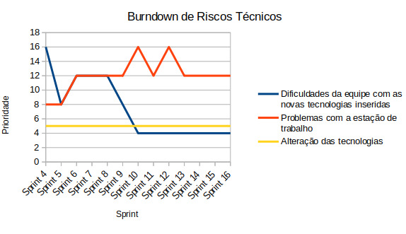
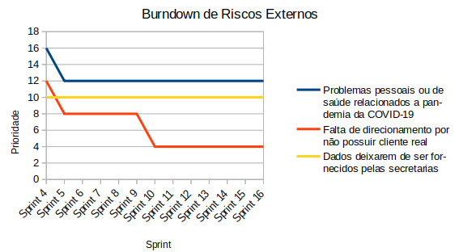
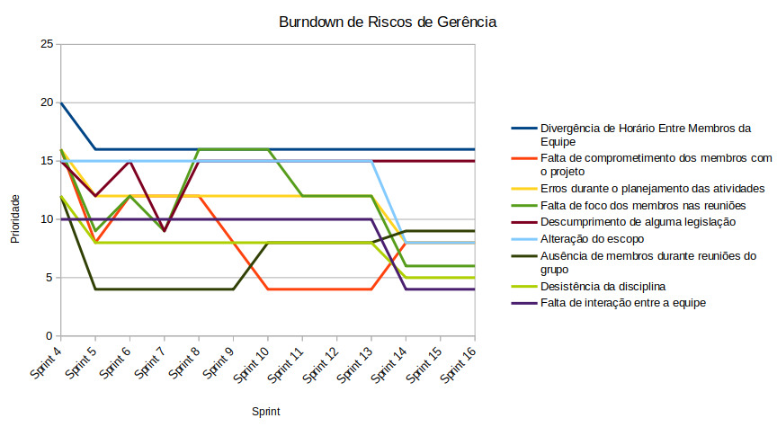

# Plano de Gerenciamento de Risco

## 1. Introdução
O plano de gerenciamento de riscos trata da execução de atividades de gerenciamento de risco. Neste documento o objetivo é facilitar a visualização dos riscos através da identificação e mapeamento, para auxiliar na tomada de decisões relacionadas, a fim de que a produtividade do projeto possa ser mantida e ele seja concluído.

## 2. Categoria de Riscos
Riscos são condições incertas que, caso ocorram, podem trazer benefícios ou maleficios aos objetivos do projeto. Como existem diversos vetores que possibilitariam essas ocorrências, foram agrupadas as possíveis classificações dos riscos em quatro grandes categorias, são elas:

* **Técnico:** Abordam tecnologia, requisitos, complexidade, desempenho, interfaces, confiabilidade e qualidade.
* **Externo:** Abordam riscos relativos ao cliente, mercado, ambiente de trabalho e fatores pessoais.
* **Organizacional:** Abordam a priorização, recursos e dependências do projeto.
* **Gerência:** Abordam planejamento, controle, estimativa e comunicação.

## 3. Análise Quantitativa

### 3.1. Probabilidade
**Probabilidade** | **Intervalo** | **Peso**
:---------------: | :-----------: | :------:
**Muito Alta**    |   81 a 100    |    5
**Alta**          |   61 a 80     |    4
**Média**         |   41 a 60     |    3
**Baixa**         |   21 a 40     |    2
**Muito Baixa**   |   0 a 20      |    1

### 3.2. Impacto
Para se quantificar o impacto do risco no projeto o custo, o tempo, o escopo e a qualidade devem ser levados em conta.

**Impacto**       |                     **Descrição**                      | **Peso**
:---------------: | :----------------------------------------------------: | :------:
**Muito Alto**    | O impacto inviabiliza o projeto                        |    5
**Alto**          | Há grande impacto no desenvolvimento do projeto        |    4
**Médio**         | Possui certo impacto porém é facilmente recuperado     |    3
**Baixo**         | Pouco impacto no desenvolvimento do projeto            |    2
**Muito Baixo**   | Impacto pouco expressivo no desenvolvimento do projeto |    1

### 3.3. Prioridade
Através da multiplicação entre as estimativas de impacto e probabilidade é possível calcular a prioridade dos riscos. A partir desses valores é determinada a urgência da inicialização de medidas de mitigação e resolução dos riscos.

**Probabilidade x Impacto** | **Muito Baixo** | **Baixo** | **Médio**  | **Alto** | **Muito Alto**
:-----------------------: | :-------------: | :-------: |:----------:|:--------:|:------------: 
**Muito Baixa**           |        1        |    2      |      3     |    4     |      5
**Baixa**                 |        2        |    4      |      6     |    8     |      10
**Média**                 |        3        |    6      |      9     |    12    |      15
**Alta**                  |        4        |    8      |      12    |    16    |      20
**Muito Alta**            |        5        |    10     |      15    |    20    |      25

#### 3.3.1 Valor de Prioridade
**Prioridade** | **Intervalo** 
:------------: | :-----------: 
**Muito Alta** |     21 a 25    
**Alta**       |     16 a 20   
**Média**      |     11 a 15     
**Baixa**      |     6 a 10   
**Muito Baixa**|     1 a 5      

## 4. Identificação dos Riscos

### R01 - Divergência de horários entre membros da equipe
**Categoria:** Gerência  
**Causa:** Membros com grades horárias muito distintas  
**Consequência:** Dificuldade para reunir toda a equipe e realizar os pareamentos  
**Ação Preventiva:** Elaboração de planilhas de controle de horários  
**Ação Reativa:** Planejar os pareamentos e reuniões baseado na planilha de horários   

### R02 - Dificuldades da equipe com as novas tecnologias inseridas
**Categoria:** Técnico  
**Causa:** Inexperiência de alguns membros  
**Consequência:** Surgimento de dívidas técnicas pela dificuldade em realizar os objetivos propostos  
**Ação Preventiva:** Realização de treinamentos efetivos nas tecnologias a serem utilizadas ao longo do semestre      
**Ação Reativa:** Organizar pareamento para rotação do conhecimento    

### R03 - Falta de comprometimento dos membros com o projeto
**Categoria:** Gerência  
**Causa:** Desânimo com o curso, problemas pessoais ou de saúde, excesso de compromissos, entre outros  
**Consequência:** Issues não entregues, dívida técnica e replanejamento               
**Ação Preventiva:** Motivar os membros do grupo e não permitir que o trabalho se torne massante      
**Ação Reativa:** Reorganizar o cronograma e entender o motivo da falta de comprometimento para tentar evitar que ele se repita    

### R04 - Problemas pessoais ou de saúde relacionados a pandemia da COVID-19
**Categoria:** Externo  
**Causa:** Doença infecciosa COVID-19  
**Consequência:** Capacidade de trabalho da equipe prejudicada e atrasos no cronograma  
**Ação Preventiva:** Seguir as recomendações de prevenção da Organização Mundial da Saúde  
**Ação Reativa:** Remanejamento das atividades e apoio ao(s) membro(s) afetado(s)  

### R05 - Erros durante o planejamento das atividades
**Categoria:** Gerência  
**Causa:** Falta de experiência da equipe de gerência  
**Consequência:** Trabalho mal distribuído entre os membros da equipe  
**Ação Preventiva:** Conhecer bem a capacidade da equipe e as necessidades do projeto   
**Ação Reativa:**  Avaliar as métricas do projeto para regular os próximos planejamentos  

### R06 - Falta de foco dos membros nas reuniões  
**Categoria:** Gerência   
**Causa:** Diversas distrações em um contexto de reuniões remotas e a falta de socialização em tempos de pandemia  
**Consequência:** Reuniões longas e com poucos resultados       
**Ação Preventiva:** Criar timebox para os tópicos da reunião e permanecer nos assuntos que são de interesse geral   
**Ação Reativa:** Mudar a maneira como a reunião é conduzida de forma a deixá-la mais despojada sem perder o foco na produtividade   

### R07 - Conflito com outras disciplinas
**Categoria:** Organizacional  
**Causa:** Necessidade, sendo alunos da UnB os membros da equipe precisam cursar outras disciplinas para conclusão da graduação  
**Consequência:** Atraso nas entregas ou entregas mal feitas  
**Ação Preventiva:** Organizar os prazos e fazer um planejamento  
**Ação Reativa:** Priorização das atividades  

### R08 - Descumprimento de alguma legislação
**Categoria:** Gerência  
**Causa:**  Falta de conhecimento jurídico da equipe de gerência  
**Consequência:** Cometer alguma ilegalidade  
**Ação Preventiva:**  Fazer um estudo da legislação associada ao escopo do projeto  
**Ação Reativa:**  Procurar apoio jurídico profissional  

### R09 - Alteração do escopo
**Categoria:** Gerência  
**Causa:** Mudança no mercado, surgimento de novos requisitos  
**Consequência:** Replanejamento do projeto   
**Ação Preventiva:** Refinar constantemente os requisitos e manter as funcionalidades atualizadas  
**Ação Reativa:** Redefinir o escopo e redistribuir tarefas   

### R10 - Ausência de membros durante reuniões do grupo
**Categoria:** Gerência   
**Causa:** Membros sobrecarregados ou desestimulados com o projeto  
**Consequência:** Membros perdidos na sprint e maior carga de trabalho pro scrum para repassar o conteúdo da reunião aos que faltaram          
**Ação Preventiva:** Manter a equipe estimulada e verificar constatemente os horários para que não haja conflito    
**Ação Reativa:** Repassar o conteúdo da reunião aos membros faltantes    

### R11 - Falta de direcionamento por não possuir cliente real
**Categoria:** Externo   
**Causa:** Produto mal discutido e planejado pela equipe  
**Consequência:** Produto desenvolvido carece de realidade            
**Ação Preventiva:** Ter uma ótima noção do produto antes de começar seu desenvolvimento    
**Ação Reativa:** Repensar o produto e alinhar nova visão com a equipe      

### R12 - Conflito de dependência entre atividades
**Categoria:** Organizacional   
**Causa:** Escopo razoavelmente complexo do projeto    
**Consequência:** Atividade pausada esperando a conclusão de outra        
**Ação Preventiva:** Planejar e priorizar as tarefas a longo prazo  
**Ação Reativa:** Finalizar uma das tarefas o mais rápido possível para que a outra possa ser realizada       

### R13 - Falta de gratuidade do Google Maps
**Categoria:** Externa  
**Causa:** Políticas da Google  
**Consequência:** Atraso nas funcionalidades que usam exibição de mapas  
**Ação Preventiva:** Fazer essas funcionalidades de forma que sejam fáceis de integrar com outra api de mapa  
**Ação Reativa:** Procurar outras alternativas gratuitas de uso de mapas    

### R14 - Desistência da disciplina
**Categoria:** Gerência  
**Causa:** Sobrecarga, problemas pessoais ou de saúde, entre outros  
**Consequência:** Equipe desfalcada e sobrecarga dos membros que permanecem na matéria   
**Ação Preventiva:** Incentivar a participação dos membros e a união do time  
**Ação Reativa:** Redistribuir tarefas e refazer parte do planejamento do projeto  

### R15 - Dados deixarem de ser fornecidos pelas secretarias
**Categoria:** Externo  
**Causa:** Decisões das secretarias  
**Consequência:** Impossibilidade de atualização de uma funcionalidade importante do projeto  
**Ação Preventiva:** -  
**Ação Reativa:** Procurar outras fontes de dados ou deixar de fornecer a funcionalidade      

### R16 - Falta de interação entre a equipe
**Categoria:** Gerência  
**Causa:** Reuniões muito formais e ambiente orientado somente a entregas    
**Consequência:** Trabalho se torna massante e sua qualidade é reduzida            
**Ação Preventiva:** Levar a reunião de um jeito informal e interagir com a equipe no tempo livre   
**Ação Reativa:** Chamar os membros pra alguma atividade divertida fora do contexto da disciplina     

### R17 - Problemas com a estação de trabalho
**Categoria:** Técnico  
**Causa:** Falta de acesso a uma boa internet e/ou a um computador funcionando  
**Consequência:** Capacidade de trabalho da equipe prejudicada e atrasos no cronograma  
**Ação Preventiva:** -  
**Ação Reativa:**  Remanejamento das atividades e revisão do cronograma  

### R18 - Alteração das tecnologias
**Categoria:** Técnico    
**Causa:** Tecnologia previamente escolhida não consegue suprir as necessidades do projeto  
**Consequência:** Refatorar tudo o que foi feito na nova linguagem/framework escolhido    
**Ação Preventiva:** Estudar com antecedência as tecnologias utilizadas e suas capacidades   
**Ação Reativa:** Incluir todos os membros na refatoração para que ela seja executada o mais rápido possivel       

## 5. Comportamento dos Riscos
Ao final da etapa de desenvolvimento da aplicação os riscos já foram identificados, monitorados e tratados(ou não) de forma completa. Tendo em mãos toda a evolução ou involução desses riscos, é possível estabelecer algumas relações entre o período em que o projeto se encontra e o comportamento dos riscos. Com o principal objetivo de ilustrar de forma clara e simplificada o desdobramento ao longo das sprints, foram desenvolvidas tabelas das prioridades atribuidas a cada risco em cada sprint bem como seus respectivos gráficos de burndown de riscos.

### Técnico
Período   | Dificuldades da equipe com novas tecnologias inseridas | Problemas com a estação de trabalho | Alteração das tecnologias
:--------:| :----------------------------------------------------: | :---------------------------------: | :------------------------:
Sprint 4  |                          16                            |                 8                   |              5
Sprint 5  |                           8                            |                 8                   |              5
Sprint 6  |                          12                            |                 12                  |              5
Sprint 7  |                          12                            |                 12                  |              5
Sprint 8  |                          12                            |                 12                  |              5
Sprint 9  |                           8                            |                 12                  |              5
Sprint 10 |                           4                            |                 16                  |              5
Sprint 11 |                           4                            |                 12                  |              5
Sprint 12 |                           4                            |                 16                  |              5
Sprint 13 |                           4                            |                 12                  |              5
Sprint 13 |                           4                            |                 12                  |              5
Sprint 15 |                           4                            |                 12                  |              5
Sprint 16 |                           4                            |                 12                  |              5

### Externo
Período   | Problemas pessoais ou de saúde relacionados a pandemia da COVID-19 | Falta de direcionamento por não possuir cliente real | Dados deixarem de ser fornecidos pelas secretarias
:--------:| :----------------------------------------------------------------: | :--------------------------------------------------: | :------------------------:
Sprint 4  |                          16                                        |                           12                         |              10
Sprint 5  |                          12                                        |                           8                          |              10
Sprint 6  |                          12                                        |                           8                          |              10
Sprint 7  |                          12                                        |                           8                          |              10
Sprint 8  |                          12                                        |                           8                          |              10
Sprint 9  |                          12                                        |                           8                          |              10
Sprint 10 |                          12                                        |                           4                          |              10
Sprint 11 |                          12                                        |                           4                          |              10
Sprint 12 |                          12                                        |                           4                          |              10
Sprint 13 |                          12                                        |                           4                          |              10
Sprint 13 |                          12                                        |                           4                          |              10
Sprint 15 |                          12                                        |                           4                          |              10
Sprint 16 |                          12                                        |                           4                          |              10

### Organizacional
Período   | Conflito com outras atividades acadêmicas | Conflito de dependência entre atividades
:--------:| :---------------------------------------: | :--------------------------------------:
Sprint 4  |                    15                     |                    12                      
Sprint 5  |                    12                     |                    16                      
Sprint 6  |                    15                     |                    12                      
Sprint 7  |                    9                      |                    12                      
Sprint 8  |                    15                     |                    8                      
Sprint 9  |                    15                     |                    12                      
Sprint 10 |                    15                     |                    16                      
Sprint 11 |                    15                     |                    4                      
Sprint 12 |                    15                     |                    8                      
Sprint 13 |                    15                     |                    12                      
Sprint 14 |                    12                     |                    12                      
Sprint 15 |                    12                     |                    12                      
Sprint 16 |                    9                      |                    9                      

### Gerência
Período | Divergência de Horário Entre Membros da Equipe | Falta de comprometimento dos membros com o projeto | Erros durante o planejamento das atividades | Falta de foco dos membros nas reuniões | Descumprimento de alguma legislação | Alteração do escopo | Ausência de membros durante reuniões do grupo | Desistência da disciplina | Falta de interação entre a equipe          
:-------: |:-------: | :-------: | :-------: | :-------: | :-------: | :-------: | :-------: | :-------: | :-------:             
Sprint 4  |    20| 16 | 16 | 16 | 15 | 15 | 12 | 12 | 10             
Sprint 5  |    16| 8  | 12 | 9  | 12 | 15 | 4  | 8  | 10                        
Sprint 6  |    16| 12 | 12 | 12 | 15 | 15 | 4  | 8  | 10                           
Sprint 7  |    16| 12 | 12 | 9  | 9  | 15 | 4  | 8  | 10                         
Sprint 8  |    16| 12 | 12 | 16 | 15 | 15 | 4  | 8  | 10                           
Sprint 9  |    16| 8  | 12 | 16 | 15 | 15 | 4  | 8  | 10                           
Sprint 10 |    16| 4  | 12 | 16 | 15 | 15 | 8  | 8  | 10                         
Sprint 11 |    16| 4  | 12 | 12 | 15 | 15 | 8  | 8  | 10                           
Sprint 12 |    16| 4  | 12 | 12 | 15 | 15 | 8  | 8  | 10                           
Sprint 13 |    16| 4  | 12 | 12 | 15 | 15 | 8  | 8  | 10                           
Sprint 14 |    16| 8  | 8  | 6  | 15 | 8  | 9  | 5  | 4                          
Sprint 15 |    16| 8  | 8  | 6  | 15 | 8  | 9  | 5  | 4                         
Sprint 16 |    16| 8  | 8  | 6  | 15 | 8  | 9  | 5  | 4                

## 6. Referências
* RODRIGUES, Eli. EAR para projetos de software. Disponível em [https://www.elirodrigues.com/2013/09/21/gerenciamento-de-riscos-ear-para-projetos-de-software/](https://www.elirodrigues.com/2013/09/21/gerenciamento-de-riscos-ear-para-projetos-de-software/). Acesso em 9 set 2020.

