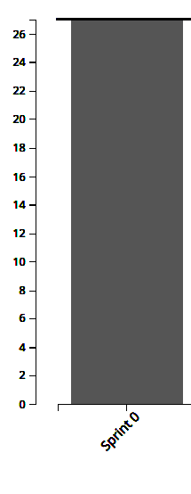
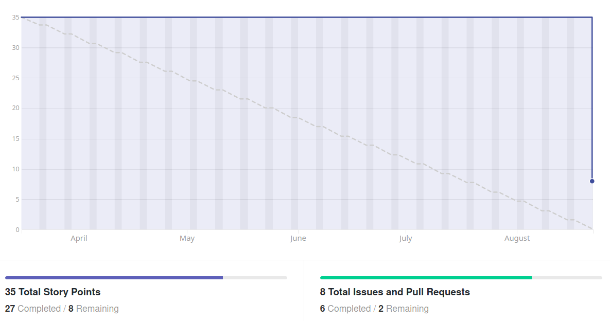

# Análise e Retrospectiva

## 1. Visão Geral
**Número da Sprint:** 0  
**Data de Início:** 18/08/2020  
**Data de Término:** 22/08/2020  
**Duração:** 5 dias  
**Pontos Planejados:** 35 pontos  
**Pontos Entregues:** 27 pontos  
**Membros Presentes:** Todos

## 2. Resultados
1. **História:** [#2 - Create vision document](https://github.com/fga-eps-mds/2020.1-stay-safe-docs/issues/2)  
**Responsáveis:** Lucas, Brenda, Tiago, Hérick, Luiz, Ítalo, Daniel  
**Pontuação:** 8  
**Status:** Não Concluído
2. **História:** [#3 - Python Training](https://github.com/fga-eps-mds/2020.1-stay-safe-docs/issues/3)  
**Responsáveis:** Equipe de desenvolvedores  
**Pontuação:** 5  
**Status:** Concluído
3. **História:** [#4 - Javascript Training](https://github.com/fga-eps-mds/2020.1-stay-safe-docs/issues/4)  
**Responsáveis:** Equipe de desenvolvedores  
**Pontuação:** 5  
**Status:** Concluído
4. **História:** [#5 - Create product and roles roadmap](https://github.com/fga-eps-mds/2020.1-stay-safe-docs/issues/5)  
**Responsáveis:** Renan Schadt, Rossicler Júnior e Sara Silva  
**Pontuação:** 5      
**Status:** Concluído
5. **História:** [#6 - Create template for PRs and issues](https://github.com/fga-eps-mds/2020.1-stay-safe-docs/issues/6)  
**Responsáveis:** Renan Schadt e Sara Silva  
**Pontuação:** 1   
**Status:** Concluído
6. **História:** [#8 - Configure mkdocs](https://github.com/fga-eps-mds/2020.1-stay-safe-docs/issues/8)  
**Responsáveis:** Rossicler Júnior   
**Pontuação:** 8   
**Status:** Concluído
7. **História:** [#9 - Make sprint-0 documents](https://github.com/fga-eps-mds/2020.1-stay-safe-docs/issues/9)  
**Responsáveis:** Renan Schadt  
**Pontuação:** 3   
**Status:** Concluído

## 3. Velocity

## 4. Burndown

## 5. Retrospectiva
### Pontos Positivos:
* O grupo aproveitou o período presencial no início do semestre passado para se conhecer, interagir e começar o planejamento do projeto
* A composição do grupo não foi modificada
* Foi possível manter o tema que havia sido aprovado antes da pandemia
* Parte da equipe treinou linguagens e frameworks durante a quarentena
* Toda equipe motivada para fazer a disciplina 
* MDS gostou da ideia de pareamento 
* Membros de MDS e EPS estão formando laços de amizade <3

### Pontos Negativos:
* Instabilidade e dúvidas em decorrência da pandemia
* Impossibilidade de reuniões presenciais
* Dependência de conexão de internet estável
* Dificuldade pra retomar a confecção de artefatos que começaram a ser feitos 5 meses atrás
* Visão do produto não está homogênea para todos os membros

### Melhorias:
* Reunião de definição e alinhamento a respeito do produto
* Alguns membros vão verificar a possibilidade de trocar de plano de internet

## 6. Quadro de Conhecimentos
Março de 2020:

Agosto de 2020:

## 7. Análise do Scrum Master
### Time
Primeira sprint do projeto marcada pelas turbulências da pandemia, apesar desta a equipe está bem unida, animada para matéria e empolgada com o tema escolhido. 

A maioria dos pontos negativos citados na retrospectiva foge do controle da equipe, só um deles é passível de intervenção (visão de produto não homogênea entre os membros) e para isso uma nova reunião para tratar sobre o produto será marcada com objetivo de coletar mais ideias, propor novas funcionalidades e alinhar a visão de todos os membros a respeito do software que será construído.

### Métricas
Em decorrência da pandemia e do semestre interrompido o **Burndown** da Sprint 0 compreende do mês de Março até o mês Agosto, o que não reflete a realidade, visto que na maior parte desse tempo o projeto estava parado.

O **Velocity** atual da equipe é de 27 pontos, a expectativa é que esse número aumente nas próximas sprints.

A inclusão de dois **Quadros de Conhecimento** foi feita para mostrar a evolução de alguns membros durante a pandemia.

### Histórias
Os treinamentos foram realizados e MDS apresentou mini projetos usando as tecnologias em questão, mostrando compromentimento em aprender as ferramentas que serão usadas ao longo da disciplina.

O **Documento de Visão** está em estado de revisão, uma falha de comunicação entre EPS e MDS fez com que o Pull Request fosse aberto tardiamente, algumas alterações foram solicitadas e estão sendo feitas no documento, a nova previsão de entrega é no início da Sprint 1.

O **Roadmap de Produto** elaborado antes da pandemia foi revisitado e adaptado para as datas atualizadas do semestre. Novas alterações deverão ser feitas na próxima sprint em decorrência da elaboração e priorização do **Product Backlog**.

As demais tarefas são auto-explicativas e ocorreram sem intercorrências.