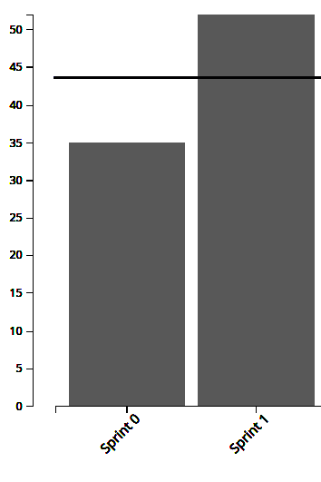
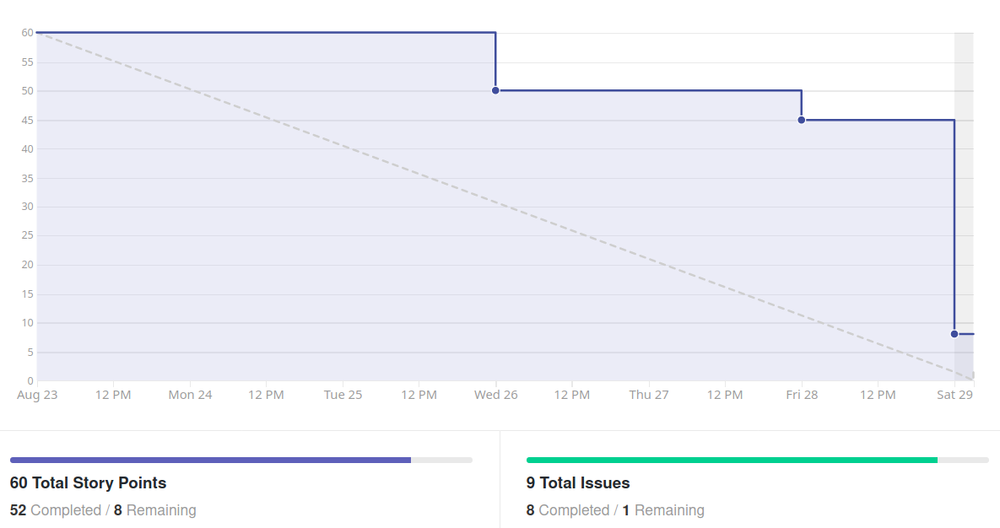

# Análise e Retrospectiva

## 1. Visão Geral
**Número da Sprint:** 1  
**Data de Início:** 23/08/2020  
**Data de Término:** 29/08/2020  
**Duração:** 7 dias  
**Pontos Planejados:** 68 pontos  
**Pontos Entregues:** 60 pontos  
**Dívida Técnica:** 8 pontos  
**Membros Presentes:** Todos

## 2. Resultados
1. **História:** [#1 - Definição de Identidade Visual](https://github.com/fga-eps-mds/2020.1-stay-safe-docs/issues/1)  
**Responsáveis:** Daniel, Ítalo   
**Pontuação:** 8  
**Status:** Concluído 
2. **História:** [#2 - Create vision document](https://github.com/fga-eps-mds/2020.1-stay-safe-docs/issues/2)  
**Responsáveis:** Lucas, Brenda, Tiago, Hérick, Luiz, Ítalo, Daniel  
**Pontuação:** 8  
**Status:** Concluído  
3. **História:** [#11 - Definição de Arquitetura](https://github.com/fga-eps-mds/2020.1-stay-safe-docs/issues/11)  
**Responsáveis:** Sara   
**Pontuação:** 8  
**Status:** Concluído   
4. **História:** [#12 - Treinamento de Flask](https://github.com/fga-eps-mds/2020.1-stay-safe-docs/issues/12)  
**Responsáveis:** Sara  
**Pontuação:** 5  
**Status:** Concluído  
5. **História:** [#14 - Treinamento de React Native](https://github.com/fga-eps-mds/2020.1-stay-safe-docs/issues/14)  
**Responsáveis:** Rossicler  
**Pontuação:** 5  
**Status:** Concluído  
6. **História:** [#15 - Definição da Licença](https://github.com/fga-eps-mds/2020.1-stay-safe-docs/issues/15)  
**Responsáveis:** Renan, Rossicler, Sara    
**Pontuação:** 2  
**Status:** Concluído  
7. **História:** [#16 - Criação do Product Backlog](https://github.com/fga-eps-mds/2020.1-stay-safe-docs/issues/16)  
**Responsáveis:** Renan, Rossicler, Sara   
**Pontuação:** 13  
**Status:** Concluído  
8. **História:** [#17 - Termo de Abertura do Projeto](https://github.com/fga-eps-mds/2020.1-stay-safe-docs/issues/17)  
**Responsáveis:** Renan, Rossicler, Sara     
**Pontuação:** 8  
**Status:** Não Concluído  
9. **História:** [#18 - Documentação de Sprints](https://github.com/fga-eps-mds/2020.1-stay-safe-docs/issues/18)  
**Responsáveis:** Renan     
**Pontuação:** 3  
**Status:** Concluído  
10. **História:** [#19 - Documento de Arquitetura](https://github.com/fga-eps-mds/2020.1-stay-safe-docs/issues/19)  
**Responsáveis:** Lucas, Brenda, Luiz, Tiago, Hérick  
**Pontuação:** 8  
**Status:** Concluído 

## 3. Velocity

## 4. Burndown

## 5. Gráfico de Contribuições

## 6. Retrospectiva
### Pontos Positivos:
* Sprint produtiva, muitos pontos entregues
* Elogio do professor
* Interação do grupo está melhorando
* Atividades entregues dentro do prazo, permitindo revisão e correções com mais calma
* Time solícito na hora de ajudar os colegas
* Capacidade da equipe de contornar uma situação adversa

### Pontos Negativos:
* Alguns membros e/ou familiares tiveram problemas pessoais ou de saúde e não puderam ser tão participativos
* Adaptação ao EAD
* Reuniões extensas e repetitivas
* Alguns membros estão esquecendo das dailies
* Issues criadas tardiamente

### Melhorias:
* Timebox em reuniões
* Configurar bot para lembretes de dailies
* Criar issues na reunião

## 7. Quadro de Conhecimentos

## 8. Análise do Scrum Master
### Time
Segunda sprint do projeto marcada pela melhora na interação geral entre os membros e alta produtividade da equipe. 

Durante a sprint dois membros tiveram problemas de saúde, um deles conseguiu levar suas atividades em um ritmo mais lento e o outro precisou da semana para se recuperar completamente. O time respondeu bem a essa situação e a grande maioria das atividades planejadas foram entregues.

### Métricas
O **Burndown** da Sprint 1 já mostra algumas entregas no meio da sprint, ainda não é o ideal que a equipe espera atingir, mas houve uma melhora significativa em relação a Sprint 0.

O **Velocity** atual da equipe é de 43.5 pontos com duas sprints fechadas e 87 pontos entregues no total. Esperamos que esse número aumente e se estabilize em torno de 50 pontos.

O **Quadro de Conhecimento** da Sprint 1 mostra uma  pequena evolução de conhecimento dos membros em React Native e Flask. Frameworks que foram apresentados em treinamentos durante a sprint.

### Histórias
Os três grandes objetivos da sprint foram definir e documentar a arquitetura e criar o backlog do produto. Estes foram concluídos com sucesso, mas acabaram tomando mais tempo que o esperado e impedindo a equipe de finalizar o **Termo de Abertura do Projeto**, que será levado como dívida técnica para Sprint 2.

A dívida técnica proveniente da Sprint 0 foi concluída ainda no começo da Sprint.

Os treinamentos explicaram o fluxo básico dos frameworks e contaram com participação tanto de EPS como MDS.

As demais tarefas são auto-explicativas e ocorreram sem intercorrências.