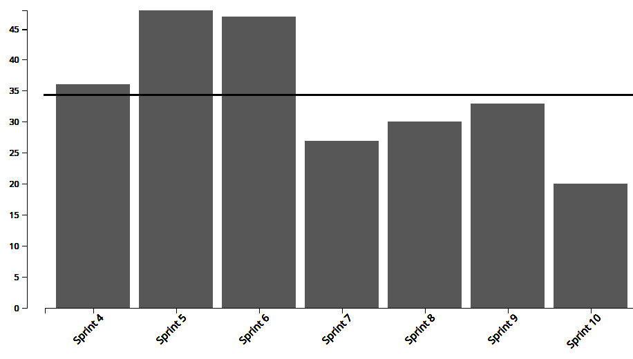
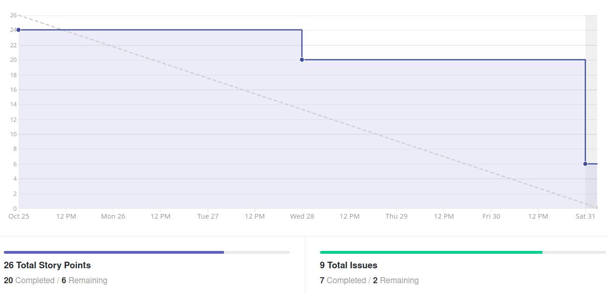
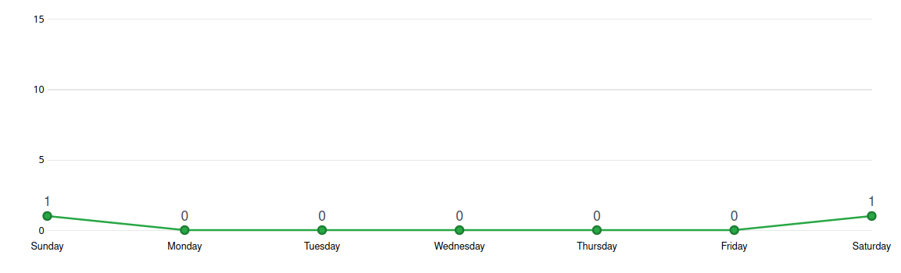
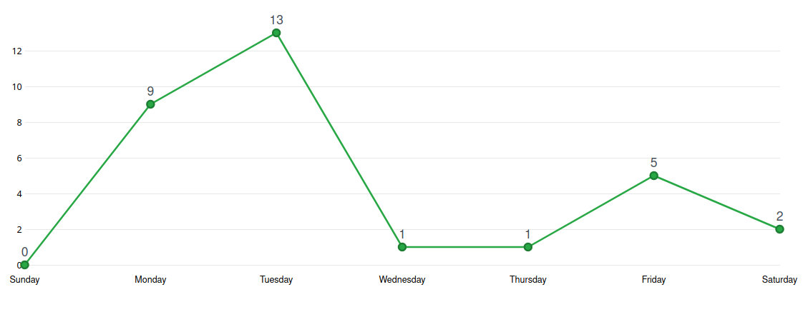
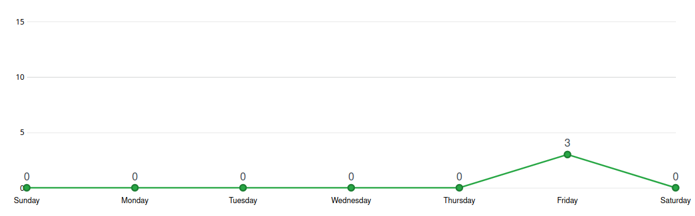
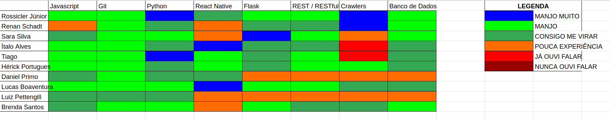

# Análise e Retrospectiva

## 1. Visão Geral
**Número da Sprint:** 10           
**Data de Início:** 25/10/2020     
**Data de Término:** 01/11/2020   
**Duração:** 8 dias  
**Pontos Planejados:** 30 pontos  
**Pontos Entregues:** 26 pontos  
**Dívida Técnica:** 8 pontos  
**Membros Ausentes:** Nenhum    

## 2. Resultados
### 2.1 Repositório Docs      
1. **História:** [#87 - Documentação da Sprint 10](https://github.com/fga-eps-mds/2020.1-stay-safe-docs/issues/87)    
**Responsáveis:** Renan     
**Pontuação:** 3     
**Status:** Concluída  

Uma dívida técnica foi herdada da Sprint 9:  

1. **História:** [#86 - Documentação da Sprint 9](https://github.com/fga-eps-mds/2020.1-stay-safe-docs/issues/86)    
**Responsáveis:** Renan       
**Pontuação:** 3   
**Status:** Concluída   

### 2.2 Repositório Frontend
1. **História:** [#55 - Visualizar localização atual do usuário](https://github.com/fga-eps-mds/2020.1-stay-safe-front-end/issues/55)    
**Responsáveis:** Ítalo        
**Pontuação:** 2        
**Status:** Concluída    
2. **História:** [#57 - Visualizar avaliação de bairro](https://github.com/fga-eps-mds/2020.1-stay-safe-front-end/issues/57)    
**Responsáveis:** Daniel e Brenda      
**Pontuação:** 5      
**Status:** Concluída    
3. **História:** [#58 - Cadastrar avaliação de bairro](https://github.com/fga-eps-mds/2020.1-stay-safe-front-end/issues/58)    
**Responsáveis:** Ítalo e Luiz      
**Pontuação:** 3       
**Status:** Não Concluída         
4. **História:** [#59 - Editar e excluir avaliações de bairro](https://github.com/fga-eps-mds/2020.1-stay-safe-front-end/issues/59)    
**Responsáveis:** Ítalo e Luiz   
**Pontuação:** 3      
**Status:** Não Concluída     

Uma dívida técnica foi herdada da Sprint 9:  

1. **História:** [#52 - Refatorar código para melhorar índices do code-climate](https://github.com/fga-eps-mds/2020.1-stay-safe-front-end/issues/52)    
**Responsáveis:** Rossicler    
**Pontuação:** 2        
**Status:** Não Concluída     

### 2.3 Repositório User-Service
1. **História:** [#37 - Adaptar a model de avaliação para novo modelo](https://github.com/fga-eps-mds/2020.1-stay-safe-user-service/issues/37)    
**Responsáveis:** Tiago    
**Pontuação:** 3    
**Status:** Concluída  
2. **História:** [#38 - Implementar melhorias de segurança na API de usuário](https://github.com/fga-eps-mds/2020.1-stay-safe-user-service/issues/38)    
**Responsáveis:** Sara     
**Pontuação:** 2      
**Status:** Concluída  
3. **História:** [#39 - Implementar CRUD de local favorito](https://github.com/fga-eps-mds/2020.1-stay-safe-user-service/issues/39)    
**Responsáveis:** Lucas e Hérick       
**Pontuação:** 3     
**Status:** Concluída  
4. **História:** [#40 - Implementar filtro de bairro para cidade e estado](https://github.com/fga-eps-mds/2020.1-stay-safe-user-service/issues/40)    
**Responsáveis:** Tiago         
**Pontuação:** 2       
**Status:** Concluída  

Uma dívida técnica foi herdada da Sprint 9:  

1. **História:** [#32 - Refatorar código para melhorar índices do code-climate](https://github.com/fga-eps-mds/2020.1-stay-safe-user-service/issues/32)    
**Responsáveis:** Rossicler     
**Pontuação:** 1    
**Status:** Concluída   

### 2.4 Repositório Secretary-Service

Uma dívida técnica foi herdada da Sprint 9:  

1. **História:** [#33 - Refatorar código para melhorar índices do code-climate](https://github.com/fga-eps-mds/2020.1-stay-safe-secretary-service/issues/33)    
**Responsáveis:** Rossicler        
**Pontuação:** 2    
**Status:** Concluída  

## 3. Velocity

## 4. Burndown

### 4.1 Burndown Review/QA

## 5. Gráfico de Contribuições

### 5.1 Contribuições na Documentação

### 5.2 Contribuições no Frontend

### 5.3 Contribuições no User-Service

### 5.4 Contribuições no Secretary-Service

## 6. Retrospectiva
### Pontos Positivos
* Alta cobertura de testes nos dois repositórios backend
* Membros de MDS se ajudando para desenvolver as tarefas da sprint

### Pontos Negativos
* Outros compromissos fora da disciplina
* Problemas relacionados a saúde na família
* Membro sem acesso a celular Android para testar aplicativo
* Demora para avaliar alguns PRs

### Melhorias
* Mais agilidade para avaliar os PRs
* Não colocar membros sem acesso a celular Android em issues de frontend

## 7. Quadro de Conhecimentos

## 8. Análise do Scrum Master
### Time
Décima primeira sprint do projeto, com planejamento inicial de 30 pontos e final de 34 pontos, dos quais 8 não foram entregues. A sprint durou um dia a mais do que o normal sendo finalizada no Domingo, a maior parte da equipe esteve bem ocupada durante a semana e alguns PRs estavam aguardando pequenas correções para serem aprovados, somado a isso o merge foi um pouco mais lento devido ao número maior de conflitos do que o habitual. De forma a não ser injusto com o trabalho desenvolvido pelo grupo e manter elevado o empenho do time a decisão acima foi tomada.

Foi observada uma quantidade menor de pontos citados na retrospectiva, que é normal depois do grupo estar trabalhando junto a quase 3 meses, entre os pontos negativos citados a maioria foge do controle da equipe, no que está ao nosso alcance foram sugeridas melhorias. 

### Métricas
Na Sprint 10 foram concluídos 26 pontos dos 30 planejados inicialmente e 34 planejados totais, o **Velocity** atual da equipe é de 35 pontos com dez sprints fechadas e 424 pontos entregues no total. Nessa sprint e nas duas anteriores foi notada uma queda na pontuação planejada da equipe que resulta em uma queda no Velocity, isso é devido aos membros de EPS dando mais atenção a demandas não pontuadas (como revisão de PRs, criação e descrição de issues, auxílio a MDS no desenvolvimento das tarefas) em oposição a demandas pontuadas (documentação, configuração de ambiente), é normal a redução de pontuação nas sprints pós R1.

O **Burndown** da Sprint 10 mostra que nessa sprint algumas tarefas não foram finalizadas com antecedência e outras ficaram como dívidas técnicas, o Burndown considerando a fase de Review/QA mostra a demora para aprovar alguns Pull Requests que foi citada na retrospectiva. 

Os **Históricos de Contribuição** apresentam padrões diferentes em cada repositório: no repositório de documentação contribuições no Sábado e Domingo são normais devido a documentação da sprint, no serviço secretaria só uma história foi feita nessa sprint gerando uma quantidade baixa de commits, as histórias no user-service começaram com antecedência enquanto no frontend começaram mais tarde. 

O **Quadro de Conhecimento** apresenta a evolução de alguns membros no conhecimento de Python, Flask e padrão REST.

### Histórias
Entre os pontos adicionados dois são referentes a uma nova demanda para **Implementar filtro de bairro para cidade e estado** e outros dois relacionados a **Visualizar localização atual do usuário**, ambas tarefas foram finalizadas.

Quatro dívidas técnicas foram herdadas da sprint anterior, três delas foram concluídas restando somente a tarefa de **Refatorar código para melhorar índices do code-climate** no frontend. Duas novas dívidas foram adicionadas essa sprint, os membros executores dessas tarefas tiveram uma semana cheia de compromissos e não conseguiram focar nas demandas do projeto, a próxima sprint será planejada levando as dívidas em consideração.

Nenhuma tarefa nova foi alocada para o secretary-service, com a atividade de **Implementar CRUD de local favorito** concluída é esperado que nas próximas sprints ocorra algo semelhante com o user-service. As funcionalidades principais desses dois repositórios estão feitas, a equipe agora pretende focar em ajustar essas APIs a pequenas regras de negócio previamente definidas, além de buscar meios para realizar pequenas melhorias em termos de manutenibilidade, desempenho, cobertura de testes, entre outros.

As demais tarefas são auto-explicativas e ocorreram sem intercorrências.

## Riscos
Entre os riscos monitorados pelo grupo os que ocorreram na sprint foram:

* Divergência de horários entre membros da equipe
* Ausência de membros durante reuniões do grupo
* Conflito de dependência entre atividades 
* Conflito com outras disciplinas
* Erros durante o planejamento das atividades
* Problemas pessoais ou de saúde relacionados a pandemia da COVID-19

Os riscos eram esperados no planejamento e foi possível realizar algumas ações preventivas e reativas.