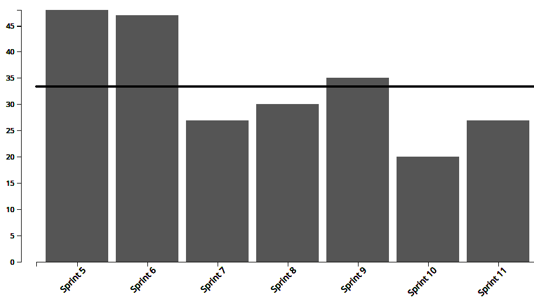
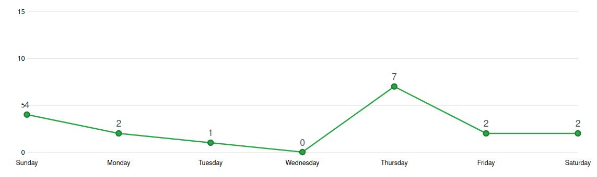
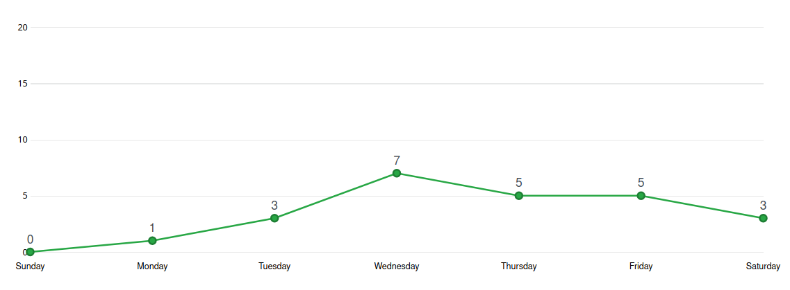
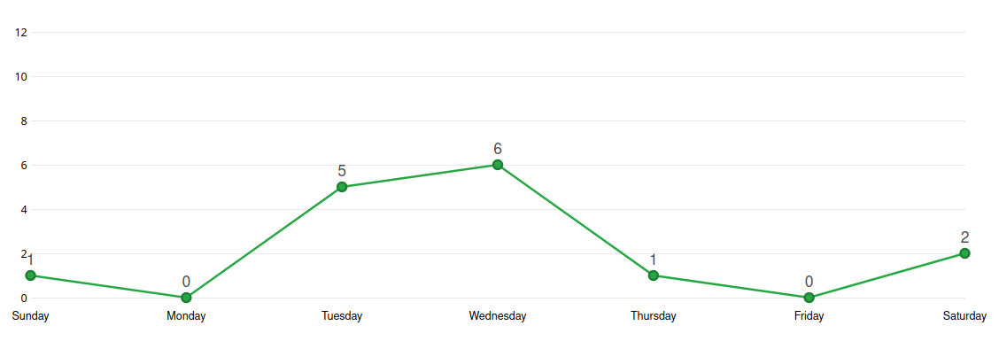
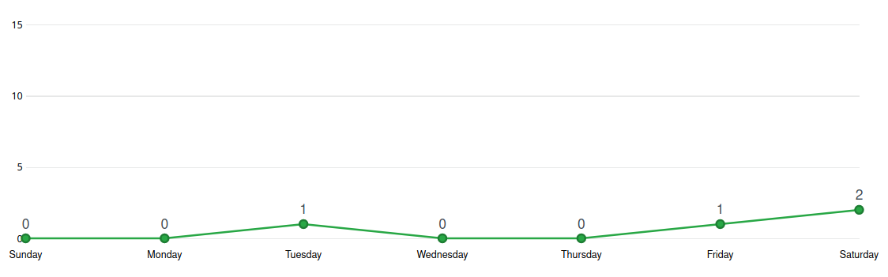
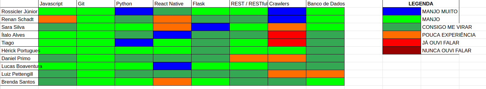

# Análise e Retrospectiva

## 1. Visão Geral
**Número da Sprint:** 11             
**Data de Início:** 01/11/2020     
**Data de Término:** 07/11/2020   
**Duração:** 7 dias  
**Pontos Planejados:** 40 pontos  
**Pontos Entregues:** 29 pontos  
**Dívida Técnica:** 14 pontos  
**Membros Ausentes:** Nenhum    

## 2. Resultados
### 2.1 Repositório Docs      
1. **História:** [#89 - Projetar teste de aceitação](https://github.com/fga-eps-mds/2020.1-stay-safe-docs/issues/89)    
**Responsáveis:** Brenda, Sara, Renan e Rossicler      
**Pontuação:** 3   
**Status:** Concluída   
2. **História:** [#91 - Documentação da Sprint 11](https://github.com/fga-eps-mds/2020.1-stay-safe-docs/issues/91)    
**Responsáveis:** Renan     
**Pontuação:** 3     
**Status:** Concluída 

### 2.2 Repositório Frontend
1. **História:** [#62 - Inserir coordenadas do mapa de SP de maneira estática](https://github.com/fga-eps-mds/2020.1-stay-safe-front-end/issues/62)    
**Responsáveis:** Lucas    
**Pontuação:** 3     
**Status:** Concluída 
2. **História:** [#63 - Implementar telas de carregamento](https://github.com/fga-eps-mds/2020.1-stay-safe-front-end/issues/63)    
**Responsáveis:** Lucas     
**Pontuação:** 2      
**Status:** Concluída  
3. **História:** [#65 - Criar, editar e deletar lugares favoritos](https://github.com/fga-eps-mds/2020.1-stay-safe-front-end/issues/65)    
**Responsáveis:** Daniel e Hérick     
**Pontuação:** 5     
**Status:** Concluída 
4. **História:** [#67 - Adicionar informação sobre as funcionalidades](https://github.com/fga-eps-mds/2020.1-stay-safe-front-end/issues/67)    
**Responsáveis:** Ítalo e Luiz   
**Pontuação:** 3      
**Status:** Não Concluída   
5. **História:** [#69 - Configurar Sonarqube](https://github.com/fga-eps-mds/2020.1-stay-safe-front-end/issues/69)    
**Responsáveis:** Rossicler     
**Pontuação:** 1      
**Status:** Concluída  

Três dívidas técnicas foram herdadas da Sprint 10:  

1. **História:** [#52 - Refatorar código para melhorar índices do code-climate](https://github.com/fga-eps-mds/2020.1-stay-safe-front-end/issues/52)    
**Responsáveis:** Rossicler    
**Pontuação:** 2        
**Status:** Concluída 
2. **História:** [#58 - Cadastrar avaliação de bairro](https://github.com/fga-eps-mds/2020.1-stay-safe-front-end/issues/58)    
**Responsáveis:** Ítalo e Luiz      
**Pontuação:** 3      
**Status:** Não Concluída      
3. **História:** [#59 - Editar e excluir avaliações de bairro](https://github.com/fga-eps-mds/2020.1-stay-safe-front-end/issues/59)    
**Responsáveis:** Ítalo e Luiz   
**Pontuação:** 3     
**Status:** Não Concluída   
   
### 2.3 Repositório User-Service
1. **História:** [#46 - Aumentar cobertura de testes](https://github.com/fga-eps-mds/2020.1-stay-safe-user-service/issues/46)    
**Responsáveis:** Lucas      
**Pontuação:** 3    
**Status:** Concluída 
2. **História:** [#49 - Adicionar campo de nome a model de lugar favorito](https://github.com/fga-eps-mds/2020.1-stay-safe-user-service/issues/49)    
**Responsáveis:** Daniel e Hérick       
**Pontuação:** 2      
**Status:** Concluída 
3. **História:** [#50 - Implementar regras de negócio relacionadas a ocorrência](https://github.com/fga-eps-mds/2020.1-stay-safe-user-service/issues/50)    
**Responsáveis:** Tiago        
**Pontuação:** 3    
**Status:** Concluída 
4. **História:** [#51 - Configurar ambiente de homologação](https://github.com/fga-eps-mds/2020.1-stay-safe-user-service/issues/51)    
**Responsáveis:** Rossicler        
**Pontuação:** 3   
**Status:** Não Concluída 
5. **História:** [#54 - Configurar Sonarqube](https://github.com/fga-eps-mds/2020.1-stay-safe-user-service/issues/54)    
**Responsáveis:** Rossicler        
**Pontuação:** 1        
**Status:** Concluída 

### 4.4 Repositório Secretary-Service
1. **História:** [#40 - Configurar ambiente de homologação](https://github.com/fga-eps-mds/2020.1-stay-safe-secretary-service/issues/40)    
**Responsáveis:** Rossicler        
**Pontuação:** 2      
**Status:** Não Concluída  
2. **História:** [#41 - Configurar Sonarqube](https://github.com/fga-eps-mds/2020.1-stay-safe-secretary-service/issues/41)    
**Responsáveis:** Rossicler        
**Pontuação:** 1        
**Status:** Concluída    

## 3. Velocity

## 4. Burndown

### 4.1 Burndown Review/QA

## 5. Gráfico de Contribuições

### 5.1 Contribuições na Documentação

### 5.2 Contribuições no Frontend

### 5.3 Contribuições no User-Service

### 5.4 Contribuições no Secretary-Service

## 6. Retrospectiva
### Pontos Positivos
* Pontuação mais fidedigna
* Falta um mês pra acabar o semestre 

### Pontos Negativos
* Demora pra avaliar os PRs
* Algumas issues foram criadas tardiamente
* Falta de feedback
* Demanda do sonarqube atrasou uma entrega da sprint
* Falta um mês pra acabar o semestre 

### Melhorias
* Criar todas as issues no começo da sprint
* Ser mais ágil para avaliar os PRs

## 7. Quadro de Conhecimentos

## 8. Análise do Scrum Master
### Time
Décima segunda sprint do projeto, com planejamento inicial de 40 pontos e final de 43 pontos, dos quais 14 não foram entregues. As dívidas ocorreram por alguns motivos: novas issues inseridas no planejamento, problemas com a estação de trabalho e conflito com outras disciplinas. O grupo pretende focar em resolver essas dívidas logo no começo da próxima sprint, pois finalizá-las é essencial para o teste de aceitação. 

Foi observada uma quantidade menor de pontos citados na retrospectiva, que é normal depois do grupo estar trabalhando junto há quase 3 meses, entre os pontos negativos citados a maioria foge do controle da equipe, no que está ao nosso alcance foram sugeridas melhorias. 

É notável que o ritmo da disciplina acaba por esgotar os times a medida que a Release 2 se aproxima, já visando esse cenário o Roadmap do Produto prevê menos atividades nas últimas sprints e um foco maior em possíveis refatorações de forma a permitir que a equipe trabalhe com uma carga horária levemente menor nas sprints finais.

### Métricas
Na Sprint 11 foram concluídos 29 pontos dos 40 planejados inicialmente e 43 planejados totais, o **Velocity** atual da equipe é de 34 pontos com doze sprints fechadas e 453 pontos entregues no total. 

O **Burndown** da Sprint 11 mostra que nessa sprint algumas tarefas não foram finalizadas com antecedência e outras ficaram como dívidas técnicas, o Burndown considerando a fase de Review/QA mostra a demora para aprovar alguns Pull Requests que foi citada na retrospectiva. 

Os **Históricos de Contribuição** apresentam um pico de commits no meio da sprint que vai decaindo a medida que ela se encerra, é um bom comportamento para um histórico de contribuição, uma única crítica seria a baixa quantidade de commits no começo da sprint, o time precisa melhorar nesse aspecto.

O **Quadro de Conhecimento** apresenta a evolução de alguns membros no conhecimento de React Native, Python, Flask e padrão REST.

### Histórias
Os três pontos adicionados sobre o planejamento inicial são referentes a uma nova demanda para **Configurar Sonarqube** nos três repositórios de código do grupo.

A tarefa de **Adicionar informação sobre as funcionalidades** ficou como dívida técnica devido a problemas da dupla para rodar o ambiente de secretaria, por esse motivo não conseguiram inserir as legendas necessárias nas funcionalidades de mapa de calor. Essa issue vai ser repassada a um membro que está com o ambiente funcionando corretamente e enquanto isso investigaremos o problema ocorrido.

As tarefas de **Cadastrar avaliação de bairro** e **Editar e excluir avaliações de bairro** continuam como dívidas técnicas, o Pull Request de ambas foi criado, mas foram encontrados alguns problemas na hora de avaliar as características relacionadas aos bairros, esse problema se aplica tanto ao cadastro como edição, portanto ambas continuam como dívidas, tentaremos solucionar essas tarefas o mais rápido possível para realizar o teste de aceitação.

As tarefas de **Inserir coordenadas do mapa de SP de maneira estática** e **Implementar telas de carregamento** melhoraram muito a usabilidade do aplicativo, a primeira fez com que o tempo para renderizar o mapa de calor de SP fosse reduzido drasticamente e a segunda tarefa foca em melhorar a [Visibilidade do Status do Sistema](https://www.nngroup.com/articles/ten-usability-heuristics/).

Como foi documentado no [review da sprint anterior](https://fga-eps-mds.github.io/2020.1-stay-safe-docs/sprints/sprint-10/sprint10-review/) as tarefas do user service agora passam a ser pequenas modificações, melhorias ou implementação de regras de negócio. Inseridas nessa lógica algumas tarefas da sprint foram: **Implementar regras de negócio relacionadas a ocorrência**,  **Aumentar cobertura de testes** e **Adicionar campo de nome a model de lugar favorito**.

As demais tarefas são auto-explicativas e ocorreram sem intercorrências.

## Riscos
Entre os riscos monitorados pelo grupo os que ocorreram na sprint foram:

* Divergência de horários entre membros da equipe
* Ausência de membros durante reuniões do grupo
* Conflito de dependência entre atividades 
* Conflito com outras disciplinas
* Erros durante o planejamento das atividades

Os riscos eram esperados no planejamento e foi possível realizar algumas ações preventivas e reativas.