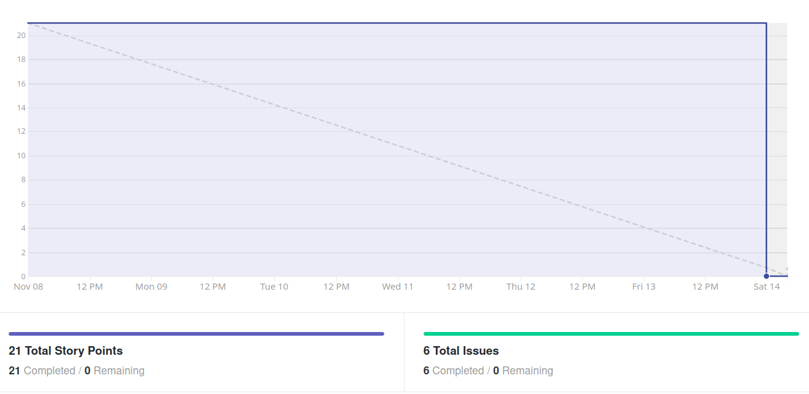
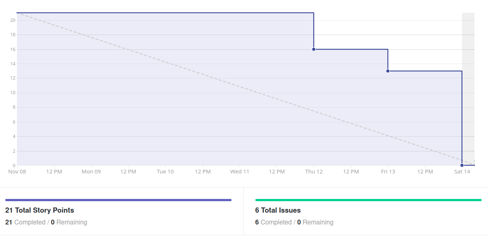
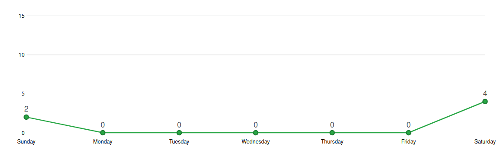
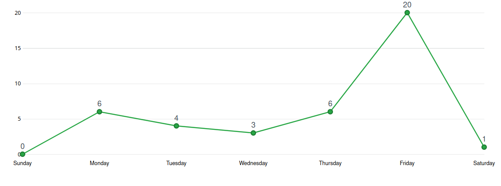
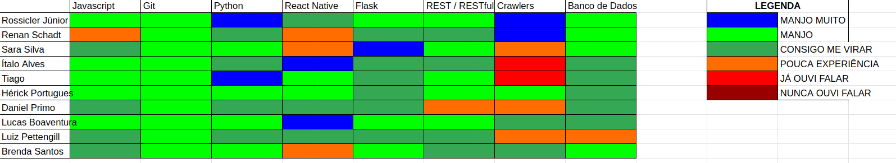

# Análise e Retrospectiva

## 1. Visão Geral
**Número da Sprint:** 12               
**Data de Início:** 08/11/2020     
**Data de Término:** 14/11/2020   
**Duração:** 7 dias  
**Pontos Planejados:** 35 pontos  
**Pontos Entregues:** 27 pontos  
**Dívida Técnica:** 8 pontos  
**Membros Ausentes:** Luiz Pettengill      

## 2. Resultados
### 2.1 Repositório Docs      
1. **História:** [#93 - Realizar testes de aceitação](https://github.com/fga-eps-mds/2020.1-stay-safe-docs/issues/93)    
**Responsáveis:** Brenda e Tiago    
**Pontuação:** 5  
**Status:** Concluída         
2. **História:** [#95 - Documentação da Sprint 12](https://github.com/fga-eps-mds/2020.1-stay-safe-docs/issues/95)    
**Responsáveis:** Renan     
**Pontuação:** 3     
**Status:** Não Concluída         

### 2.2 Repositório Frontend
1. **História:** [#73 - Implementar tela de pesquisa](https://github.com/fga-eps-mds/2020.1-stay-safe-front-end/issues/73)    
**Responsáveis:** Daniel e Luiz      
**Pontuação:** 5     
**Status:** Não Concluída         
2. **História:** [#74 - Configurar sistema de notificação](https://github.com/fga-eps-mds/2020.1-stay-safe-front-end/issues/74)    
**Responsáveis:** Ítalo e Lucas    
**Pontuação:** 3       
**Status:** Concluída      
3. **História:** [#75 - Ajustar fluxo de avaliação de bairro](https://github.com/fga-eps-mds/2020.1-stay-safe-front-end/issues/75)    
**Responsáveis:** Hérick     
**Pontuação:** 3      
**Status:** Concluída     
  

Três dívidas técnicas foram herdadas de sprints anteriores:  

1. **História:** [#58 - Cadastrar avaliação de bairro](https://github.com/fga-eps-mds/2020.1-stay-safe-front-end/issues/58)    
**Responsáveis:** Ítalo e Luiz      
**Pontuação:** 3         
**Status:** Concluída           
2. **História:** [#59 - Editar e excluir avaliações de bairro](https://github.com/fga-eps-mds/2020.1-stay-safe-front-end/issues/59)    
**Responsáveis:** Ítalo e Luiz   
**Pontuação:** 3      
**Status:** Concluída         
3. **História:** [#67 - Adicionar informação sobre as funcionalidades](https://github.com/fga-eps-mds/2020.1-stay-safe-front-end/issues/67)    
**Responsáveis:** Ítalo e Luiz   
**Pontuação:** 3    
**Status:** Concluída         
   
### 2.3 Repositório User-Service
1. **História:** [#56 - Adicionar campos de notificação a model de usuário](https://github.com/fga-eps-mds/2020.1-stay-safe-user-service/issues/56)    
**Responsáveis:** Ítalo e Lucas         
**Pontuação:** 2     
**Status:** Concluída         

Uma dívida técnica foi herdada de sprints anteriores: 

1. **História:** [#51 - Configurar ambiente de homologação e produção](https://github.com/fga-eps-mds/2020.1-stay-safe-user-service/issues/51)    
**Responsáveis:** Rossicler        
**Pontuação:** 3   
**Status:** Concluída    

### 2.4 Repositório Secretary-Service
Uma dívida técnica foi herdada de sprints anteriores: 

1. **História:** [#40 - Configurar ambiente de homologação e produção](https://github.com/fga-eps-mds/2020.1-stay-safe-secretary-service/issues/40)    
**Responsáveis:** Rossicler        
**Pontuação:** 2      
**Status:** Concluída         

## 3. Velocity

## 4. Burndown

### 4.1 Burndown Review/QA

## 5. Gráfico de Contribuições

### 5.1 Contribuições na Documentação

### 5.2 Contribuições no Frontend

## 6. Retrospectiva

### Pontos Positivos
* Identificação de pontos problemáticos da aplicação e propostas de refatoração
* Boa comunicação
* Discussão sobre o produto
* Excelente trabalho da Brenda e do Tiago ao realizar os testes de aceitação
* Através dos testes de aceitação o grupo teve a certeza do valor do produto
* Comprometimento do time de MDS em ajudar uns aos outros

### Pontos Negativos
* Algumas mudanças sugeridas não agradaram tanto o time

## 7. Quadro de Conhecimentos

## 8. Análise do Scrum Master
### Time
Décima terceira sprint do projeto, dedicada em grande parte a solucionar dívidas herdadas das sprints anteriores, seu objetivo foi cumprido e as cinco tarefas que estavam como dívida no review da sprint 11 foram entregues.

Foi observada uma quantidade menor de pontos citados na retrospectiva, que é normal depois do grupo estar trabalhando junto há quase 3 meses, a maior parte dos pontos positivos citados foi relacionado ao teste de aceitação.

É notável que o ritmo da disciplina acaba por esgotar os times a medida que a Release 2 se aproxima, já visando esse cenário o Roadmap do Produto prevê menos atividades nas últimas sprints e um foco maior em possíveis refatorações de forma a permitir que a equipe trabalhe com uma carga horária levemente menor nas sprints finais.

### Métricas
Na Sprint 12 foram concluídos 27 pontos dos 35 planejados, o **Velocity** atual da equipe é de 34 pontos com treze sprints fechadas e 480 pontos entregues no total. 

O **Burndown** da Sprint 12 mostra que nessa sprint as tarefas não foram finalizadas com antecedência e outras ficaram como dívidas técnicas, o Burndown considerando a fase de Review/QA mostra a demora para aprovar alguns Pull Requests.

Passamos a exibir só os **Históricos de Contribuição** dos repositórios mais relevantes na sprint, isso foi feito para evitar tomar espaço do documento com repositórios onde só estão sendo feitas pequenas atualizações em pouquissímos commits, nos repositórios de maior trabalho o comportamento notado foi de pico de commits na Sexta, véspera de fechamento da sprint, o que indica trabalho tardio.

O **Quadro de Conhecimento** não demonstrou evolução de conhecimento dos membros nessa sprint.

Os gráficos de **Burndown** e **Velocity** não são completamente representativos pois mostram que todas atividades foram entregues, o que não é a realidade, isso ocorreu pois eles foram capturados tardiamente, depois que as dívidas da sprint foram entregues.

### Histórias
A tarefa de **Realizar testes de aceitação** foi executada e deu ao grupo feedbacks valiosos para melhorar o produto, documentos foram criados para ilustrar [planejamento](https://fga-eps-mds.github.io/2020.1-stay-safe-docs/produto/Testes_de_Aceita%C3%A7%C3%A3o/planning/) e [resultados](https://fga-eps-mds.github.io/2020.1-stay-safe-docs/produto/Testes_de_Aceita%C3%A7%C3%A3o/results/) dos testes.

As tarefas de **Adicionar informação sobre as funcionalidades**, **Cadastrar avaliação de bairro** e **Editar e excluir avaliações de bairro** que estavam como dívidas foram resolvidas, alocamos mais membros de MDS para ajudar na finalização rápida dessas tarefas para realização dos testes de aceitação.

As tarefas de **Configurar sistema de notificação** e **Adicionar campos de notificação a model de usuário** realizam uma notificação de boas-vindas a um novo usuário que se cadastra no aplicativo, as tarefas foram concluídas com sucesso e agora vamos partir pras notificações específicas do nosso produto. 

A tarefa de **Ajustar fluxo de avaliação de bairro** foi concluída e melhorou muito a clareza e usabilidade ao fazer ou visualizar a avaliação de um bairro.

A tarefa de **Implementar tela de pesquisa** acabou ficando como dívida devido a sua complexidade e a falta de comprometimento de um dos membros da dupla.

As demais tarefas são auto-explicativas e ocorreram sem intercorrências.

## Riscos
Entre os riscos monitorados pelo grupo os que ocorreram na sprint foram:

* Divergência de horários entre membros da equipe
* Ausência de membros durante reuniões do grupo
* Conflito de dependência entre atividades 
* Conflito com outras disciplinas
* Erros durante o planejamento das atividades

Os riscos eram esperados no planejamento e foi possível realizar algumas ações preventivas e reativas.