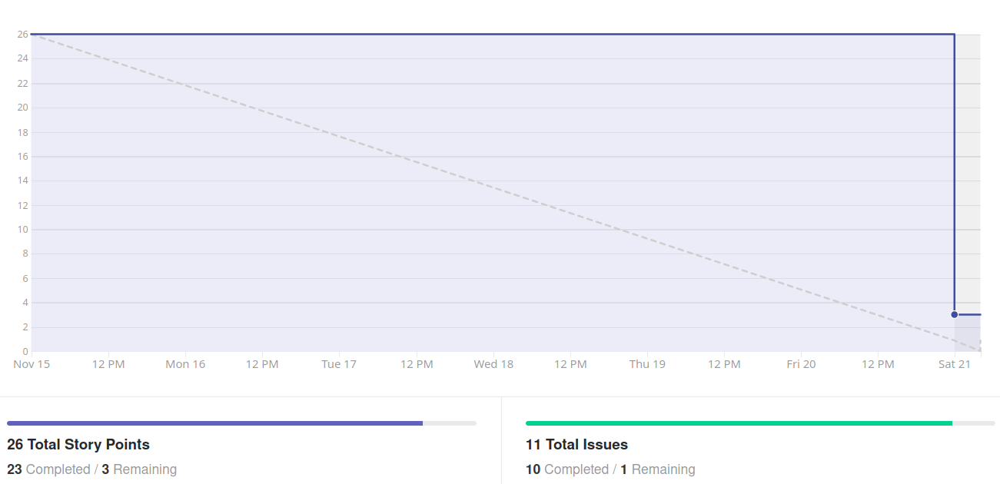
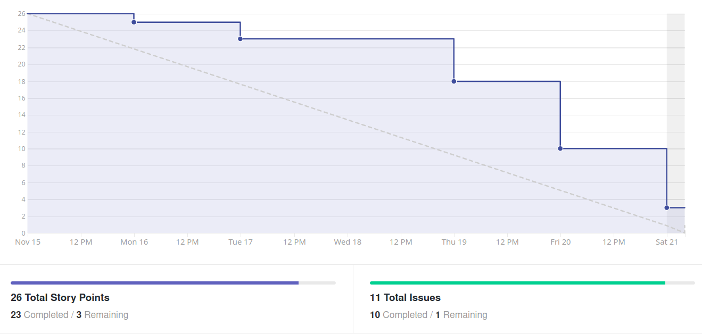
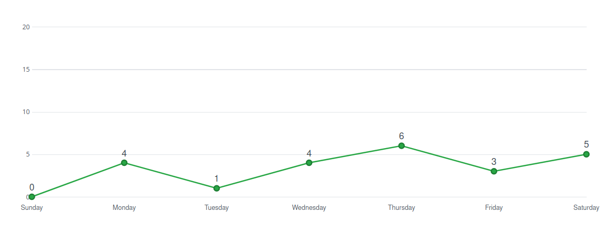

# Análise e Retrospectiva

## 1. Visão Geral
**Número da Sprint:** 13                 
**Data de Início:** 15/11/2020     
**Data de Término:** 21/11/2020   
**Duração:** 7 dias  
**Pontos Planejados:** 34 pontos  
**Pontos Entregues:** 21 pontos  
**Dívida Técnica:** 13 pontos  
**Membros Ausentes:** Luiz Pettengill      

## 2. Resultados
### 2.1 Repositório Docs      
1. **História:** [#97 - Documentação da Sprint 13](https://github.com/fga-eps-mds/2020.1-stay-safe-docs/issues/97)    
**Responsáveis:** Renan     
**Pontuação:** 3    
**Status:** Não Concluída   

Uma dívida técnica foi herdada de sprints anteriores:  

1. **História:** [#95 - Documentação da Sprint 12](https://github.com/fga-eps-mds/2020.1-stay-safe-docs/issues/95)    
**Responsáveis:** Renan     
**Pontuação:** 3    
**Status:** Não Concluída   

### 2.2 Repositório Frontend
1. **História:** [#82 - Melhorar comunicação com usuário](https://github.com/fga-eps-mds/2020.1-stay-safe-front-end/issues/82)    
**Responsáveis:** Luiz      
**Pontuação:** 2       
**Status:** Não Concluída   
2. **História:** [#83 - Repartir componente do mapa em dois](https://github.com/fga-eps-mds/2020.1-stay-safe-front-end/issues/83)    
**Responsáveis:** Lucas e Ítalo       
**Pontuação:** 5          
**Status:** Concluída   
3. **História:** [#84 - Padronizar botões e mensagens de erro](https://github.com/fga-eps-mds/2020.1-stay-safe-front-end/issues/84)    
**Responsáveis:** Daniel e Hérick     
**Pontuação:** 3      
**Status:** Concluída    

Uma dívida técnica foi herdada de sprints anteriores:  

1. **História:** [#73 - Implementar tela de pesquisa](https://github.com/fga-eps-mds/2020.1-stay-safe-front-end/issues/73)    
**Responsáveis:** Daniel e Hérick       
**Pontuação:** 5     
**Status:** Concluída   
   
### 2.3 Repositório User-Service
1. **História:** [#58 - Configurar ambiente de produção](https://github.com/fga-eps-mds/2020.1-stay-safe-user-service/issues/58)    
**Responsáveis:** Rossicler      
**Pontuação:** 1    
**Status:** Concluída   
2. **História:** [#59 - Inserir CD na pipeline](https://github.com/fga-eps-mds/2020.1-stay-safe-user-service/issues/59)    
**Responsáveis:** Rossicler        
**Pontuação:** 3        
**Status:** Não Concluída   
3. **História:** [#60 - Melhorar mensagens para tratamento de erros](https://github.com/fga-eps-mds/2020.1-stay-safe-user-service/issues/60)    
**Responsáveis:** Tiago e Brenda        
**Pontuação:** 3    
**Status:** Concluída   
4. **História:** [#61 - Alterar nomes de alguns tipos de crimes](https://github.com/fga-eps-mds/2020.1-stay-safe-user-service/issues/61)    
**Responsáveis:** Tiago e Brenda          
**Pontuação:** 1       
**Status:** Concluída   

### 2.4 Repositório Secretary-Service
1. **História:** [#43 - Configurar ambiente de produção](https://github.com/fga-eps-mds/2020.1-stay-safe-secretary-service/issues/43)    
**Responsáveis:** Rossicler   
**Pontuação:** 1    
**Status:** Concluída     
2. **História:** [#44 - Inserir CD na pipeline](https://github.com/fga-eps-mds/2020.1-stay-safe-secretary-service/issues/44)    
**Responsáveis:** Rossicler    
**Pontuação:** 2    
**Status:** Não Concluída       
3. **História:** [#45 - Alterar nomes de alguns tipos de crimes](https://github.com/fga-eps-mds/2020.1-stay-safe-secretary-service/issues/45)    
**Responsáveis:** Tiago e Brenda          
**Pontuação:** 2   
**Status:** Concluída       

## 3. Velocity

## 4. Burndown

### 4.1 Burndown Review/QA

## 5. Gráfico de Contribuições

### 5.1 Contribuições no Frontend

## 6. Retrospectiva

### Pontos Positivos
* Feedback positivo da R1 
* Semestre está acabando
* Não há necessidade de alterações bruscas no trabalho que o grupo já vem fazendo

### Pontos Negativos
* Decisões de interface tomadas tardiamente 

### Melhorias
* Amadurecer a interface antes de executar as histórias não cobertas pelo protótipo

## 7. Quadro de Conhecimentos

## 8. Análise do Scrum Master
### Time
Décima quarta sprint do projeto, dedicada principalmente a resolver inconsistências apontadas nos testes de aceitação e realizar as atividades finais de DevOps do projeto. 

Foi observada uma quantidade menor de pontos citados na retrospectiva, que é normal depois do grupo estar trabalhando junto há quase 3 meses, esperamos que o feedback positivo da R1 dê ao grupo gás necessário nessa reta final do projeto.

Uma das atividades da semana foi planejada sem executor, nós tomamos essa medida por conta da falta de comprometimento de um membro específico com o projeto e a dificuldade do grupo em parear com ele. O aviso repassado sobre essa tarefa foi que quem estava disponível poderia executar a história, podendo ser esse membro citado que estava sem issue ou algum outro que finalizou a sua tarefa na semana. Observamos uma mudança de atitude nessa sprint do membro citado ao tomarmos essa medida mais rigorosa.

### Métricas
Na Sprint 13 foram concluídos 21 pontos dos 34 planejados, o **Velocity** atual da equipe é de 33 pontos com catorze sprints fechadas e 501 pontos entregues no total. 

O **Burndown** da Sprint 13 mostra que nessa sprint as tarefas não foram finalizadas com antecedência e outras ficaram como dívidas técnicas, o Burndown considerando a fase de Review/QA mostra a demora para aprovar os Pull Requests.

Passamos a exibir só os **Históricos de Contribuição** dos repositórios mais relevantes na sprint, isso foi feito para evitar tomar espaço do documento com repositórios onde só estão sendo feitas pequenas atualizações em pouquissímos commits, no repositório de maior trabalho o comportamento notado foi de um número estável de contribuições durante a semana, que é o comportamento esperado.

O **Quadro de Conhecimento** apresenta a evolução de alguns membros no conhecimento do padrão REST.

Os gráficos de **Burndown** e **Velocity** não são completamente representativos pois mostram que todas atividades foram entregues, o que não é a realidade, isso ocorreu pois eles foram capturados tardiamente, depois que as dívidas da sprint foram entregues.

### Histórias
Duas histórias do Backlog do Produto tiveram sua prioridade reduzida em acordo feito pelo grupo e não serão feitas dentro do escopo da disciplina, são elas: **Visualizar avaliação de bairros através de mapa de calor** e **Ser notificado quando um crime ocorre próximo ao meu local atual**. Nos deparamos com uma limitação técnica ao realizar a primeira história (a dificuldade de se obter coordenadas para delimitar um bairro) e a segunda história também apresenta certa dificuldade técnica sem entregar grande valor ao produto (tanto que sua prioridade já era baixa), acreditamos que vamos adicionar mais valor ao produto a curto prazo melhorando sua usabilidade ao trabalhar em cima dos feedbacks obtidos com os testes de aceitação.

As novas tarefas atribuídas a MDS nessa sprint (**Melhorar comunicação com usuário**, **Repartir componente do mapa em dois**,**Padronizar botões e mensagens de erro**, **Melhorar mensagens para tratamento de erros** e **Alterar nomes de alguns tipos de crimes**) foram provenintes dos testes de aceitação e tem por função melhorar a usabilidade do aplicativo sob diferentes óticas, como padronizar o tamanho e formato de alguns elementos em diferentes telas, melhorar o feedback para o usuário em caso de erros ou dar mais clareza e informação sobre os campos na hora de preencher um formulário dentro do aplicativo. Todas essas tarefas foram concluídas com excessão da relacionada a **Melhorar comunicação com usuário**.

As outras dívidas técnicas são relacionadas a tarefas de EPS, que são: **Inserir CD na pipeline** e **Documentação de Sprint**.

As demais tarefas são auto-explicativas e ocorreram sem intercorrências.

## Riscos
Entre os riscos monitorados pelo grupo os que ocorreram na sprint foram:

* Divergência de horários entre membros da equipe
* Ausência de membros durante reuniões do grupo
* Conflito de dependência entre atividades 
* Conflito com outras disciplinas

Os riscos eram esperados no planejamento e foi possível realizar algumas ações preventivas e reativas.