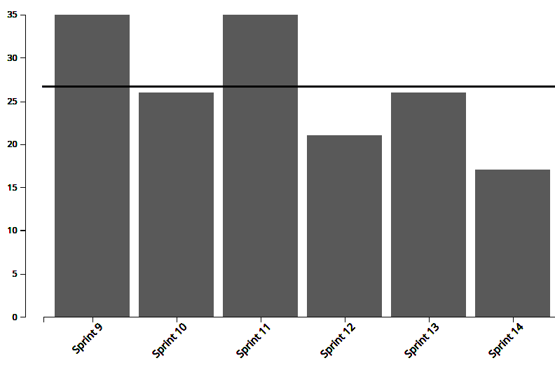
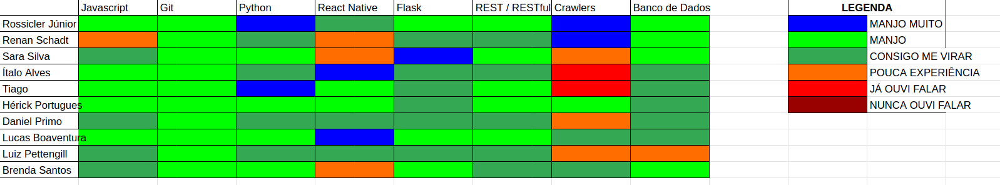

# Análise e Retrospectiva

## 1. Visão Geral
**Número da Sprint:** 14                   
**Data de Início:** 22/11/2020     
**Data de Término:** 28/11/2020   
**Duração:** 7 dias  
**Pontos Planejados:** 33 pontos  
**Pontos Entregues:** 24 pontos  
**Dívida Técnica:** 9 pontos  
**Membros Ausentes:** Nenhum        

## 2. Resultados
### 2.1 Repositório Docs      
1. **História:** [#100 - Documentação da Sprint 14](https://github.com/fga-eps-mds/2020.1-stay-safe-docs/issues/100)    
**Responsáveis:** Renan     
**Pontuação:** 3    
**Status:** Não Concluída  

Duas dívidas técnicas foram herdadas de sprints anteriores:  
1. **História:** [#97 - Documentação da Sprint 13](https://github.com/fga-eps-mds/2020.1-stay-safe-docs/issues/97)    
**Responsáveis:** Renan     
**Pontuação:** 3    
**Status:** Não Concluída  
2. **História:** [#95 - Documentação da Sprint 12](https://github.com/fga-eps-mds/2020.1-stay-safe-docs/issues/95)    
**Responsáveis:** Renan     
**Pontuação:** 3    
**Status:** Não Concluída  

### 2.2 Repositório Frontend
1. **História:** [#89 - Melhorar usabilidade dos mapas](https://github.com/fga-eps-mds/2020.1-stay-safe-front-end/issues/89)    
**Responsáveis:** Lucas e Ítalo        
**Pontuação:** 3       
**Status:** Concluída  
2. **História:** [#90 - Capturar os crimes dos últimos 12 meses](https://github.com/fga-eps-mds/2020.1-stay-safe-front-end/issues/90)    
**Responsáveis:** Lucas e Ítalo       
**Pontuação:** 1      
**Status:** Concluída        
3. **História:** [#91 - Melhorar dark mode e torná-lo padrão](https://github.com/fga-eps-mds/2020.1-stay-safe-front-end/issues/91)    
**Responsáveis:** Luiz       
**Pontuação:** 2      
**Status:** Concluída    
4. **História:** [#92 - Criar botão flutuante para agrupar ícones](https://github.com/fga-eps-mds/2020.1-stay-safe-front-end/issues/92)    
**Responsáveis:** Brenda e Tiago      
**Pontuação:** 3    
**Status:** Concluída  
5. **História:** [#93 - Refatorar tela de pesquisa](https://github.com/fga-eps-mds/2020.1-stay-safe-front-end/issues/93)    
**Responsáveis:** Daniel e Hérick     
**Pontuação:** 3    
**Status:** Concluída  
6. **História:** [#94 - Diminuir aparições da modal de login](https://github.com/fga-eps-mds/2020.1-stay-safe-front-end/issues/94)    
**Responsáveis:** Daniel e Hérick     
**Pontuação:** 2    
**Status:** Concluída  
7. **História:** [#98 - Corrigir avaliação de bairros](https://github.com/fga-eps-mds/2020.1-stay-safe-front-end/issues/98)    
**Responsáveis:** Brenda e Tiago       
**Pontuação:** 2    
**Status:** Concluída  

Uma dívida técnica foi herdada de sprints anteriores:
1. **História:** [#82 - Melhorar comunicação com usuário](https://github.com/fga-eps-mds/2020.1-stay-safe-front-end/issues/82)    
**Responsáveis:** Luiz      
**Pontuação:** 2   
**Status:** Concluída  
   
### 2.3 Repositório User-Service
1. **História:** [#64 - Configurar SonarQube na nuvem](https://github.com/fga-eps-mds/2020.1-stay-safe-user-service/issues/64)    
**Responsáveis:** Sara        
**Pontuação:** 1   
**Status:** Concluída  

Uma dívida técnica foi herdada de sprints anteriores:

1. **História:** [#59 - Inserir CD na pipeline](https://github.com/fga-eps-mds/2020.1-stay-safe-user-service/issues/59)    
**Responsáveis:** Rossicler        
**Pontuação:** 3    
**Status:** Concluída  

### 2.4 Repositório Secretary-Service     
Uma dívida técnica foi herdada de sprints anteriores:

1. **História:** [#44 - Inserir CD na pipeline](https://github.com/fga-eps-mds/2020.1-stay-safe-secretary-service/issues/44)    
**Responsáveis:** Rossicler    
**Pontuação:** 2     
**Status:** Concluída  

## 3. Velocity

## 4. Burndown

### 4.1 Burndown Review/QA

## 5. Gráfico de Contribuições

### 5.1 Contribuições no Frontend

## 6. Retrospectiva

### Pontos Positivos
* O semestre está acabando
* O projeto está avançado e segue de acordo com o planejamento

### Pontos Negativos
* Problemas com o carregamento do expo
* Grupo está esgotado, saturado e cansado

### Melhorias
* Grupo está precisando de um rolê de fim de semestre

## 7. Quadro de Conhecimentos

## 8. Análise do Scrum Master
### Time
Décima quinta sprint do projeto, dedicada principalmente a resolver inconsistências apontadas nos testes de aceitação e realizar as atividades finais de DevOps do projeto. 

Foi observada uma quantidade menor de pontos citados na retrospectiva, que ocorre pois o grupo está um pouco exausto das atividades do projeto e super ansioso pro fim do semestre. Estamos tentando administrar isso da melhor forma, visto que os membros de EPS também estão cansados, apreciamos o esforço de todos em realizar as atividades visto o baixo número de dívidas.

### Métricas
Na Sprint 14 foram concluídos 24 pontos dos 33 planejados, o **Velocity** atual da equipe é de 32 pontos com quinze sprints fechadas e 525 pontos entregues no total. 

O **Burndown** da Sprint 14 mostra que nessa sprint as tarefas não foram finalizadas com antecedência e outras ficaram como dívidas técnicas, o Burndown considerando a fase de Review/QA mostra a demora para aprovar os Pull Requests.

Passamos a exibir só os **Históricos de Contribuição** dos repositórios mais relevantes na sprint, isso foi feito para evitar tomar espaço do documento com repositórios onde só estão sendo feitas pequenas atualizações em pouquissímos commits, no repositório de maior trabalho o comportamento notado foi de um pico de commits no dia de fechamento da sprint, o que pode indicar que o trabalho foi feito tardiamente ou que foram feitas correções de última hora aos PRs, através desse dado e do que foi percebido no Burndown de Review (mostrando alguns PRs em fase de Review/QA antes de Sábado) notamos que a razão desse pico foram correções realizadas no último dia.

### Histórias
As novas tarefas atribuídas a MDS nessa sprint (**Melhorar usabilidade dos mapas**, **Capturar os crimes dos últimos 12 meses**, **Melhorar dark mode e torná-lo padrão**, **Criar botão flutuante para agrupar ícones**, **Refatorar tela de pesquisa**, **Diminuir aparições da modal de login** e **Corrigir avaliação de bairros**) foram provenintes dos testes de aceitação e tem por função melhorar a usabilidade do aplicativo sob diferentes óticas, como padronizar o tamanho e formato de alguns elementos em diferentes telas, melhorar o feedback para o usuário em caso de erros ou dar mais clareza e informação sobre os campos na hora de preencher um formulário dentro do aplicativo. Todas essas tarefas foram concluídas.

As dívidas técnicas são relacionadas a tarefas de EPS, mais especificamente as tarefas do scrum de **Documentação da Sprint**. O scrum que vos escreve tem se sentido um pouco desanimado nessa reta final do semestre e ver o tamanho de documento que ele se propôs a fazer desde o início acaba cansando só de olhar. Mas, se inspirando nesse time maravilhoso, ele tem conseguido motivação pra escrever essa análise e finalizar os documentos de sprint que ainda restam, da mesma forma que está finalizando esse.

As demais tarefas são auto-explicativas e ocorreram sem intercorrências.

## Riscos
Entre os riscos monitorados pelo grupo os que ocorreram na sprint foram:

* Divergência de horários entre membros da equipe
* Conflito de dependência entre atividades 
* Conflito com outras disciplinas

Os riscos eram esperados no planejamento e foi possível realizar algumas ações preventivas e reativas.