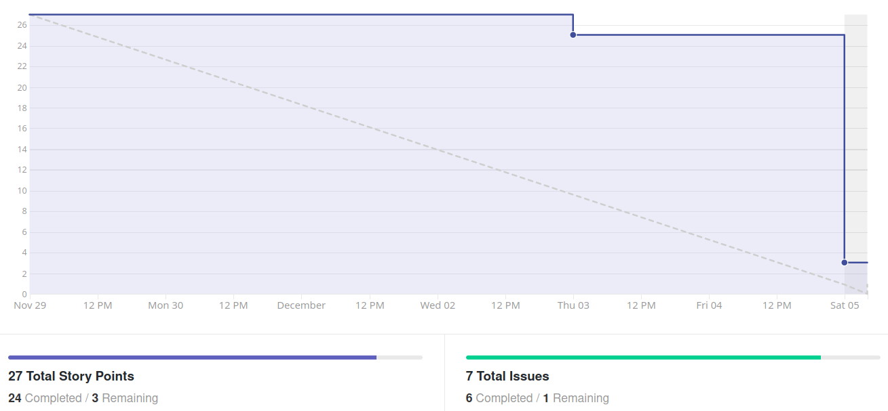
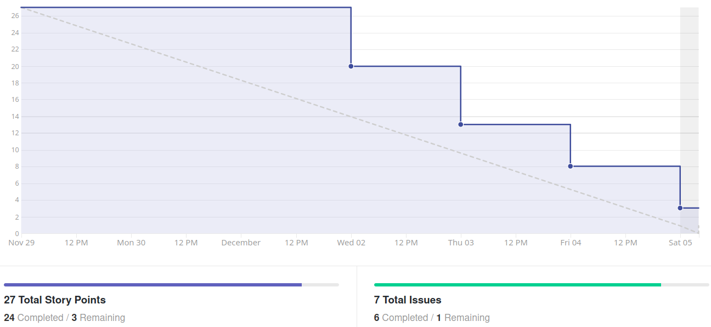
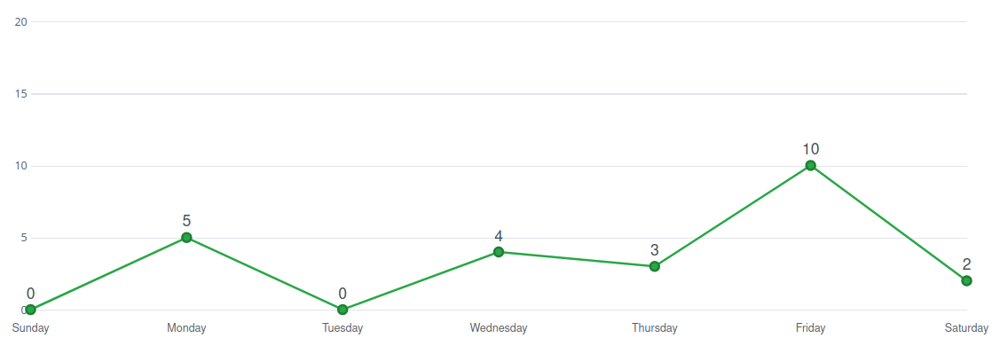

# Análise e Retrospectiva

## 1. Visão Geral
**Número da Sprint:** 15                     
**Data de Início:** 29/11/2020     
**Data de Término:** 05/12/2020   
**Duração:** 7 dias  
**Pontos Planejados:** 36 pontos  
**Pontos Entregues:** 30 pontos  
**Dívida Técnica:** 6 pontos  
**Membros Ausentes:** Luiz Pettengill   

## 2. Resultados
### 2.1 Repositório Docs 
1. **História:** [#99 - Atualizar documento de arquitetura](https://github.com/fga-eps-mds/2020.1-stay-safe-docs/issues/99)    
**Responsáveis:** Sara       
**Pontuação:** 2  
**Status:** Concluída  
2. **História:** [#101 - Criar histórias de usuário como issues](https://github.com/fga-eps-mds/2020.1-stay-safe-docs/issues/101)    
**Responsáveis:** Brenda         
**Pontuação:** 5     
**Status:** Concluída 
3. **História:** [#135 - Documentação da Sprint 15](https://github.com/fga-eps-mds/2020.1-stay-safe-docs/issues/135)    
**Responsáveis:** Renan     
**Pontuação:** 3    
**Status:** Não Concluída 
 
Três dívidas técnicas foram herdadas de sprints anteriores:  
1. **História:** [#95 - Documentação da Sprint 12](https://github.com/fga-eps-mds/2020.1-stay-safe-docs/issues/95)    
**Responsáveis:** Renan     
**Pontuação:** 3  
**Status:** Concluída 
2. **História:** [#97 - Documentação da Sprint 13](https://github.com/fga-eps-mds/2020.1-stay-safe-docs/issues/97)    
**Responsáveis:** Renan     
**Pontuação:** 3    
**Status:** Concluída 
3. **História:** [#100 - Documentação da Sprint 14](https://github.com/fga-eps-mds/2020.1-stay-safe-docs/issues/100)    
**Responsáveis:** Renan     
**Pontuação:** 3   
**Status:** Não Concluída 
   

### 2.2 Repositório Frontend
1. **História:** [#103 - Listar cidades de um estado ordenadas por crime per capita](https://github.com/fga-eps-mds/2020.1-stay-safe-front-end/issues/103)    
**Responsáveis:** Hérick e Luiz            
**Pontuação:** 5          
**Status:** Concluída  
2. **História:** [#104 - Sugerir delegacia mais próxima](https://github.com/fga-eps-mds/2020.1-stay-safe-front-end/issues/104)    
**Responsáveis:** Hérick e Luiz         
**Pontuação:** 2      
**Status:** Concluída         
3. **História:** [#106 - Criar guia da aplicação](https://github.com/fga-eps-mds/2020.1-stay-safe-front-end/issues/106)    
**Responsáveis:** Daniel e Ítalo          
**Pontuação:** 5      
**Status:** Concluída     
   
### 2.3 Repositório User-Service
1. **História:** [#65 - Notificação de local favorito](https://github.com/fga-eps-mds/2020.1-stay-safe-user-service/issues/65)    
**Responsáveis:** Lucas e Tiago          
**Pontuação:** 5   
**Status:** Concluída 

## 3. Velocity

## 4. Burndown

### 4.1 Burndown Review/QA

## 5. Gráfico de Contribuições

### 5.1 Contribuições no Frontend

## 6. Retrospectiva

### Pontos Positivos
* Penúltima sprint
* Projeto bem encaminhado e bonitão para ser finalizado
* Brenda está na praia e participando da reunião
* Algumas issues já foram fechadas antes da reunião de sprint

### Pontos Negativos
* Grupo cansado

## 7. Quadro de Conhecimentos

## 8. Análise do Scrum Master
### Time
Décima sexta sprint, penúltima antes do encerramento do projeto, dedicada a implementar as últimas funcionalidades restantes e de baixa prioridade disponíveis no backlog.

Projeto e semestre se encaminhando para o final com o grupo cansado, porém super satisfeito com o produto desenvolvido colaborativamente.

### Métricas
Na Sprint 15 foram concluídos 30 pontos dos 36 planejados, o **Velocity** atual da equipe é de 32 pontos com dezesseis sprints fechadas e 555 pontos entregues no total. 

O **Burndown** da Sprint 15 mostra que nessa sprint as tarefas não foram finalizadas com antecedência e outras ficaram como dívidas técnicas, o Burndown considerando a fase de Review/QA mostra a demora para aprovar os Pull Requests.

Passamos a exibir só os **Históricos de Contribuição** dos repositórios mais relevantes na sprint, isso foi feito para evitar tomar espaço do documento com repositórios onde só estão sendo feitas pequenas atualizações em pouquissímos commits, no repositório de maior trabalho o comportamento notado foi de um pico de commits no dia anterior ao fechamento da sprint, o que pode indicar que o trabalho foi feito tardiamente ou que foram feitas correções de última hora aos PRs, através desse dado e do que foi percebido no Burndown de Review (mostrando alguns PRs em fase de Review/QA antes de Sexta) notamos que a razão desse pico foram correções realizadas no último dia.

### Histórias
As tarefas da semana são relacionadas a três épicos: Ajuda (**Sugerir delegacia mais próxima** e **Criar guia da aplicação**), Notificação (**Notificação de local favorito**) e Cidade (**Listar cidades de um estado ordenadas por crime per capita**). Os épicos de Ajuda e Notificação tem prioridades baixas e algumas de suas tarefas foram repensadas considerando o esforço necessário para implementação e o valor que entregam ao usuário, de forma geral elas foram simplificadas entregando um valor igual ou um pouco menor para o usuário final, mas diminuindo considerávelmente o custo de implementação, medida necessária para garantir um ritmo de trabalho viável no fim do semestre. As quatro tarefas citadas acima foram concluídas.

A tarefa de **Criar histórias de usuário como issues** foi uma correção pedida pelo professor durante o feedback da Release 1, todas as histórias do Backlog do Produto foram também passadas para o GitHub junto com as tasks necessárias para se completar cada uma, o tópico final do Backlog do Produto que fazia essa relação entre histórias e tasks foi excluído e links foram inseridos nos códigos das histórias dentro da documentação para que o usuário seja redirecionado ao GitHub.

As dívidas técnicas relacionadas a **Documentação da Sprint** estão sendo resolvidas, mas o scrum ainda não está completamente em dia com a sua documentação, ele continua a valorizar o que considera de extrema importância: manter a estrutura rígida do documento e a profundidade e informação vasta das análises.

As demais tarefas são auto-explicativas e ocorreram sem intercorrências.

## Riscos
Entre os riscos monitorados pelo grupo os que ocorreram na sprint foram:

* Divergência de horários entre membros da equipe
* Conflito de dependência entre atividades 
* Conflito com outras disciplinas

Os riscos eram esperados no planejamento e foi possível realizar algumas ações preventivas e reativas.