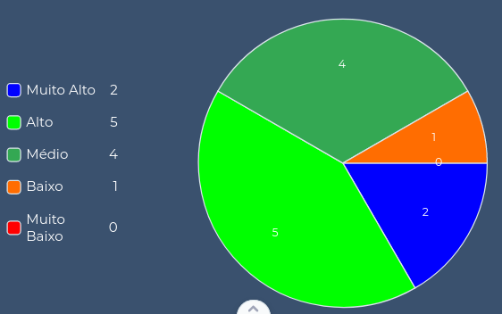
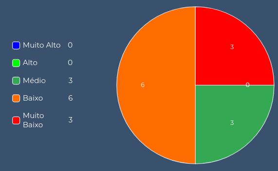
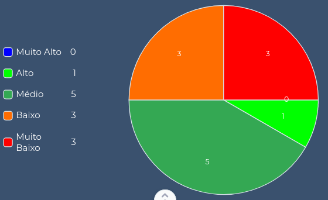
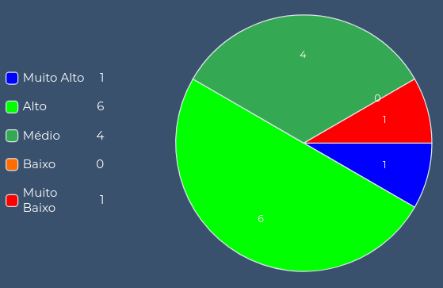
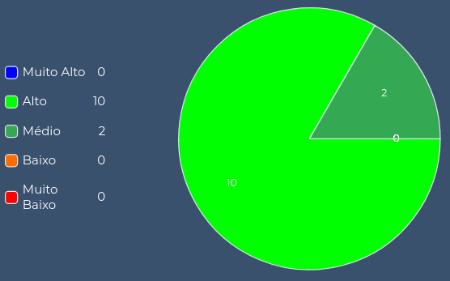
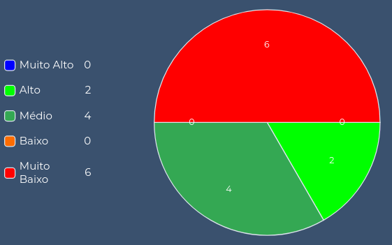
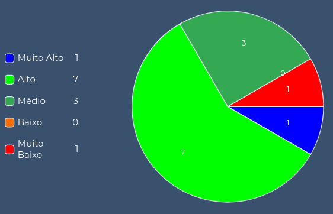
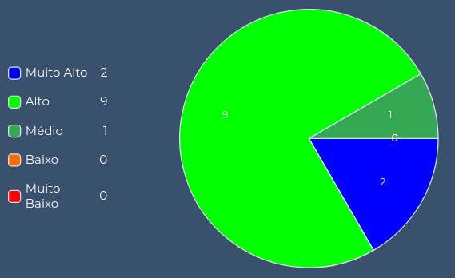
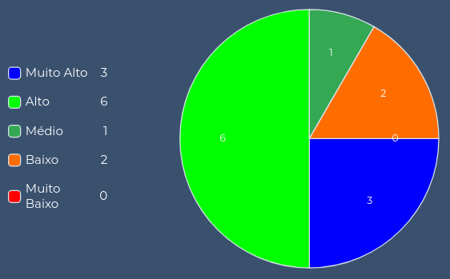

# Sáude do Time

## 1. Introdução
Para ter um panorama geral da saúde do time é utilizado o Squad Health Check Model (Modelo de Análise de Saúde do Time), uma ferramanta desenvolvida pelo Spotify que funciona quase como uma retrospectiva de sprint direcionada através de atributos, onde cada membro avalia o desempenho do grupo em características pré determinadas e manifesta suas ideias em relação a elas de forma a justificar sua avaliação.

Em relação ao framework original o grupo aplicou algumas mudanças, como o maior número de cores para fazer a avaliação a fim de permitir uma visualização mais fidedigna de todos os parâmetros.

Ao final do modelo de análise de saúde pedimos os relatos pessoais de cada membro e fizemos um gráfico da evolução de conhecimento de cada um dentro do projeto.

## 2. Atributos Avaliados

Abaixo são fornecidos exemplos de avaliações boas e ruins de cada atributo disponibilizadas pelo próprio Spotify e traduzidas pelo [zup](https://www.zup.com.br/blog/health-check-saude-da-sua-equipe):

* Entregando Valor - (Verde) Entregamos coisas fantásticas. Estamos orgulhosos disso e o cliente está muito feliz. (Vermelho) O que entregamos não foi muito bom. O cliente não viu valor nisso.

* Diversão - (Verde) Gostamos de vir trabalhar e nos divertimos trabalhando juntos. (Vermelho) Fico ansioso para ir embora do trabalho.

* Saúde do código - (Verde) Estamos orgulhosos da qualidade do nosso código. Ele é limpo, fácil de ler e tem ótima cobertura de teste. (Vermelho) Nosso código está ruim e existe muito débito técnico.‍

* Aprendizado - (Verde) Estamos aprendendo coisas interessantes o tempo todo. (Vermelho) Nós nunca temos tempo para aprender qualquer coisa nova.‍

* Missão - (Verde) Sabemos exatamente porque estamos aqui e estamos animados com isso. (Vermelho) Não temos ideia do porque estamos aqui. Não temos inspiração.‍

* Peões ou Jogadores - (Verde) Temos controle do nosso próprio destino. Decidimos o que e como construí-lo. (Vermelho) Somos apenas peões em um jogo de xadrez sem decidir o que ou como vamos construir nosso próprio destino.

* Velocidade - (Verde) Fazemos as coisas muito rapidamente, sem demora ou atraso. (Vermelho) Nós não conseguimos entregar as coisas, estamos sempre bloqueados ou com pendências.

* Processo Adequado - (Verde) Nossa maneira de trabalhar é boa. (Vermelho) Nossa maneira de trabalhar é ruim.

* Ajuda - (Verde) Ajudamos e somos ajudados quando necessário. (Vermelho) Nós não ajudamos ou somos ajudados quando necessário.

* Trabalho em Equipe - (Verde) Somos pessoas incríveis trabalhando em equipe, nos preocupamos com o todo.   (Vermelho) Somos pessoas que não nos importamos com os outros e nem com a equipe.

## 3. Planilha do Time
Para fazer a avaliação foram utilizadas cinco cores:  azul, verde claro, verde escuro, laranja e vermelho. Que representam nessa ordem da avaliação mais positiva a mais negativa. 

## 4. Considerações
As avaliações mostraram que apesar de algumas oportunidades de melhoria o panorama geral de saúde do grupo é bem positivo, nenhum aspecto foi avaliado de maneira ruim (laranja) ou péssima (vermelha).

Ajuda, Trabalho em Equipe, Missão e Entregando Valor foram avaliados de maneira extremamente positiva, sendo definitivamente os pontos de destaque do grupo. Em relação ao Aprendizado a maioria dos membros de MDS avaliaram como excelente (azul) e EPS como bom (verde claro), o que é um comportamento já esperado até pelo momento do curso em que estão localizadas as matérias. Com relação aos outros aspectos a avaliação foi de boa a excelente, dependendo do membro que avaliou, o cansaço do fim de semestre acabou piorando alguns aspectos como Diversão e Velocidade, além de algumas demandas que acabaram prejudicando o aspecto de Peões ou Jogadores. 

## 5. Considerações Individuais 
Colocamos abaixo as considerações finais de cada membro juntamente com a comparação de seu gráfico de conhecimento no início e fim do projeto, 12 tecnologias/áreas do conhecimento foram avaliadas, no gráfico é possível ver a distribuição relacionada ao nível de conhecimento de cada uma dessas áreas (muito alto, alto, médio, baixo e muito baixo) e a evolução de cada membro.

### 5.1 Brenda - MDS
Se pudesse definir MDS em uma palavra com certeza seria como descoberta. Descobri o que gosto e o que não gosto de fazer, o que possívelmente gostaria de trabalhar ao me formar, descobri que trabalho em grupo pode sim ser muito bom e trazer novos amigos. Quando era só caloura ouvia muito os veteranos falarem que MDS mudaria todas as minhas percepções e deixaria claro se o curso é pra mim ou não...eu duvidava 100% e estava completamente errada. A matéria trouxe uma percepção muito diversa do universo de software, deu sentido ao curso e a todas as matérias que temos que fazer e trouxe muitas novas possibilidades que eu sequer imaginava. Não teria feito nada diferente e nunca teria escolhido uma equipe que não fosse a que tenho hoje.

**Nível de Conhecimento das Tecnologias na Sprint 0:**

**Nível de Conhecimento das Tecnologias na Sprint 16:**

### 5.2 Daniel - MDS
Saber que StaySafe é "Permanecer Seguro", ironicamente, foi exatamente isso que senti com esse trabalho, segurança. Segurança, com os amigos e integrantes, segurança com os EPSs e pude me dar a oportunidade de ter segurança comigo mesmo, sabendo que se eu precisasse de ajuda, eu teria alguém com quem contar.

Ter um problema sozinho, se torna um pesadelo. Mas ter um problema e ter amigos para resolver, esse problema deixa de ser de fato um problema, e se torna uma experiência. E esse grupo foi a melhor experiência que tive na faculdade, até agora.

**Nível de Conhecimento das Tecnologias na Sprint 0:**

**Nível de Conhecimento das Tecnologias na Sprint 16:**

### 5.3 Lucas - MDS
Sem dúvida a melhor experiência que eu já tive em uma matéria da faculdade, e viver esse momento com o grupo mais incrível de todos também ajudou. Na matéria pude perceber que eu ainda tenho muito pra aprender, e que eu costumo gostar de quase tudo na área de engenharia de software, tecnologias e e tudo mais, minha cabeça está aberta pra novas oportunidades e tecnologia. 

Aprendi bastante sobre os processos e as metodologias, e o quanto faz falta ter interações entre o time de gerência e desenvolvimento. Nosso grupo teve uma ótima interação e isso facilitou tudo.

**Nível de Conhecimento das Tecnologias na Sprint 0:**

**Nível de Conhecimento das Tecnologias na Sprint 16:**

### 5.4 Ítalo - MDS
Essa disciplina de MDS foi o que me trouxe mais segurança e certeza no que eu pensei em seguir em software até agora, com um grupo bastante diverso e mesmo assim bem unido. Consegui aprender e perceber bastante coisa nas tecnologias que usamos e na metodologia que a partir de agora e futuramente usaremos bastante.

Antes de estudar MDS, eu ouvia muito sobre essa disciplina e a importância que ela tinha na nossa carreira. Agora, depois de vivenciar por um semestre vejo que quem me falava isso estava 100% certo desses fatos e estou feliz de ter realizado ela junto com pessoas bem legais e espero que esse laço feito com a equipe não se desfaça tão cedo.

**Nível de Conhecimento das Tecnologias na Sprint 0:**

**Nível de Conhecimento das Tecnologias na Sprint 16:**

### 5.5 Hérick - MDS
Eu sempre ouvia muita gente falar que MDS tinha sido um grande marco no curso, e pra mim não foi diferente, foi uma experiência incrível entender e fazer parte do ciclo de desenvolvimento de um software e encerro o projeto com um aprendizado muito grande. Sem dúvida foi a melhor experiência que tive até então na faculdade, e grande parte disso se deve ao nosso time fantástico de EPS e MDS, que durante todo o semestre manteve uma comunicação, interação e comprometimento incríveis, o que possibilitou uma enorme troca de conhecimentos e mais importante, a formação de laços de amizade.

**Nível de Conhecimento das Tecnologias na Sprint 0:**

**Nível de Conhecimento das Tecnologias na Sprint 16:**

### 5.6 Tiago - MDS
Um dos melhores projetos que já participei. Gostei muito dos meus companheiros de time. A organização do meu time foi excepcional e por causa disso pude aprender muito sobre as metodologias utilizadas e sobre as tecnologias do projeto. Saio muito melhor do que entrei, tanto em conhecimento quanto em amizades. A matéria me abriu portas muito importantes para minha carreira profissional e nunca me esquecerei disso. Tive muito noção também sobre a minha área de atuação. Só tenho a agradecer.

**Nível de Conhecimento das Tecnologias na Sprint 0:**

**Nível de Conhecimento das Tecnologias na Sprint 16:**

### 5.7 Renan - EPS
Sem dúvida a melhor experiência que tive com trabalho em grupo e fico muito orgulhoso do excelente produto que pensamos e criamos juntos. Apesar do processo no geral ter corrido muito bem existiram alguns problemas no meio do caminho e acredito que eu poderia ter trabalho de maneira mais árdua na resolução desses, esse é meu único arrependimento.

Com esse grupo maravilhoso de pessoas confesso que meu trabalho como scrum foi um pouco facilitado, kkkkkkk, fica aqui também o elogio aos meus colegas de EPS que levaram o trabalho com muito compromisso e seriedade e aos MDS que sempre conseguem fazer a issue da semana, não importa o tamanho do desafio, foi ótimo trabalhar com vocês. 

Um brinde aos laços que formamos e tudo que aprendemos no projeto, agora só precisamos de vacina e rolê, chega de trabalho.

**Nível de Conhecimento das Tecnologias na Sprint 0:**

**Nível de Conhecimento das Tecnologias na Sprint 16:**

### 5.8 Rossicler - EPS
EPS é uma matéria que sempre tive a vontade de fazer, mesmo com um certo medo por saber que é uma matéria muito puxada em que você depende muito da sua equipe para que tenha uma boa experiência. Com isso em mente eu só tenho a agradecer ao meu grupo, nessa matéria consegui conhecer pessoas que fizeram dessa matéria uma experiência incrível, onde consegui aprender e praticar conceitos que eu sempre tive a vontade de aplicar em um projeto real, além de conhecimentos que não tinha a mínima ideia de que iria adquirir. 

Por fim, agradeço aos meus colegas de equipe de EPS pelo esforço e empenho dentro do nosso projeto e na disciplina como um todo, também agradeço a nossa equipe de MDS que conseguiram fazer tantas coisas que eu nem sonhava em fazer quando estava em MDS, do esforço, da boa comunicação (geralmente é algo bem complicado nessa interação entre MDS e EPS) e da vontade de aprender que com certeza foi essencial para chegarmos onde chegamos. Obrigado a todos.

**Nível de Conhecimento das Tecnologias na Sprint 0:**

**Nível de Conhecimento das Tecnologias na Sprint 16:**

### 5.9 Sara - EPS
A matéria pra mim foi proveitosa, aprendi muito sobre arquitetura com a chance de aplicar em um projeto na prática.

Além de ter o prazer de trabalhar com uma equipe compromissada e profissional, que se preocupa com a qualidade do produto desde a sua concepção, desenvolvimento até a finalização.

Através da matéria consegui ter mais noção de projeto em seus vários aspectos, além de ter a oportunidade de trocar conhecimentos com os membros de EPS e MDS, valorizo essa oportunidade que as matérias proporcionam.

**Nível de Conhecimento das Tecnologias na Sprint 0:**

**Nível de Conhecimento das Tecnologias na Sprint 16:**

## 6. Referências
* [Spotify - Squad Health Check Model](https://engineering.atspotify.com/2014/09/16/squad-health-check-model/)
* [Zup - Health Check](https://www.zup.com.br/blog/health-check-saude-da-sua-equipe)