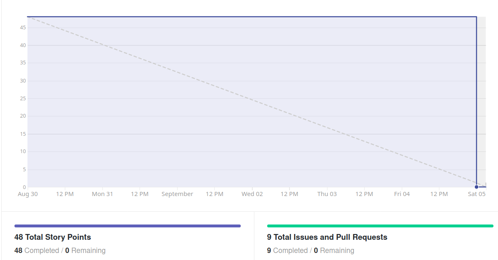
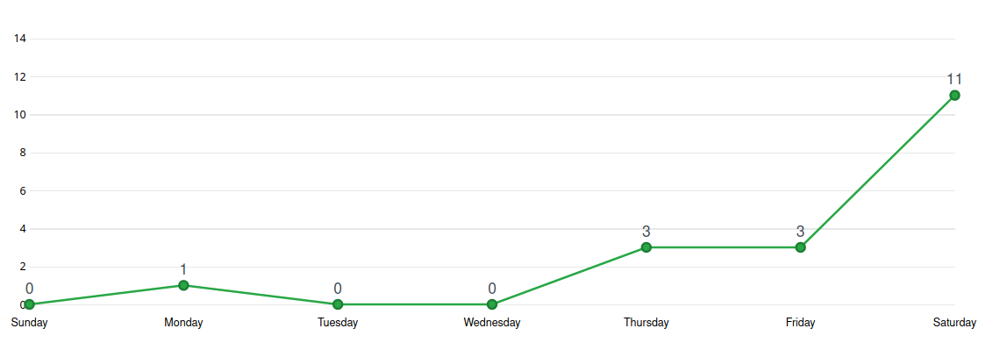
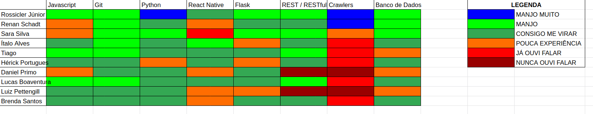

# Análise e Retrospectiva

## 1. Visão Geral
**Número da Sprint:** 2  
**Data de Início:** 30/08/2020  
**Data de Término:** 05/09/2020  
**Duração:** 7 dias  
**Pontos Planejados:** 56 pontos  
**Pontos Entregues:** 41 pontos  
**Dívida Técnica:** 15 pontos  
**Membros Presentes:** Todos

## 2. Resultados
1. **História:** [#27 - Política de Contribuição](https://github.com/fga-eps-mds/2020.1-stay-safe-docs/issues/27)    
**Responsáveis:** Renan     
**Pontuação:** 2  
**Status:** Concluído
2. **História:** [#29 - CRUD de usuário](https://github.com/fga-eps-mds/2020.1-stay-safe-docs/issues/29)    
**Responsáveis:** Tiago e Brenda  
**Pontuação:** 8  
**Status:** Concluído
3. **História:** [#28 - Protótipo de Alta Fidelidade (Telas Principais)](https://github.com/fga-eps-mds/2020.1-stay-safe-docs/issues/28)   
**Responsáveis:** Lucas, Hérick, Ítalo e Luiz   
**Pontuação:** 13  
**Status:** Não Concluído
4. **História:** [#30 - Definição de Personas](https://github.com/fga-eps-mds/2020.1-stay-safe-docs/issues/30)  
**Responsáveis:** Daniel   
**Pontuação:** 5  
**Status:** Concluído
5. **História:** [#31 - Modelagem de Dados](https://github.com/fga-eps-mds/2020.1-stay-safe-docs/issues/31)   
**Responsáveis:** Renan e Sara  
**Pontuação:** 8   
**Status:** Concluído
6. **História:** [#32 - Atualização do Roadmap](https://github.com/fga-eps-mds/2020.1-stay-safe-docs/issues/32)  
**Responsáveis:** Renan, Rossicler, Sara    
**Pontuação:** 2  
**Status:** Não Concluído
7. **História:** [#33 - Definir tecnologias de DevOps](https://github.com/fga-eps-mds/2020.1-stay-safe-docs/issues/33)  
**Responsáveis:** Rossicler  
**Pontuação:** 2  
**Status:** Concluído
8. **História:** [#34 - Configuração dos Ambientes FrontEnd e Backend](https://github.com/fga-eps-mds/2020.1-stay-safe-docs/issues/34)  
**Responsáveis:** Rossicler  
**Pontuação:** 5  
**Status:** Concluído
9. **História:** [#35 - Documentação da Sprint 1](https://github.com/fga-eps-mds/2020.1-stay-safe-docs/issues/35)   
**Responsáveis:** Renan  
**Pontuação:** 3  
**Status:** Concluído 

A dívida técnica herdada da Sprint 1 foi solucionada:

1. **História:** [#17 - Termo de Abertura do Projeto](https://github.com/fga-eps-mds/2020.1-stay-safe-docs/issues/17)  
**Responsáveis:** Renan, Rossicler, Sara     
**Pontuação:** 8  
**Status:** Concluído

## 3. Velocity

## 4. Burndown

## 5. Gráfico de Contribuições

### 5.1 Contribuições na Documentação

### 5.1 Contribuições no User-Service
A ser adicionado 

## 6. Retrospectiva
### Pontos Positivos:
* Primeira tarefa de backend entrega completa e com testes
* Ajuda de EPS para conclusão da história de backend
* Comportamento positivo de membro de MDS ao ir atrás do conteúdo que havia perdido lendo os artefatos criados e usando membros de EPS para tirar dúvidas em relação a documentação lida

### Pontos Negativos:
* Entregas em cima da hora
* Compromissos de outras matérias
* Problemas com internet/energia
* Conflito de horário entre pares
* Planejamento de próxima sprint em cima da hora
* EPS não acompanhou muito MDS
* Tarefas iniciadas tardiamente
* Adaptação a ferramanta de prototipação
* Ausência nas dailies

### Melhorias:
* Gerenciar melhor o tempo da sprint
* Acompanhamento melhor de EPS
* Planejamento melhor das duplas de pareamento
* Pontualidade nas reuniões e nas dailies
* Escolha de tarefas da sprint com antecedência

## 7. Quadro de Conhecimentos

## 8. Análise do Scrum Master
### Time
Terceira sprint do projeto marcada mais por pontos negativos do que positivos, apesar de muita coisa ter sido entregue a equipe não se comportou como esperado. Os membros de EPS sentem que poderiam ter planejado melhor as histórias e acompanhado melhor MDS ao longo da semana, enquanto a equipe de MDS sabe que começou a fazer as tarefas muito tardiamente. Todos os membros estão empenhados em mudar isso na próxima sprint.

Apesar dos pontos mencionados a equipe continua bem unida e animada com o projeto e a matéria, temos a noção de que essa sprint foi um ponto fora da curva. Uma medida que o time de EPS está tomando é destacar comportamentos positivos que queremos incentivar e recomendar a toda equipe, alguns membros de MDS estão tomando ações que nos surpreenderam positivamente em relação a isso e estão ajudando a moldar o comportamento que esperamos da equipe. 

### Métricas
O **Burndown** da Sprint 2 contém um erro, ele só foi recolhido de maneira apropriada após a resolução das dívidas técnicas, por esse motivo ele mostra que os 48 pontos foram concluídos, sendo que 15 só foram concluídos no início da Sprint 3. De toda forma é notável que as tarefas foram entregues na última hora.

O **Velocity** apresenta o mesmo problema citado no Burndown, a sua medida correta seria de 42.66 pontos por sprint.

Os **Históricos de Contribuição** apresentam uma quantidade pequena de commits no começo e meio da semana o que mostra que as tarefas foram iniciadas tardiamente.

O **Quadro de Conhecimento** mostra evolução principalmente nos membros responsáveis por realizar a funcionalidade de CRUD do usuário.

### Histórias
A primeira tarefa de código do projeto foi o **CRUD do Usuário** que foi completada e entregue testada pelo time de MDS, o time de EPS só auxiliou em alguns ajustes finais.

A **Modelagem do Banco de Dados** foi feita de forma relacional para o User-Service e de forma não relacional para o Secretary-Service, os artefatos gerados a partir da modelagem foram incluídos no **Documento de Arquitetura**.

O **Protótipo de Alta Fidelidade** ficou como dívida para próxima sprint, a tarefa é de um tamanho considerável e levou mais tempo que o esperado para ser executada, algumas dificuldades com a ferramenta de prototipação acabaram atrasando o proceso. A atualização do **Roadmap do Produto** também ficou como dívida para próxima sprint, o time de EPS se sentiu sobrecarregado com as outras demandas exigidas pelo projeto e decidiu por não priorizar essa tarefa na sprint.

O **Termo de Abertura do Projeto** e a **Política de Contribuição** tomaram mais trabalho que o esperado pela equipe, foram concluídos, mas acabaram por atrasar outras tarefas da sprint. A priorização do primeiro foi feita por ser fundamental ao projeto e a do segundo foi devido ao fato de que MDS está entrando nas primeiras issues de código e é fundamental que saibam exatamente como contribuir.

As demais tarefas são auto-explicativas e ocorreram sem intercorrências.