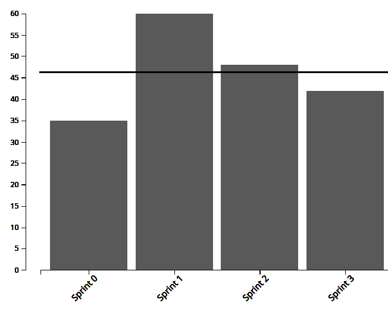
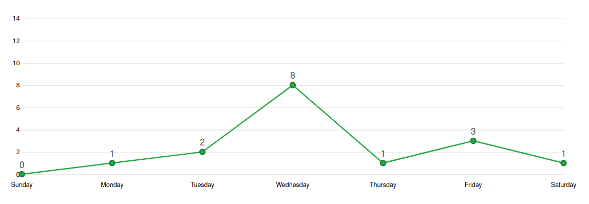
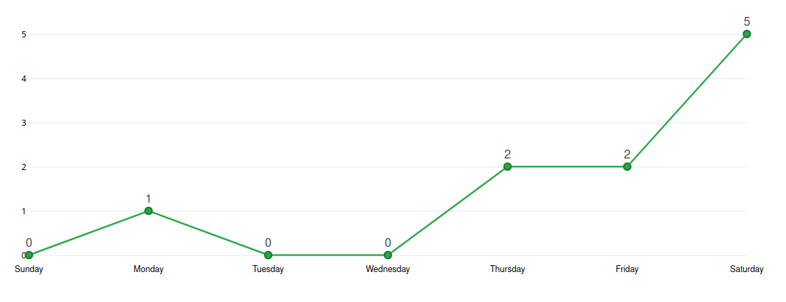
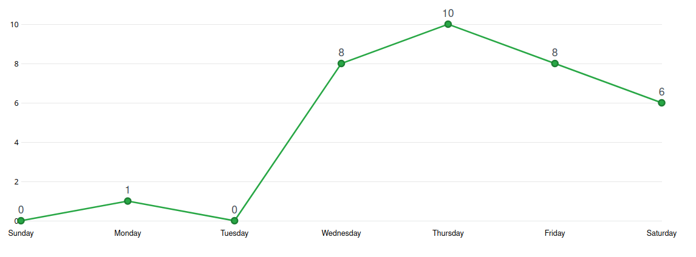
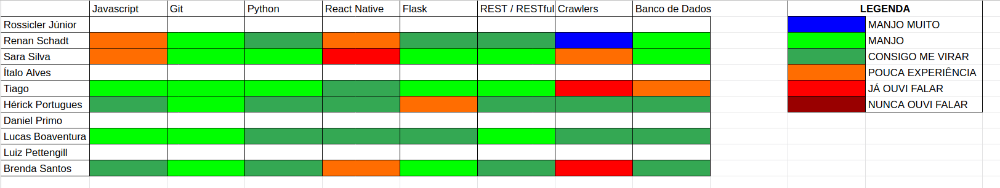

# Análise e Retrospectiva

## 1. Visão Geral
**Número da Sprint:** 3    
**Data de Início:** 06/09/2020    
**Data de Término:** 12/09/2020   
**Duração:** 7 dias  
**Pontos Planejados:** 57 pontos  
**Pontos Entregues:** 57 pontos  
**Dívida Técnica:** 0 pontos  
**Membros Presentes:** Todos

## 2. Resultados
### 2.1 Repositório Docs
1. **História:** [#42 - Documentar Pipeline](https://github.com/fga-eps-mds/2020.1-stay-safe-docs/issues/42)    
**Responsáveis:** Rossicler    
**Pontuação:** 3  
**Status:** Concluído
2. **História:** [#43 - Documentar Sprint 3](https://github.com/fga-eps-mds/2020.1-stay-safe-docs/issues/43)    
**Responsáveis:** Renan  
**Pontuação:** 3  
**Status:** Concluído
3. **História:** [#44 - Elaborar Plano de Gerenciamento de Risco](https://github.com/fga-eps-mds/2020.1-stay-safe-docs/issues/44)    
**Responsáveis:** Brenda, Sara, Renan  
**Pontuação:** 5   
**Status:** Concluído

As duas dívidas técnicas herdadas da Sprint 2 foram solucionadas:  

4. **História:** [#28 - Elaborar Protótipo de Alta Fidelidade](https://github.com/fga-eps-mds/2020.1-stay-safe-docs/issues/28)  
**Responsáveis:** Ítalo e Luiz  
**Pontuação:** 13  
**Status:** Concluído
5. **História:** [#32 - Atualizar Roadmap do Produto](https://github.com/fga-eps-mds/2020.1-stay-safe-docs/issues/32)  
**Responsáveis:** Renan, Rossicler, Sara  
**Pontuação:** 2  
**Status:** Concluído

### 2.2 Repositório Frontend
6. **História:** [#1 - Tela de Cadastro](https://github.com/fga-eps-mds/2020.1-stay-safe-front-end/issues/1)    
**Responsáveis:** Ítalo, Daniel  
**Pontuação:** 8   
**Status:** Concluído

### 2.3 Repositório User-Service
7. **História:** [#2 - CRUD de Ocorrência](https://github.com/fga-eps-mds/2020.1-stay-safe-user-service/issues/2)    
**Responsáveis:** Tiago, Luiz  
**Pontuação:** 5  
**Status:** Concluído
8. **História:** [#3 - Autenticação do Usuário](https://github.com/fga-eps-mds/2020.1-stay-safe-user-service/issues/3)    
**Responsáveis:** Brenda  
**Pontuação:** 5  
**Status:** Concluído

### 2.4 Repositório Secretary-Service
9. **História:** [#1 - Extração de dados SSP-DF](https://github.com/fga-eps-mds/2020.1-stay-safe-secretary-service/issues/1)    
**Responsáveis:** Lucas, Hérick  
**Pontuação:** 8  
**Status:** Concluído
10. **História:** [#2 - Execução programada do crawler](https://github.com/fga-eps-mds/2020.1-stay-safe-secretary-service/issues/2)    
**Responsáveis:** Sara e Rossicler  
**Pontuação:** 5  
**Status:** Concluído

## 3. Velocity

## 4. Burndown

## 5. Gráfico de Contribuições

### 5.1 Contribuições na Documentação

### 5.1 Contribuições no Frontend

### 5.1 Contribuições no User-Service

### 5.1 Contribuições no Secretary-Service

## 6. Retrospectiva
### Pontos Positivos:
* Sprint sem dívidas técnicas (boa produtividade)
* Comunicação efetiva entre EPS e MDS
* Conversa com o Hilmer ajudou a esclarecer alguns pontos
* EPS compreensíveis e incentivadores <3
* Qualidade da documentação
* Suporte maior de EPS para quem está fazendo a issue sozinho
* Membros preocupados com a arquitetura

### Pontos Negativos:
* As dívidas herdadas da sprint anterior atrapalharam os pareamentos 
* Sobrecarga nas tarefas de EPS
* Scrum atrasando os docs da sprint
* Falhas de comunicação pontuais entre MDS
* Timebox da reunião não sendo seguido
* Algumas issues não foram bem descritas

### Melhorias:
* Relatar problemas ou dúvidas o mais rápido possível
* Planejar horários para parear com antecedência
* Uso do LiveShare para as duplas que se interessarem
* Comunicar sempre 
* Melhor descrição das issues

## 7. Quadro de Conhecimentos

## 8. Análise do Scrum Master
### Time
Quarta sprint do projeto marcada mais por pontos negativos do que positivos, apesar de muita coisa ter sido entregue a equipe não se comportou como esperado. Os membros de EPS sentem que poderiam ter planejado melhor as histórias e acompanhado melhor MDS ao longo da semana, enquanto a equipe de MDS sabe que começou a fazer as tarefas muito tardiamente. Todos os membros estão empenhados em mudar isso na próxima sprint.

Apesar dos pontos mencionados a equipe continua bem unida e animada com o projeto e a matéria, temos a noção de que essa sprint foi um ponto fora da curva. Uma medida que o time de EPS está tomando é destacar comportamentos positivos que queremos incentivar e recomendar a toda equipe, alguns membros de MDS estão tomando ações que nos surpreenderam positivamente em relação a isso e estão ajudando a moldar o comportamento que esperamos da equipe. 

### Métricas
Na Sprint 3 foram concluídos 57 pontos (sendo 42 planejados para Sprint e 15 que vieram como dívida técnica), o **Velocity** atual da equipe é de 46.25 pontos com quatro sprints fechadas e 185 pontos entregues no total.

O **Burndown** da Sprint 3 mostra que todas tarefas criadas para a sprint foram concluídas, mas também é possível notar que a maior parte delas foi concluída no último dia, o que pode indicar issues muito grandes, procrastinação da equipe na realização das tarefas ou demora nas revisões de Pull Request.

Os **Históricos de Contribuição** apresentam uma quantidade pequena de commits nos três primeiros dias da sprint o que indica que a maior parte do trabalho está sendo feito da metade pro fim da sprint

O **Quadro de Conhecimento** mostra evolução principalmente nos membros responsáveis por realizar a funcionalidade extração de dados que melhoraram seu conhecimento em crawlers.

### Histórias
A primeira tarefa de código do projeto foi o **CRUD do Usuário** que foi completada e entregue testada pelo time de MDS, o time de EPS só auxiliou em alguns ajustes finais.

A **Modelagem do Banco de Dados** foi feita de forma relacional para o User-Service e de forma não relacional para o Secretary-Service, os artefatos gerados a partir da modelagem foram incluídos no **Documento de Arquitetura**.

O **Protótipo de Alta Fidelidade** ficou como dívida para próxima sprint, a tarefa é de um tamanho considerável e levou mais tempo que o esperado para ser executada, algumas dificuldades com a ferramenta de prototipação acabaram atrasando o proceso. A atualização do **Roadmap do Produto** também ficou como dívida para próxima sprint, o time de EPS se sentiu sobrecarregado com as outras demandas exigidas pelo projeto e decidiu por não priorizar essa tarefa na sprint.

O **Termo de Abertura do Projeto** e a **Política de Contribuição** tomaram mais trabalho que o esperado pela equipe, foram concluídos, mas acabaram por atrasar outras tarefas da sprint. A priorização do primeiro foi feita por ser fundamental ao projeto e a do segundo foi devido ao fato de que MDS está entrando nas primeiras issues de código e é fundamental que saibam exatamente como contribuir.

As demais tarefas são auto-explicativas e ocorreram sem intercorrências.