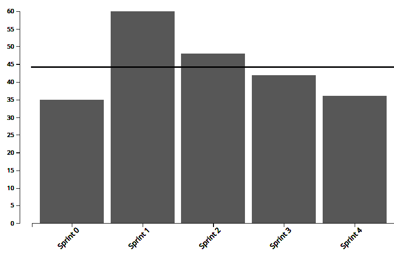
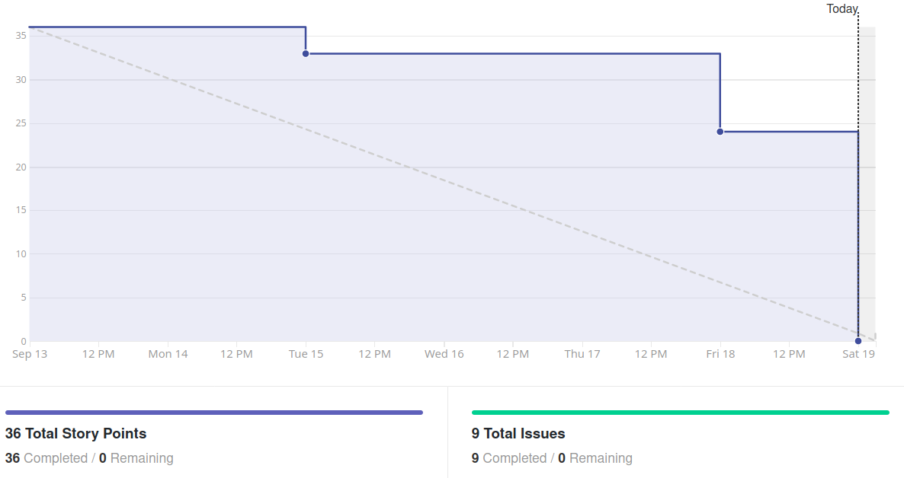
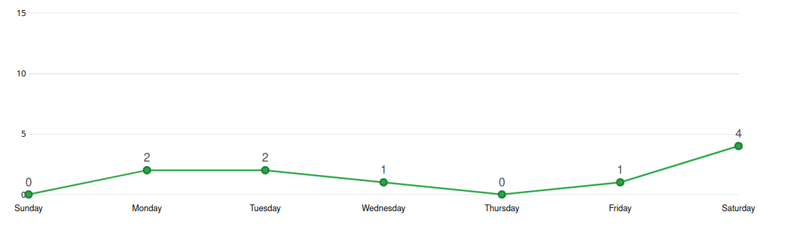
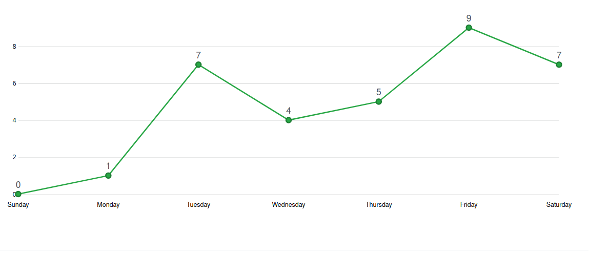
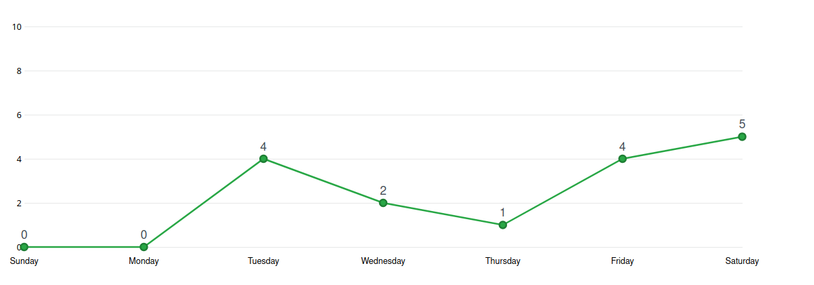
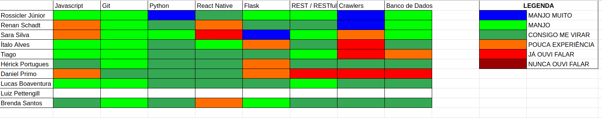

# Análise e Retrospectiva

## 1. Visão Geral
**Número da Sprint:** 4    
**Data de Início:** 13/09/2020    
**Data de Término:** 19/09/2020   
**Duração:** 7 dias  
**Pontos Planejados:** 36 pontos  
**Pontos Entregues:** 36 pontos  
**Dívida Técnica:** 0 pontos  
**Membros Ausentes:** Nenhum

## 2. Resultados

### 2.1 Repositório Docs
1. **História:** [#50 - Elaborar EAP](https://github.com/fga-eps-mds/2020.1-stay-safe-docs/issues/50)    
**Responsáveis:** Renan, Rossicler e Sara     
**Pontuação:** 3     
**Status:** Concluído   
2. **História:** [#51 - Documentar Sprint 4](https://github.com/fga-eps-mds/2020.1-stay-safe-docs/issues/51)    
**Responsáveis:** Renan  
**Pontuação:** 3       
**Status:** Concluído       

### 2.2 Repositório Frontend
3. **História:** [#2 - Tela de Login](https://github.com/fga-eps-mds/2020.1-stay-safe-front-end/issues/2)    
**Responsáveis:** Ítalo e Tiago  
**Pontuação:** 3   
**Status:** Concluído   
4. **História:** [#3 - Integração com API do Maps](https://github.com/fga-eps-mds/2020.1-stay-safe-front-end/issues/3)    
**Responsáveis:** Daniel  
**Pontuação:** 5   
**Status:** Concluído   
5. **História:** [#5 - Integração da Tela de Cadastro](https://github.com/fga-eps-mds/2020.1-stay-safe-front-end/issues/5)    
**Responsáveis:** Ítalo e Tiago  
**Pontuação:** 3   
**Status:** Concluído   

### 2.3 Repositório User-Service
6. **História:** [#6 - Proteger dados e ações do usuário](https://github.com/fga-eps-mds/2020.1-stay-safe-user-service/issues/6)    
**Responsáveis:** Sara  
**Pontuação:** 3  
**Status:** Concluído   
7. **História:** [#7 - CRUD de avaliação de bairro](https://github.com/fga-eps-mds/2020.1-stay-safe-user-service/issues/7)    
**Responsáveis:** Lucas e Luiz    
**Pontuação:** 5  
**Status:** Concluído   

### 2.4 Repositório Secretary-Service
8. **História:** [#5 - Extração de dados SSP-SP](https://github.com/fga-eps-mds/2020.1-stay-safe-secretary-service/issues/5)    
**Responsáveis:** Hérick e Brenda  
**Pontuação:** 8  
**Status:** Concluído   
9. **História:** [#6 - Configuração do Mongo no Docker](https://github.com/fga-eps-mds/2020.1-stay-safe-secretary-service/issues/6)    
**Responsáveis:** Rossicler    
**Pontuação:** 3   
**Status:** Concluído    

## 3. Velocity

## 4. Burndown

## 5. Gráfico de Contribuições

### 5.1 Contribuições na Documentação

### 5.2 Contribuições no Frontend

### 5.3 Contribuições no User-Service

### 5.4 Contribuições no Secretary-Service

## 6. Retrospectiva
### Pontos Positivos:
* Sem dívida técnica
* Padrão e qualidade de código mantido apesar da inexperiência da equipe
* Algumas tarefas entregues com antecedência
* Combinação de horários
* Disponibilidade de EPS para parear e tirar dúvidas
* Brenda e Hérick gostaram de mexer com crawler
* Lucas gostou da história e aprendeu decorators do Python
* Tiago gostou de testes no user-service
* Frontend maduro e funcional

### Pontos Negativos:
* Algumas histórias começaram tardiamente
* Ainda existem melhorias a serem feitas na comunicação
* Alguns membros de MDS tiveram problemas com a estação de trabalho
* Membro sobrecarregado 

### Melhorias:
* Começar as histórias mais cedo
* Comunicar sempre
* Honrar os compromissos assumidos

## 7. Quadro de Conhecimentos

## 8. Análise do Scrum Master
### Time
Quinta sprint do projeto marcada por uma quantidade menor de pontos e fechamento sem dívidas por parte da equipe. A comunicação entre EPS e MDS continua a ser um ponto positivo e colabora para desenvolvimento das tarefas. O time de MDS vem mostrando maturidade ao se preocupar com a qualidade do código desenvolvido e sugerirem refatorações a medida que o conhecimento nos frameworks vai melhorando.

Como pontos negativos houve uma diferença grande de horas dedicadas entre alguns membros o que indica uma distribuição ou pontuação inadequada das issues e dois membros que não se comunicaram tanto no decorrer da sprint, um deles deixou sua dupla de pareamento sobrecarregada.

### Métricas
Na Sprint 4 foram concluídos 36 pontos, o **Velocity** atual da equipe é de 44.20 pontos com cinco sprints fechadas e 221 pontos entregues no total.

O **Burndown** da Sprint 4 mostra que todas tarefas criadas para a sprint foram concluídas, em comparação com a sprint anterior algumas histórias foram entregues mais cedo. Ao visualizarmos o Burndown considerando a fase de Review/QA podemos verificar que o comportamento da sprint foi bom, o único problema foi a demora na revisão de alguns PRs.

Os **Históricos de Contribuição** apresentam uma quantidade adequada de commits distribuídos pela sprint, o que indica que as tarefas começaram cedo, o único ponto a ser melhorado é evitar o pico de commits no último dia, que indica revisões e merges tardios.

O **Quadro de Conhecimento** mostra evolução principalmente nos membros responsáveis por realizar a funcionalidade extração de dados que melhoraram seu conhecimento em crawlers.

### Histórias
A segunda tarefa para extração de dados foi a  **Extração de dados SSP-SP** usando a biblioteca Scrapy em conjunto com Selenium, para realizar a história a dupla executora recebeu uma pequena ajuda no começo para entender o uso do Selenium e partir disso resolveram a issue, apesar da grande quantidade de trabalho (devido ao HTML complicado do site) ambos gostaram muito de trabalhar com extração de dados.

Por conta do grupo já estar com uma visão de produto madura a **EAP** foi fácil de elaborar. 

A issue da **Integração com o Maps** não estava tão bem descrita e essa tarefa acabou por ser entregue sem alguns pontos esperados.

As demais tarefas são auto-explicativas e ocorreram sem intercorrências.