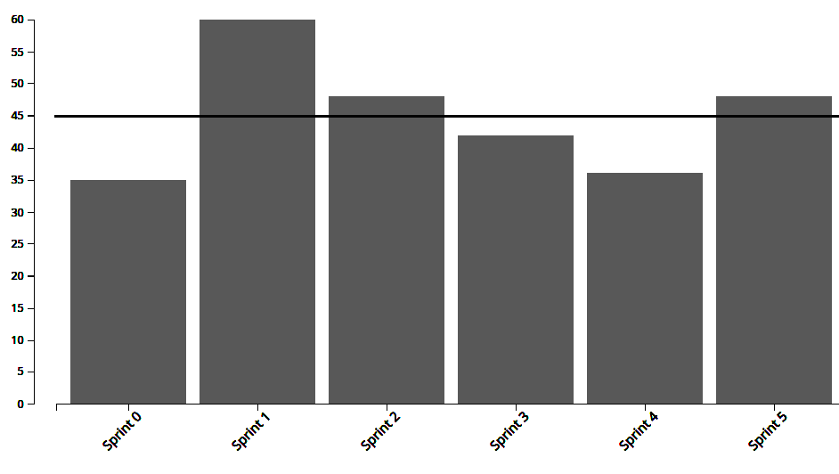
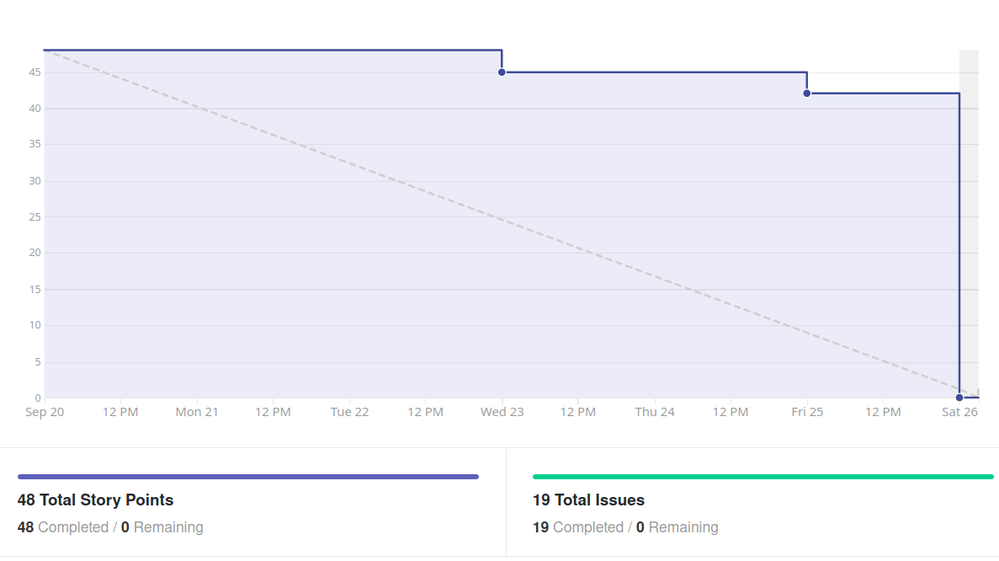
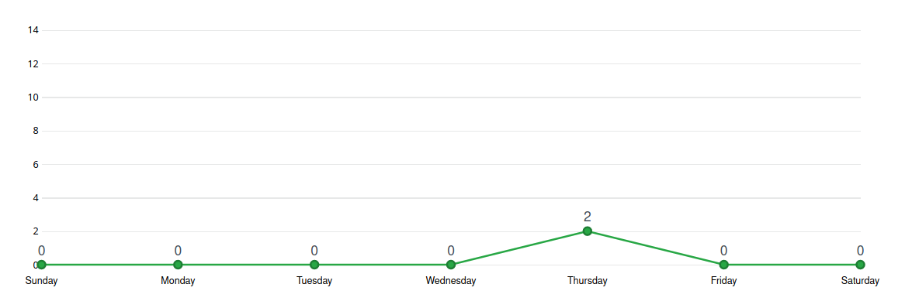
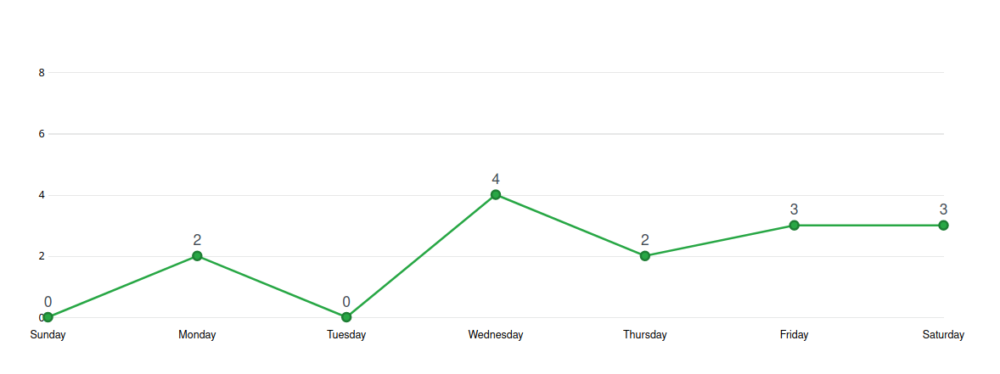

# Análise e Retrospectiva

## 1. Visão Geral
**Número da Sprint:** 5    
**Data de Início:** 20/09/2020    
**Data de Término:** 26/09/2020   
**Duração:** 7 dias  
**Pontos Planejados:** 48 pontos  
**Pontos Entregues:** 48 pontos  
**Dívida Técnica:** 0 pontos  
**Membros Ausentes:** Luiz Pettengill

## 2. Resultados

### 2.1 Repositório Docs
1. **História:** [#55 - Documentar custos do projeto](https://github.com/fga-eps-mds/2020.1-stay-safe-docs/issues/55)    
**Responsáveis:** Renan, Rossicler e Sara     
**Pontuação:** 3  
**Status:** Concluído   
2. **História:** [#56 - Documentar métricas de qualidade do produto](https://github.com/fga-eps-mds/2020.1-stay-safe-docs/issues/56)    
**Responsáveis:** Renan, Rossicler e Sara  
**Pontuação:** 3     
**Status:** Concluído    
3. **História:** [#57 - Documentar Sprint 5](https://github.com/fga-eps-mds/2020.1-stay-safe-docs/issues/57)    
**Responsáveis:** Renan  
**Pontuação:** 3    
**Status:** Concluído     

### 2.2 Repositório Frontend
1. **História:** [#9 - Realizar cadastro de ocorrências](https://github.com/fga-eps-mds/2020.1-stay-safe-front-end/issues/9)    
**Responsáveis:** Hérick e Brenda  
**Pontuação:** 5   
**Status:** Concluído   
2. **História:** [#10 - Implementar logout do usuário](https://github.com/fga-eps-mds/2020.1-stay-safe-front-end/issues/10)    
**Responsáveis:** Daniel e Lucas   
**Pontuação:** 3   
**Status:** Concluído   
3. **História:** [#11 - Implementar visualização, edição e exclusão de usuário](https://github.com/fga-eps-mds/2020.1-stay-safe-front-end/issues/11)    
**Responsáveis:** Daniel e Lucas  
**Pontuação:** 5   
**Status:** Concluído   
4. **História:** [#12 - Fazer modal para avisar usuário não logado](https://github.com/fga-eps-mds/2020.1-stay-safe-front-end/issues/12)    
**Responsáveis:** Ítalo e Luiz  
**Pontuação:** 2   
**Status:** Concluído   
5. **História:** [#13 - Implementar navegação por abas](https://github.com/fga-eps-mds/2020.1-stay-safe-front-end/issues/13)    
**Responsáveis:** Ítalo e Luiz  
**Pontuação:** 3   
**Status:** Concluído   
6. **História:** [#14 - Configuração da Pipeline](https://github.com/fga-eps-mds/2020.1-stay-safe-front-end/issues/14)    
**Responsáveis:** Rossicler  
**Pontuação:** 2   
**Status:** Concluído   

### 2.3 Repositório User-Service
1. **História:** [#8 - Corrigir bug relacionado a timezone](https://github.com/fga-eps-mds/2020.1-stay-safe-user-service/issues/8)    
**Responsáveis:** Tiago  
**Pontuação:** 1  
**Status:** Concluído   
2. **História:** [#11 - Configuração do Swagger](https://github.com/fga-eps-mds/2020.1-stay-safe-user-service/issues/11)    
**Responsáveis:** Sara    
**Pontuação:** 3  
**Status:** Concluído   
3. **História:** [#12 - Configuração da Pipeline](https://github.com/fga-eps-mds/2020.1-stay-safe-user-service/issues/12)    
**Responsáveis:** Rossicler    
**Pontuação:** 2  
**Status:** Concluído   
4. **História:** [#13 - Corrigir bug relacionado a campo ocurrence_date_time](https://github.com/fga-eps-mds/2020.1-stay-safe-user-service/issues/13)    
**Responsáveis:** Tiago    
**Pontuação:** 1  
**Status:** Concluído   
5. **História:** [#14 - Filtro para pegar todas ocorrências e avaliações de usuário](https://github.com/fga-eps-mds/2020.1-stay-safe-user-service/issues/14)    
**Responsáveis:** Sara e Tiago    
**Pontuação:** 2  
**Status:** Concluído   
6. **História:** [#15 - Proibir edição de username](https://github.com/fga-eps-mds/2020.1-stay-safe-user-service/issues/15)    
**Responsáveis:** Sara e Tiago    
**Pontuação:** 1  
**Status:** Concluído   

### 2.4 Repositório Secretary-Service
1. **História:** [#9 - Criação de endpoints para obtenção de dados](https://github.com/fga-eps-mds/2020.1-stay-safe-secretary-service/issues/9)    
**Responsáveis:** Tiago  
**Pontuação:** 3  
**Status:** Concluído   
2. **História:** [#10 - Incluir Selenium no Docker](https://github.com/fga-eps-mds/2020.1-stay-safe-secretary-service/issues/10)    
**Responsáveis:** Rossicler    
**Pontuação:** 3    
**Status:** Concluído   
3. **História:** [#11 - Configuração da Pipeline](https://github.com/fga-eps-mds/2020.1-stay-safe-secretary-service/issues/11)    
**Responsáveis:** Rossicler    
**Pontuação:** 1   
**Status:** Concluído   
4. **História:** [#12 - Configuração do Swagger](https://github.com/fga-eps-mds/2020.1-stay-safe-secretary-service/issues/12)    
**Responsáveis:** Sara    
**Pontuação:** 2    
**Status:** Concluído   

## 3. Velocity

## 4. Burndown

### 4.1 Burndown Review/QA

## 5. Gráfico de Contribuições

### 5.1 Contribuições na Documentação

### 5.2 Contribuições no Frontend

### 5.3 Contribuições no User-Service

### 5.4 Contribuições no Secretary-Service

## 6. Retrospectiva
### Pontos Positivos
* EPS ajudando na execução das tarefas
* Mesmo com uma sprint pesada todas tarefas foram entregues
* Comprometimento dos membros e excelente comunicação
* MDS rápidos em aplicar as correções sugeridas

### Pontos Negativos
* Outras demandas fora do projeto sobrecarregaram os membros
* Problemas com a estação de trabalho de um membro
* Uma das duplas não foi tão bem definida, tiveram dificuldades com o framework por inexperiência
* Avaliação tardia de alguns PRs
* Quantidade de pontos da sprint
* Protótipo desatualizado causou algumas dúvidas na hora de fazer telas 
* Código no front não está homogêneo
* Mal planejamento de dependências entre histórias

### Melhorias 
* Definir padrões para código do front
* Analisar melhor o quadro de conhecimentos para escolha das duplas
* Atualizar o protótipo
* Avaliar PRs o mais cedo possível
* MDS avaliar PRs
* Pensar melhor nas dependências das histórias 

## 7. Quadro de Conhecimentos

## 8. Análise do Scrum Master
### Time
Sexta sprint do projeto marcada pela maior quantidade de issues até então e uma quantidade de pontos acima do Velocity da equipe. A comunicação entre EPS e MDS continua a ser um ponto positivo e colabora para desenvolvimento das tarefas. O time de MDS vem mostrando maturidade ao se preocupar com a qualidade do código desenvolvido e sugerirem refatorações a medida que o conhecimento nos frameworks vai melhorando, por esse motivo os membros de EPS sentem segurança para que os membros de MDS também avaliem PRs.

Apesar da excelente produtividade foram destacados mais pontos negativos do que positivos na sprint, um deles é que os membros de EPS estão se sentindo sobrecarregados com suas tarefas (documentação, descrição de issues, auxílio e acompanhamento dos MDS, revisão e aprovação de PRs, tarefas específicas do papel e outros afazeres externos a matéria), para solucionar em parte esse problema os membros de MDS estão autorizados a revisar e aprovar PRs (desde que não sejam executores da issue). A partir desse ponto para um PR ser integrado a branch base ele precisa de duas aprovações, sendo uma delas de um membro de EPS e outra de um membro de MDS, acreditamos que essa medida impactará positivamente o problema dos merges tardios e do sobrecarregamento de EPS.

Outro ponto negativo destacado foi o protótipo desatualizado (feito na Sprint 2), os problemas na tarefa aconteceram por conta de várias falhas que englobam as fases de planejamento, execução, acompanhamento e revisão. O time conseguiu abstrair diversos ensinamentos (relacionados a comunicação, pontuação, quantidade de membros envolvidos em uma issue, entre outros) através dos erros contidos nessa tarefa. Para solucionar esse ponto priorizamos a atualização do protótipo para Sprint 6.

A grande quantidade de issues acabou prejudicando a qualidade do planejamento, houveram alguns problemas pontuais como dependências entre tarefas e uma dupla mal definida para execução de uma issue.

### Métricas
Na Sprint 5 foram concluídos 48 pontos, o **Velocity** atual da equipe é de 44.83 pontos com seis sprints fechadas e 269 pontos entregues no total.

O **Burndown** da Sprint 5 mostra que todas tarefas criadas para a sprint foram concluídas, a maioria delas no último dia, que indica um desempenho inferior em relação a Sprint 4. Ao visualizarmos o Burndown considerando a fase de Review/QA como final podemos verificar que o comportamento da sprint foi bom, o único problema foi a demora na revisão de alguns PRs que foi destacada entre os pontos negativos. 

Os **Históricos de Contribuição** apresentam uma quantidade grande de commits no meio da sprint, que é o comportamento esperado, o único ponto a ser melhorado é evitar o pico de commits no último dia, que indica revisões e merges tardios. O que pudemos notar é que em vários PRs acabou faltando um review para aprovação (dos dois necessários) e maioria dos merges foi feito no último dia.

O **Quadro de Conhecimento** mostra evolução principalmente nos dois membros responsáveis por realizar a funcionalidade do cadastro de ocorrência, que foi a primeira experiência de frontend deles neste projeto.

### Histórias
A dependência entre as tarefas do frontend foi um problema nessa sprint, as issues de **Modal para usuário não logado** e **Navegação entre tabs** interagiam com as outras issues. 

A issue de **Visualização, edição e exclusão de usuário** saiu com certa dificuldade pelo protótipo desatualizado. Enquanto os membros que fizeram a issue de **Cadastro de ocorrência** relataram que a inexperiência de ambos com o frontend do projeto consumiu deles mais horas de trabalho que o planejado.

As tarefas relacionadas ao **User-Service** foram completadas com antecedência pelo comprometimento e conhecimento da Sara e do Tiago em Flask.

As demais tarefas são auto-explicativas e ocorreram sem intercorrências.

## Riscos
Entre os riscos monitorados pelo grupo os que ocorreram na sprint foram:

* Divergência de horários entre membros da equipe
* Conflito de dependência entre atividades
* Conflito com outras disciplinas
* Ausência de membros durante reuniões do grupo
* Erros durante o planejamento das atividades
* Dificuldades da equipe com as novas tecnologias inseridas
* Problemas com a estação de trabalho

Os quatro primeiros riscos eram esperados no planejamento e foi possível realizar algumas ações preventivas e reativas, em relação aos outros riscos só tomamos as ações reativas.