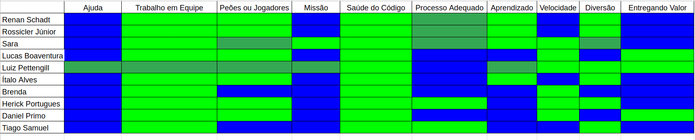

# Sáude do Time

## 1. Introdução
Para ter um panorama geral da saúde do time é utilizado o Squad Health Check Model (Modelo de Análise de Saúde do Time), uma ferramanta desenvolvida pelo Spotify que funciona quase como uma retrospectiva de sprint direcionada através de atributos, onde cada membro avalia o desempenho do grupo em características pré determinadas e manifesta suas ideias em relação a elas de forma a justificar sua avaliação.

Em relação ao framework original o grupo aplicou algumas mudanças, como o maior número de cores para fazer a avaliação a fim de permitir uma visualização mais fidedigna de todos os parâmetros.

## 2. Atributos Avaliados

Abaixo são fornecidos exemplos de avaliações boas e ruins de cada atributo disponibilizadas pelo próprio Spotify e traduzidas pelo [zup](https://www.zup.com.br/blog/health-check-saude-da-sua-equipe):

* Entregando Valor - (Verde) Entregamos coisas fantásticas. Estamos orgulhosos disso e o cliente está muito feliz. (Vermelho) O que entregamos não foi muito bom. O cliente não viu valor nisso.

* Diversão - (Verde) Gostamos de vir trabalhar e nos divertimos trabalhando juntos. (Vermelho) Fico ansioso para ir embora do trabalho.

* Saúde do código - (Verde) Estamos orgulhosos da qualidade do nosso código. Ele é limpo, fácil de ler e tem ótima cobertura de teste. (Vermelho) Nosso código está ruim e existe muito débito técnico.‍

* Aprendizado - (Verde) Estamos aprendendo coisas interessantes o tempo todo. (Vermelho) Nós nunca temos tempo para aprender qualquer coisa nova.‍

* Missão - (Verde) Sabemos exatamente porque estamos aqui e estamos animados com isso. (Vermelho) Não temos ideia do porque estamos aqui. Não temos inspiração.‍

* Peões ou Jogadores - (Verde) Temos controle do nosso próprio destino. Decidimos o que e como construí-lo. (Vermelho) Somos apenas peões em um jogo de xadrez sem decidir o que ou como vamos construir nosso próprio destino.

* Velocidade - (Verde) Fazemos as coisas muito rapidamente, sem demora ou atraso. (Vermelho) Nós não conseguimos entregar as coisas, estamos sempre bloqueados ou com pendências.

* Processo Adequado - (Verde) Nossa maneira de trabalhar é boa. (Vermelho) Nossa maneira de trabalhar é ruim.

* Ajuda - (Verde) Ajudamos e somos ajudados quando necessário. (Vermelho) Nós não ajudamos ou somos ajudados quando necessário.

* Trabalho em Equipe - (Verde) Somos pessoas incríveis trabalhando em equipe, nos preocupamos com o todo.   (Vermelho) Somos pessoas que não nos importamos com os outros e nem com a equipe.

## 3. Planilha do Time
Para fazer a avaliação foram utilizadas cinco cores:  azul, verde claro, verde escuro, laranja e vermelho. Que representam nessa ordem da avaliação mais positiva a mais negativa. 

## 4. Considerações
As avaliações mostraram que apesar de algumas oportunidades de melhoria o panorama geral de saúde do grupo é bem positivo, principalmente nos aspectos de ajuda, missão e entregando valor. Nenhum aspecto foi avaliado de maneira ruim (laranja) ou péssima (vermelha).

Em relação ao aprendizado a maioria dos membros de MDS avaliaram como excelente (azul) e EPS como bom (verde claro), o que é um comportamento já esperado até pelo momento do curso em que estão localizadas as matérias. Quanto ao processo adequado foi notado uma avaliação mais baixa por parte de EPS pelo excesso de demandas e horas dedicadas até então no projeto.

As considerações geradas pelo grupo foram dividas em: Pontos Positivos, Pontos Negativos e Oportunidades de Melhoria.

### Ajuda
* EPS sempre dispostos a ajudar e rápidos para responder (Ponto Positivo)
* Mais ajuda de MDS com MDS (Oportunidade de Melhoria)

### Trabalho em Equipe
* Os fatores externos acabam atrapalhando os pareamentos (Ponto Negativo)
* Problemas com um membro específico (Oportunidade de Melhoria)

### Peões ou Jogadores
* Fazer artefatos que não agregam valor ao produto desmotivam um pouco (Ponto Negativo)

### Missão
* Proatividade em identificar e resolver bugs encontrados (Ponto Positivo)
* Comprometimento maravilhoso da equipe (Ponto Positivo)

### Sáude do Código
* React tem várias formas de fazer a mesma coisa que causa dificuldade de padronização de código no frontend (Ponto Negativo)

### Processo Adequado
* Mais ajuda de MDS com MDS (Oportunidade de Melhoria)

### Aprendizado
* Inserir mais pessoas em tarefas no user e secretary services (Oportunidade de Melhoria)

### Velocidade
* Mais velocidade para avaliar artefatos e código (Oportunidade de Melhoria)
* MDS avaliar PRs está ajudando muito (Ponto Positivo)

### Diversão
* Fazer artefatos que não agregam valor ao produto desmotivam um pouco (Ponto Negativo)

### Entregando Valor
* Comprometimento maravilhoso da equipe (Ponto Positivo)
* Equipe acredita no valor do produto (Ponto Positivo)

## 5. Referências
* [Spotify - Squad Health Check Model](https://engineering.atspotify.com/2014/09/16/squad-health-check-model/)
* [Zup - Health Check](https://www.zup.com.br/blog/health-check-saude-da-sua-equipe)