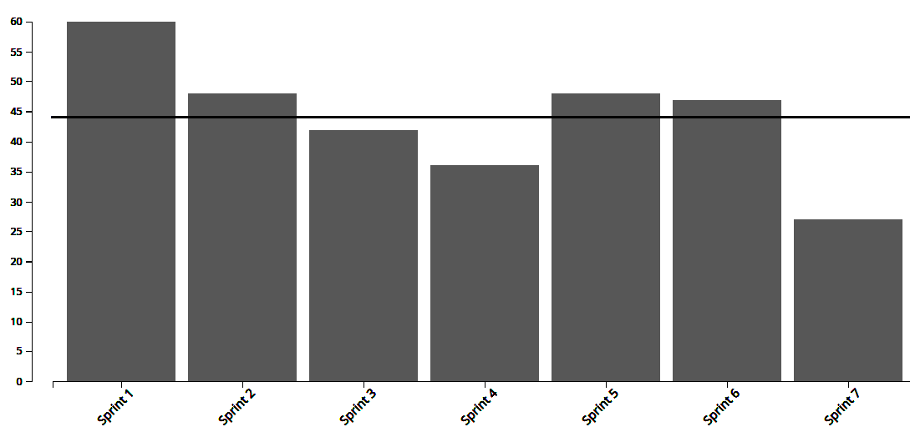
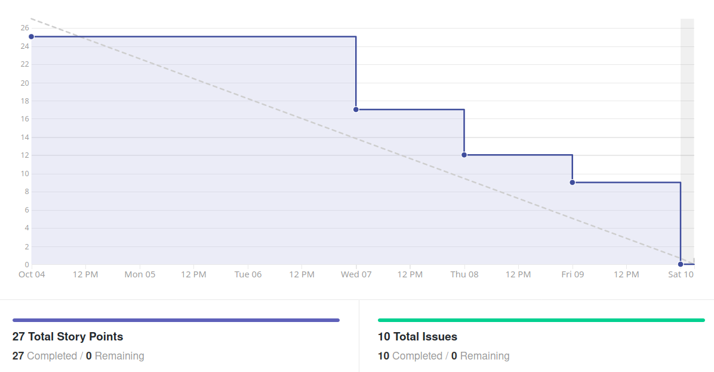
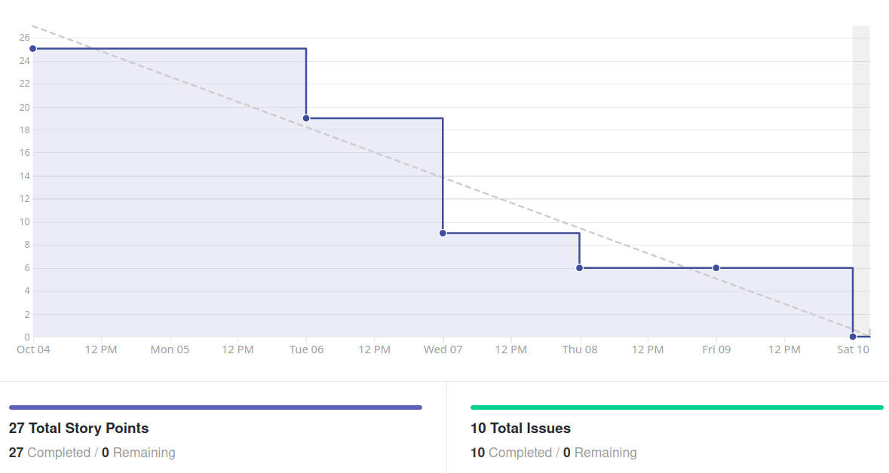
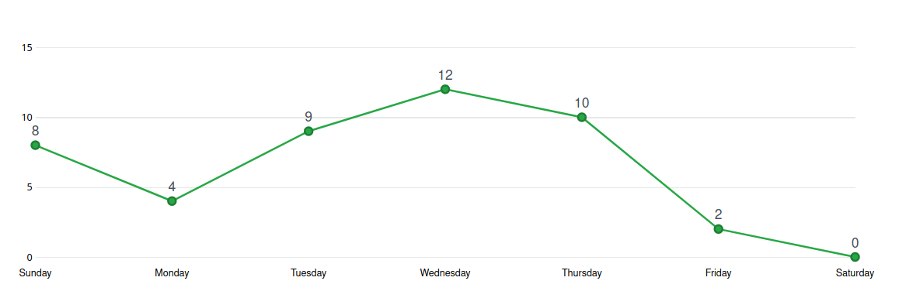
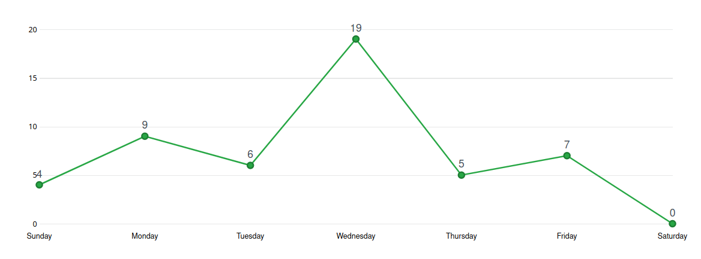
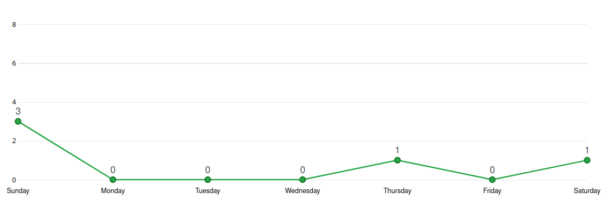
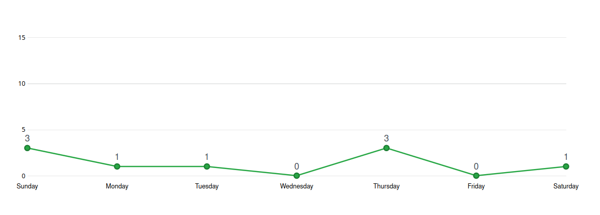

# Análise e Retrospectiva

## 1. Visão Geral
**Número da Sprint:** 8       
**Data de Início:** 11/10/2020    
**Data de Término:** 17/10/2020   
**Duração:** 7 dias  
**Pontos Planejados:** 26 pontos  
**Pontos Entregues:** 28 pontos  
**Dívida Técnica:** 0 pontos  
**Membros Ausentes:** Nenhum  

## 2. Resultados
### 2.1 Repositório Docs
1. **História:** [#80 - Verificar métricas do code climate](https://github.com/fga-eps-mds/2020.1-stay-safe-docs/issues/80)    
**Responsáveis:** Rossicler      
**Pontuação:** 2    
**Status:** Concluída          
2. **História:** [#82 - Modelo JSON de dados populacionais](https://github.com/fga-eps-mds/2020.1-stay-safe-docs/issues/82)    
**Responsáveis:** Sara     
**Pontuação:** 2          
**Status:** Concluída      
3. **História:** [#83 - Documentação da Sprint 8](https://github.com/fga-eps-mds/2020.1-stay-safe-docs/issues/83)    
**Responsáveis:** Renan     
**Pontuação:** 3      
**Status:** Concluída    

### 2.2 Repositório Frontend
1. **História:** [#42 - Fazer filtro de tipos ocorrências nos mapas interativos](https://github.com/fga-eps-mds/2020.1-stay-safe-front-end/issues/42)    
**Responsáveis:** Ítalo e Tiago    
**Pontuação:** 2        
**Status:** Concluída    
2. **História:** [#43 - Visualizar estatísticas de crime de uma cidade](https://github.com/fga-eps-mds/2020.1-stay-safe-front-end/issues/43)    
**Responsáveis:** Lucas      
**Pontuação:** 3        
**Status:** Concluída     
3. **História:** [#44 - Criar e aplicar logo colorida de acordo com o tipo de crime](https://github.com/fga-eps-mds/2020.1-stay-safe-front-end/issues/44)    
**Responsáveis:** Ítalo e Tiago    
**Pontuação:** 2       
**Status:** Concluída    

### 2.3 Repositório User-Service
1. **História:** [#28 - Fazer filtro de tipos ocorrências nos mapas interativos](https://github.com/fga-eps-mds/2020.1-stay-safe-user-service/issues/28)    
**Responsáveis:** Ítalo e Tiago    
**Pontuação:** 2    
**Status:** Concluída    

### 2.4 Repositório Secretary-Service
1. **História:** [#28 - Obter os dados populacionais dos estados de SP e DF](https://github.com/fga-eps-mds/2020.1-stay-safe-secretary-service/issues/28)    
**Responsáveis:** Brenda e Luiz      
**Pontuação:** 5    
**Status:** Concluída    
2. **História:** [#29 - Refatorar spiders para pegar dados mensais das SSP](https://github.com/fga-eps-mds/2020.1-stay-safe-secretary-service/issues/29)    
**Responsáveis:** Daniel e Hérick      
**Pontuação:** 5  
**Status:** Concluída    

## 3. Velocity

## 4. Burndown

### 4.1 Burndown Review/QA

## 5. Gráfico de Contribuições

### 5.1 Contribuições na Documentação

### 5.2 Contribuições no Frontend

### 5.3 Contribuições no User-Service

### 5.4 Contribuições no Secretary-Service

## 6. Retrospectiva

### Pontos Positivos
* Decisões relacionadas a design tomadas em grupo 
* Ítalo, Hérick e Daniel conseguiram compreender melhor o funcionamento e os testes das APIs Flask (Secretary e User)
* Métricas do code-climate próximas do ideal
* Alta cobertura de testes do secretary-service
* Proatividade do Lucas ao realizar melhorias gerais no frontend
* Comunicação constante e eficaz de MDS com EPS
* Qualidade do código nos três repositórios do projeto
* Refatoração no secretary-service melhorou sua manutenibilidade e escalabilidade

### Pontos Negativos
* Tarefas levemente mal pontuadas
* Timebox não sendo seguidos, grupo se empolga ao falar

### Melhorias
* Seguir timebox
* Revisão de pontuação na review

## 7. Quadro de Conhecimentos

## 8. Análise do Scrum Master
### Time
Nona sprint do projeto sendo a primeira depois da Release 1. Sprint com menor quantidade de pontos até então o que é explicado pela queda nas demandas extras de EPS (normalmente relacionadas a documentação) e um planejamento mais moderado depois de notarmos o aplicativo tomando forma, além da evolução no conhecimento de MDS que reduz as pontuações de certas tarefas. 

Sprint com vários pontos positivos apresentados e poucos negativos, o que mostra uma evolução em relação a Sprint 6 e as anteriores a ela e que o grupo está focado em aplicar as melhorias apresentadas. Como pontos positivos foram destacados a evolução do conhecimento de certos membros em relação a algumas tecnologias que eles ainda não haviam trabalhado dentro do contexto do projeto, a qualidade de código dos repositórios e a proatividade dos membros em melhorar a UX do aplicativo. 

Como ponto negativo foi levantado que algumas tarefas foram levemente mal pontuadas, em resposta a isso o grupo decidiu fazer uma repontuação dessas tarefas no review da sprint para melhor representar o esforço necessário para conclusão de uma atividade, dessa forma foram entregues mais pontos que o planejado.

### Métricas
Na Sprint 8 foram concluídos 28 pontos dos 26 planejados, o **Velocity** atual da equipe é de 39.7 pontos com nove sprints fechadas e 371 pontos entregues no total. Com EPS focando mais em demandas não pontuadas (como revisão de PRs, criação e descrição de issues, auxílio a MDS no desenvolvimento das tarefas) em oposição a demandas pontuadas (documentação, configuração de ambiente) é normal a redução de pontuação nas sprints pós R1. Essa quantidade de pontos reduzida também permite aos membros investimento em iniciativas extras e conseguimos notar o grupo integrado em melhorar a UX do aplicativo.

O **Burndown** e o Burndown considerando a fase de Review/QA da Sprint 8 mostra que nessa sprint a equipe não finalizou as tarefas com antecedência.

Os **Históricos de Contribuição** apresentam uma quantidade grande de commits no começo e meio da sprint, que é o comportamento esperado, a quantidade pequena de commits no fim da sprint indica um comportamento positivo de tarefas feitas com antecedência.

O **Quadro de Conhecimento** está começando a mostrar evoluções mais lentas agora que os membros estão acostumados a usar as tecnologias em questão.

### Histórias
Para solucionar a tarefa de **Obter os dados populacionais dos estados de SP e DF** foi utilizada uma estimativa de censo de 2020 e todos esses dados foram salvos em um JSON especificado no documento de arquitetura. 

A tarefa de **Refatorar spiders para pegar dados mensais das SSP** também melhorou a manutenibilidade e escalabilidade do crawler desenvolvido, permitindo a introdução de novas secretarias só criando uma nova spider adaptada a sua estrutura específica, sem precisar alterar a estrutura de pipelines e items.

As três tarefas do frontend contiveram mudanças visuais acordadas em grupo em relação ao que estava especificado no protótipo, este será atualizado em uma sprint futura. 

Entre as tarefas extras executadas é possível destacar a definição de um context e tema global do aplicativo no frontend e o desenvolvimento de um dark-mode, o que é algo indispensável em 2020.

As demais tarefas são auto-explicativas e ocorreram sem intercorrências.

## Riscos
Entre os riscos monitorados pelo grupo os que ocorreram na sprint foram:

* Divergência de horários entre membros da equipe
* Ausência de membros durante reuniões do grupo
* Conflito com outras disciplinas
* Erros durante o planejamento das atividades

Os quatros riscos eram esperados no planejamento e foi possível realizar algumas ações preventivas e reativas.