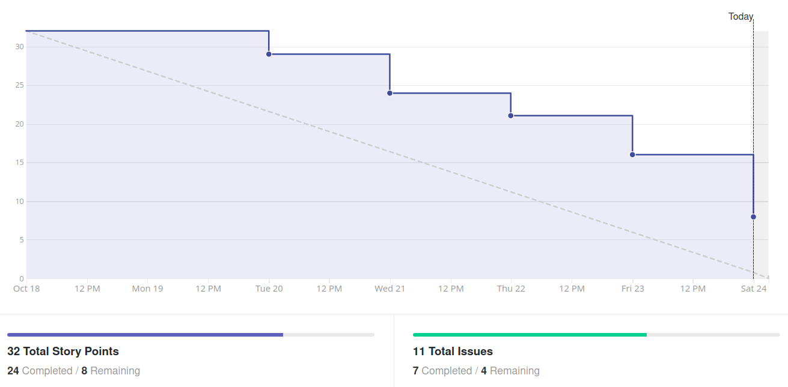
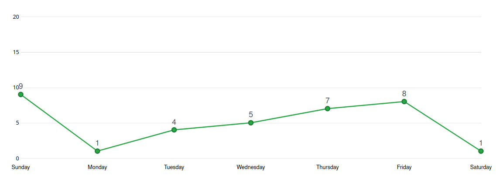
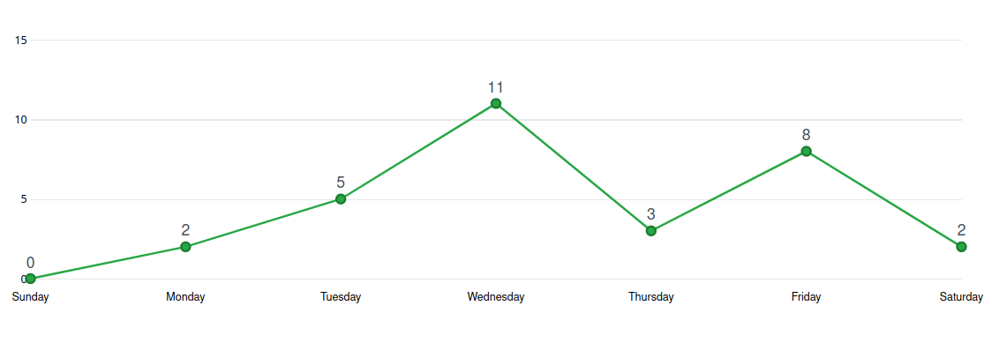
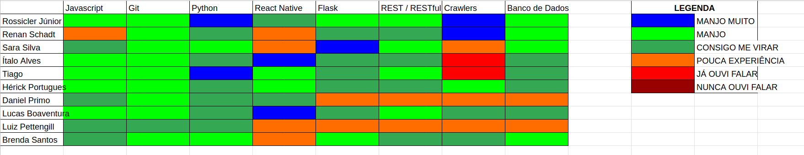

# Análise e Retrospectiva

## 1. Visão Geral
**Número da Sprint:** 9         
**Data de Início:** 18/10/2020     
**Data de Término:** 24/10/2020   
**Duração:** 7 dias  
**Pontos Planejados:** 25 pontos  
**Pontos Entregues:** 27 pontos  
**Dívida Técnica:** 8 pontos  
**Membros Ausentes:** Nenhum    

## 2. Resultados
### 2.1 Repositório Docs      
1. **História:** [#86 - Documentação da Sprint 9](https://github.com/fga-eps-mds/2020.1-stay-safe-docs/issues/86)    
**Responsáveis:** Renan     
**Pontuação:** 3      
**Status:** Não Concluída      

### 2.2 Repositório Frontend
1. **História:** [#49 - Visualizar cidades de SP em mapa de calor](https://github.com/fga-eps-mds/2020.1-stay-safe-front-end/issues/49)    
**Responsáveis:** Ítalo, Luiz e Lucas      
**Pontuação:** 5        
**Status:** Concluída 
2. **História:** [#50 - Refatorar mapa de calor para mostrar mais cores](https://github.com/fga-eps-mds/2020.1-stay-safe-front-end/issues/50)    
**Responsáveis:** Lucas      
**Pontuação:** 2           
**Status:** Concluída 
3. **História:** [#51 - Adaptar frontend ao novo JSON de crimes](https://github.com/fga-eps-mds/2020.1-stay-safe-front-end/issues/51)    
**Responsáveis:** Lucas   
**Pontuação:** 3        
**Status:** Concluída 
4. **História:** [#52 - Refatorar código para melhorar índices do code-climate](https://github.com/fga-eps-mds/2020.1-stay-safe-front-end/issues/52)    
**Responsáveis:** Rossicler    
**Pontuação:** 2        
**Status:** Não Concluída 

### 2.3 Repositório User-Service
1. **História:** [#30 - Identificar lista de bairros por município](https://github.com/fga-eps-mds/2020.1-stay-safe-user-service/issues/30)    
**Responsáveis:** Brenda e Tiago    
**Pontuação:** 3    
**Status:** Concluída 
2. **História:** [#31 - Implementar mecanismo de média de avaliações](https://github.com/fga-eps-mds/2020.1-stay-safe-user-service/issues/31)    
**Responsáveis:** Brenda e Tiago    
**Pontuação:** 3    
**Status:** Concluída 
3. **História:** [#32 - Refatorar código para melhorar índices do code-climate](https://github.com/fga-eps-mds/2020.1-stay-safe-user-service/issues/32)    
**Responsáveis:** Rossicler     
**Pontuação:** 1     
**Status:** Não Concluída 

### 2.4 Repositório Secretary-Service
1. **História:** [#32 - Implementar filtros no Secretary-Service](https://github.com/fga-eps-mds/2020.1-stay-safe-secretary-service/issues/32)    
**Responsáveis:** Daniel e Hérick       
**Pontuação:** 8     
**Status:** Concluída 
2. **História:** [#33 - Refatorar código para melhorar índices do code-climate](https://github.com/fga-eps-mds/2020.1-stay-safe-secretary-service/issues/33)    
**Responsáveis:** Rossicler        
**Pontuação:** 2      
**Status:** Não Concluída
3. **História:** [#35 - Implementar crawler para pegar coordenadas de cidades do estado de SP](https://github.com/fga-eps-mds/2020.1-stay-safe-secretary-service/issues/35)    
**Responsáveis:** Renan        
**Pontuação:** 3   
**Status:** Concluída

## 3. Velocity

## 4. Burndown

### 4.1 Burndown Review/QA

## 5. Gráfico de Contribuições

### 5.1 Contribuições na Documentação

### 5.2 Contribuições no Frontend

### 5.3 Contribuições no User-Service

### 5.4 Contribuições no Secretary-Service

## 6. Retrospectiva
### Pontos Positivos
* Devido a ausência de aulas o grupo conseguiu focar mais no projeto 
* Boa comunicação do grupo como um todo
* Bom comprometimento do grupo para entregar as tarefas
* Prova de FSO adiada

### Pontos Negativos
* Problemas com a estação de trabalho
* Problemas de ambiente
* Alta depedência entre tarefas
* Falta de feedback
* Histórias mal pontuadas

### Melhorias
* Melhor planejamento das tarefas

## 7. Quadro de Conhecimentos

## 8. Análise do Scrum Master
### Time
Décima sprint do projeto, com planejamento inicial de 25 pontos e final de 35 pontos, dos quais 8 não foram entregues. Sprint com uma quantidade de pontos inferior ao Velocity que é explicada pela queda nas demandas extras de EPS (normalmente relacionadas a documentação) e um planejamento mais moderado depois de notarmos o aplicativo tomando forma, além da evolução no conhecimento de MDS que reduz as pontuações de certas tarefas. 

Entre os pontos positivos é destacado que a comunicação do grupo continua eficaz, tanto de MDS com MDS como de EPS com MDS e os membros estão se ajudando no que é necessário para entregar as tarefas da sprint. Os pontos negativos mais relevantes foram os problemas de ambiente (serviço secretaria) e a alta depedência entre tarefas (relacionadas aos mapas de calor), também foi destacada a pontuação baixa de algumas tarefas que demandaram mais trabalho que o esperado para serem completadas, essas foram repontuadas no review.

### Métricas
Na Sprint 9 foram concluídos 27 pontos dos 25 planejados inicialmente e 35 planejados totais, o **Velocity** atual da equipe é de 37 pontos com dez sprints fechadas e 398 pontos entregues no total. Nessa sprint e na anterior foi notada uma queda na pontuação planejada da equipe que resulta em uma queda no Velocity, isso é devido aos membros de EPS dando mais atenção a demandas não pontuadas (como revisão de PRs, criação e descrição de issues, auxílio a MDS no desenvolvimento das tarefas) em oposição a demandas pontuadas (documentação, configuração de ambiente), é normal a redução de pontuação nas sprints pós R1.

O **Burndown** e o Burndown considerando a fase de Review/QA da Sprint 9 mostra que nessa sprint algumas tarefas não foram finalizadas com antecedência e outras ficaram como dívidas técnicas.

Os **Históricos de Contribuição** apresentam uma quantidade adequada de contribuições durante toda sprint.

O **Quadro de Conhecimento** apresenta a evolução de alguns membros no conhecimento de React Native e Python.

### Histórias
Entre os pontos adicionados três são referentes a uma nova demanda para **Implementar crawler para pegar coordenadas de cidades do estado de SP** feita com o objetivo de facilitar a execução da tarefa de **Visualizar cidades de SP em mapa de calor**. Em relação a segunda tarefa os membros executores tiveram problemas de ambiente e precisaram da ajuda de um terceiro membro para concluí-la.

As tarefas com o objetivo de **Refatorar código para melhorar índices do code-climate** nos três repositórios se mostraram mais trabalhosas do que esperado e a pontuação total delas foi elevada de 3 para 5 pontos. A issue de **Implementar filtros no Secretary-Service** também se mostrou desafiadora devido a dificuldade enfrentada pelos membros com as querys do MongoDb e foi repontuada de 5 para 8 pontos.

As demais tarefas são auto-explicativas e ocorreram sem intercorrências.

## Riscos
Entre os riscos monitorados pelo grupo os que ocorreram na sprint foram:

* Divergência de horários entre membros da equipe
* Ausência de membros durante reuniões do grupo
* Conflito de dependência entre atividades 
* Conflito com outras disciplinas
* Erros durante o planejamento das atividades

Os riscos eram esperados no planejamento e foi possível realizar algumas ações preventivas e reativas.