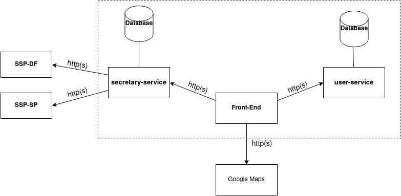
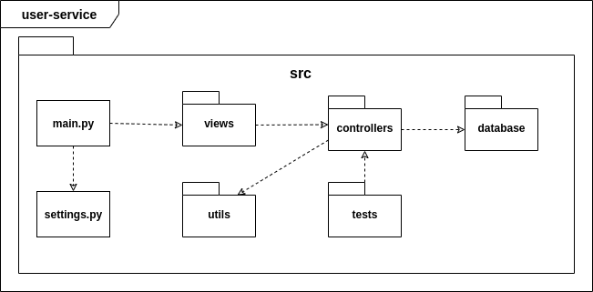

# Documento de Arquitetura

## 1. Introdução

### 1.1. Finalidade

Este documento tem como objetivo fornecer uma visão geral da arquitetura do aplicativo Stay Safe. Visa apresentar de forma clara o fluxo de comportamento da aplicação e como as partes se relacionam, bem como expor de maneira objetiva as decisões arquiteturais que foram tomadas em relação ao projeto.

### 1.2. Escopo

Este documento de arquitetura se aplica ao Stay Safe. Estão descritos neste documento os padrões de arquitetura adotados, frameworks e linguagens escolhidas.

### 1.3. Definições, Acrônimos e Abreviações

* **API** - *Application Programming Interface*: conjunto de rotinas e padrões de programação que viabiliza a comunicação entre dois sistemas ou plataformas distintas.
* **HTTP** - *Hypertext Transfer Protocol*: protocolo de transferência e comunicação de dados.
* **Backend** - Parte da aplicação responsável pela conexão com o banco de dados e gerência das informações que serão enviadas ao frontend.
* **Frontend** - Parte da aplicação responsável pela interação com o usuário, utilizando recursos consumidos do backend.
* **SSP** - Secretaria de Estado de Segurança Pública

## 2. Representação da Arquitetura

### 2.1. Diagrama de Relações

#### 2.1.1. Frontend

#### 2.1.2. Serviço da SSP

#### 2.1.3. Serviço do Usuário

### 2.2. Flask

Flask é um framework de aplicativos web em Python. Foi designado para se ter um início de projeto fácil e rápido, com a habilidade de escalar para aplicações complexas. Flask oferece sugestões, mas não força dependências e layouts ao projeto. Para saber mais acesse a documentação de Flask [aqui](https://flask.palletsprojects.com/en/1.1.x/#).

### 2.3. React Native

React Native é um framework de JavaScript para desenvolver aplicações nativas tanto para Android como para IOS. É baseada em React, uma biblioteca do Facebook criada para desenvolver interfaces de usuário, porém em vez de adaptar o código para browsers, ele adapta para dispositivos móveis. Para saber mais acesse o website do React Native clicando [aqui](https://reactnative.dev/).

### 2.4. API Google Maps

A API do Google Maps foi utilizada para se obter os mapas da aplicação, onde será feita a inclusão dos marcadores de crimes por parte dos usuários e a inclusão das demarcações dos estados/cidades/bairros que irão possuir as características com base nos dados obtidos da SSP. A documentação da API pode ser encontrada [aqui](https://developers.google.com/maps/documentation?hl=pt-br).

### 2.5. SSP

A Secretaria de Segurança Pública do Distrito Federal e do Estado de São Paulo são as maiores fontes dos dados obtidos para a aplicação. Os dados são disponibilizados nos respectivos websites e iremos utilizar crawlers para a obtenção dos mesmos. Com esses dados podemos implementar as funcionalidades do aplicativo, mostrando de uma forma mais amigável ao usuário final. Os websites podem ser acessados aqui: [DF](http://www.ssp.df.gov.br/) [SP](https://www.ssp.sp.gov.br/).

### 2.6. PostgreSQL

PostgreSQL é um banco de dados relacional open source que suporta grande parte do padrão SQL. Ele será utilizado na API dos usuários, onde irá ser um banco com mais relações e mais definido. É possível saber mais acessando seu website [aqui](https://www.postgresql.org/).

### 2.7. MongoDB

MongoDB é um banco de dados orientado a documentos não relacional caracterizado como NoSQL. Ele possui uma maior versatilidade na hora de armazenar os dados. Foi escolhido para armazenar os dados obtidos na SSP e conversar com o microserviço dos crawlers. É possível acessar seu website clicando [aqui](https://www.mongodb.com/).

## 3. Requisitos e Restrições de Arquitetura

* Aplicação deve ser construída sobre a arquitetura de microsserviços, na qual o backend será desenvolvido em Flask e o frontend em React Native.

* O aplicativo será funcional em smartphones com o sistema operacional Android e acesso à Play Store, necessita de conexão estável de internet para uso completo e atualizado do aplicativo.

* A API secretary-service deve ser desenvolvida para consumir dados de diferentes secretarias, portanto deve ser facilmente escalável.

* O serviço de mapas da aplicação será fornecido por uma API externa.

## 4. Visão de Implementação

### 4.1. User-Service

* **src/** - Pasta raiz do projeto que contém todo o código fonte da API.
* **main.py** - Arquivo que controla a execução do programa e direciona as chamadas para outras funções.
* **settings.py** - Arquivo que contém todas as configurações do servidor e do banco de dados.
* **views/** - Implementa os endpoints e define quais métodos HTTP serão utilizados.
* **controllers/** - Camada responsável pelo fluxo do usuário na aplicação.  Esta é usada para comunicação com a camada DB enviando informações para a View.
* **utils/** - Armazena funções reutilizáveis que serão disponibilizadas para todo o projeto. 
* **tests/** - Inclui os testes unitários realizados dentro da API.
* **db/** - Realiza a comunicação com o banco de dados relacional.

### 4.2. Secretary-Service

* **src/** - Pasta raiz do projeto que contém todo o código fonte da API.
* **main.py** - Arquivo que controla a execução do programa e direciona as chamadas para outras funções.
* **settings.py** - Arquivo que contém todas as configurações do servidor e do banco de dados.
* **views/** - Implementa os endpoints e define quais métodos HTTP serão utilizados.
* **controllers/** - Camada responsável pelo fluxo do usuário na aplicação.  Esta é usada para comunicação com a camada DB enviando informações para a View.
* **utils/** - Armazena funções reutilizáveis que serão disponibilizadas para todo o projeto. 
* **tests/** - Inclui os testes unitários realizados dentro da API.
* **db/** - Realiza a comunicação com o banco de dados não relacional.
* **crawler/** - Responsável pela implementação dos crawlers que realizarão a extração metódica e automatizada de dados da Web. 

### 4.3. Frontend

* **src/** - Pasta raiz do projeto que contém todo o código fonte da aplicação.
* **index.js** - Arquivo que controla a execução do programa e direciona as chamadas para outras funções.
* **config.js** - Responsável por armazenar diferentes variáveis e a configuração da aplicação.
* **screens/** - Contêm as telas da aplicação.
* **utils/** - Armazena funções reutilizáveis que serão disponibilizadas para todo o projeto. 
* **components/** - Inclue os componentes primários que serão aproveitados nas telas da aplicação.
* **public/assets/** - Possui as imagens e ícones estáticos utilizados no projeto. 

## 5. Referências

* https://flask.palletsprojects.com/en/1.1.x/#

* https://reactnative.dev/

* https://developers.google.com/maps/documentation?hl=pt-br

* http://www.ssp.df.gov.br/

* https://www.ssp.sp.gov.br/

* https://www.postgresql.org/

* https://www.mongodb.com/

* https://fga-eps-mds.github.io/2018.2-IndicaAi//docs/2018/08/28/architecture-doc.html

* https://cjjcastro.gitlab.io/2019-1-hubcare-docs/project/architecture-document/#5-visao-de-implementacao

* https://translate-me.github.io/docs/documentos/projeto/doc_de_arquitetura/

* https://fga-desenho-2019-2.github.io/Wiki/seminario5/arquitetura/

## Histórico de Revisão

| Data | Versão| Descrição | Autor |
|----|----|----|----|
| 26/08/2020 | 0.1 | Adicionando Introdução | Brenda e Hérick |
| 26/08/2020 | 0.2 | Adicionando Requisitos e Restrições de Arquitetura | Brenda e Hérick |
| 26/08/2020 | 0.3 | Adicionando Visão de Implementação | Brenda e Hérick |
| 26/08/2020 | 0.4 | Adicionando Representação da Arquitetura | Tiago |
| 26/08/2020 | 0.5 | Adicionando Referências | Luiz |
