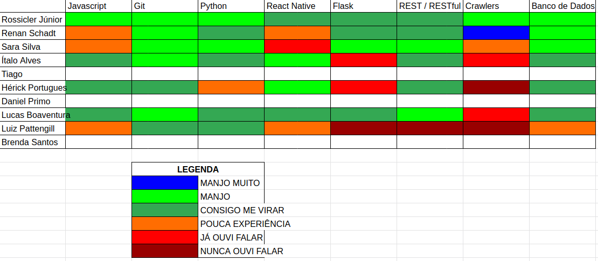

# Análise e Retrospectiva

## 1. Visão Geral
**Número da Sprint:** 0  
**Data de Início:** 18/08/2020  
**Data de Término:** 22/08/2020  
**Duração:** 4 dias  
**Pontos Planejados:** 35 pontos  
**Pontos Entregues:** 27 pontos  
**Membros Presentes:** Todos

## 2. Resultados
1. **História:** [#1 - Definição de Identidade Visual](https://github.com/fga-eps-mds/2020.1-stay-safe-docs/issues/1)  
**Responsáveis:** Daniel, Ítalo   
**Pontuação:** 8  
**Status:** Concluído 
2. **História:** [#2 - Create vision document](https://github.com/fga-eps-mds/2020.1-stay-safe-docs/issues/2)  
**Responsáveis:** Lucas, Brenda, Tiago, Hérick, Luiz, Ítalo, Daniel  
**Pontuação:** 8  
**Status:** Concluído  
3. **História:** [#11 - Definição de Arquitetura](https://github.com/fga-eps-mds/2020.1-stay-safe-docs/issues/11)  
**Responsáveis:** Sara   
**Pontuação:** 8 
**Status:** Concluído   
4. **História:** [#12 - Treinamento de Flask](https://github.com/fga-eps-mds/2020.1-stay-safe-docs/issues/12)  
**Responsáveis:** Sara  
**Pontuação:** 5  
**Status:** Concluído  
5. **História:** [#14 - Treinamento de React Native](https://github.com/fga-eps-mds/2020.1-stay-safe-docs/issues/14)  
**Responsáveis:** Rossicler  
**Pontuação:** 5  
**Status:** Concluído  
6. **História:** [#15 - Definição da Licença](https://github.com/fga-eps-mds/2020.1-stay-safe-docs/issues/15)  
**Responsáveis:** Renan, Rossicler, Sara    
**Pontuação:** 2
**Status:** Concluído  
7. **História:** [#16 - Criação do Product Backlog](https://github.com/fga-eps-mds/2020.1-stay-safe-docs/issues/16)  
**Responsáveis:** Renan, Rossicler, Sara   
**Pontuação:** 13
**Status:** Concluído  
8. **História:** [#17 - Termo de Abertura do Projeto](https://github.com/fga-eps-mds/2020.1-stay-safe-docs/issues/17)  
**Responsáveis:** Renan, Rossicler, Sara     
**Pontuação:** 8
**Status:** Não Concluído  
9. **História:** [#18 - Documentação de Sprints](https://github.com/fga-eps-mds/2020.1-stay-safe-docs/issues/18)  
**Responsáveis:** Renan     
**Pontuação:** 3
**Status:** Concluído  
10. **História:** [#19 - Documento de Arquitetura](https://github.com/fga-eps-mds/2020.1-stay-safe-docs/issues/19)  
**Responsáveis:** Lucas, Brenda, Luiz, Tiago, Hérick  
**Pontuação:** 8
**Status:** Concluído 

## 3. Velocity

## 4. Burndown

## 5. Retrospectiva
### Pontos Positivos:
* Uma sprint bem produtiva
* Hilmer nos elogiou
* A interação do grupo está muito boa e cumprimos quase tudo que foi proposto em bons prazos, sem ser mt em cima da hora
* O time ta ajudando bastante, sempre que alguem precisa de ajuda :) (time solicito)
* Capacidade da equipe de contornar uma situação adversa

### Pontos Negativos:
* O momento ainda é tenso, alguns membros e/ou familiares tiveram problemas pessoais ou de saúde e não estavam tão bem pra participar
* Adaptação ao EAD
* Reuniões extensas
* Alguns membros ainda não estão adaptados ao ritmo de reunião e daily
* Issues criadas tardiamente

### Melhorias:
* Timebox em reuniões
* Configurar bot para lembretes de dailies
* Criar issues na reunião

## 6. Quadro de Conhecimentos
Março de 2020:

Agosto de 2020:

## 7. Análise do Scrum Master
### Time
Primeira sprint do projeto marcada pelas turbulências da pandemia, apesar desta a equipe está bem unida, animada para matéria e empolgada com o tema escolhido. 

A maioria dos pontos negativos citados na retrospectiva foge do controle da equipe, só um deles é passível de intervenção (visão de produto não homogênea entre os membros) e para isso uma nova reunião para tratar sobre o produto será marcada com objetivo de coletar mais ideias, propor novas funcionalidades e alinhar a visão de todos os membros a respeito do software que será construído.

### Métricas
Em decorrência da pandemia e do semestre interrompido o **Burndown** da Sprint 0 compreende do mês de Março até o mês Agosto, o que não reflete a realidade, visto que na maior parte desse tempo o projeto estava parado.

O **Velocity** atual da equipe é de 27 pontos, a expectativa é que esse número aumente nas próximas sprints.

A inclusão de dois **Quadros de Conhecimento** foi feita para mostrar a evolução de alguns membros durante a pandemia.

### Histórias
Os treinamentos foram realizados e MDS apresentou mini projetos usando as tecnologias em questão, mostrando compromentimento em aprender as ferramentas que serão usadas ao longo da disciplina.

O **Documento de Visão** está em estado de revisão, uma falha de comunicação entre EPS e MDS fez com que o Pull Request fosse aberto tardiamente, algumas alterações foram solicitadas e estão sendo feitas no documento, a nova previsão de entrega é no início da Sprint 1.

O **Roadmap de Produto** elaborado antes da pandemia foi revisitado e adaptado para as datas atualizadas do semestre. Novas alterações deverão ser feitas na próxima sprint em decorrência da elaboração e priorização do **Product Backlog**.

As demais tarefas são auto-explicativas e ocorreram sem intercorrências.